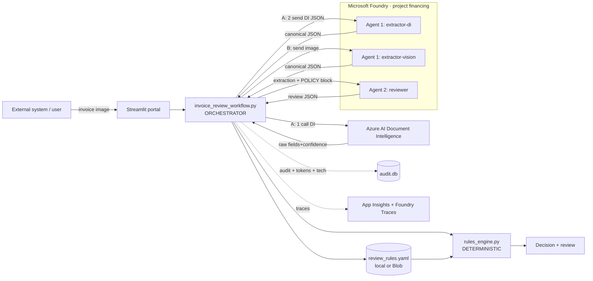
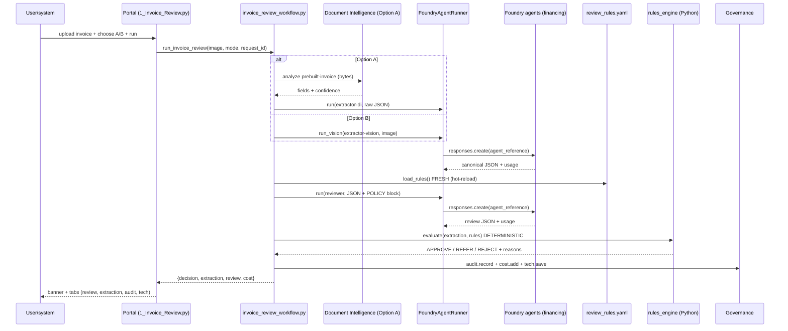

# 02 · Architecture & flow

## The layers

| Layer | Files | Role |
|-------|-------|------|
| **UI** | [app/portal/views/1_Invoice_Review.py](../app/portal/views/1_Invoice_Review.py) | Upload, Option A/B toggle, live flow, results |
| **Orchestration** | [app/workflows/invoice_review_workflow.py](../app/workflows/invoice_review_workflow.py) | Runs Agent 1 → Agent 2 → rules; plain Python |
| **Runner** | [app/agents/shared/foundry_runner.py](../app/agents/shared/foundry_runner.py) | Calls Foundry agents by reference; records governance |
| **Agents (remote)** | Microsoft Foundry project `financing` | 3 persistent prompt agents |
| **Extraction (Option A)** | [app/tools/doc_intelligence.py](../app/tools/doc_intelligence.py) | Document Intelligence `prebuilt-invoice` |
| **Deterministic rules** | [app/review/rules_engine.py](../app/review/rules_engine.py) | Config-driven binding decision + prompt injection |
| **Config** | [config/review_rules.yaml](../config/review_rules.yaml) | Editable policy (hot-reload) |
| **Governance** | [audit_log.py](../app/governance/audit_log.py) · [cost_tracker.py](../app/governance/cost_tracker.py) · [tech_log.py](../app/governance/tech_log.py) | Audit trail, tokens/cost, technical proof |
| **Observability** | [otel_setup.py](../app/observability/otel_setup.py) + Foundry Traces | App telemetry + agent-side traces |

## ⚠️ Who calls whom (read this first)

The **orchestration (plain Python)** is the conductor — it calls every service in order.
The **agents do not call anything**; they receive text and return text.

- **Document Intelligence is called by Python**, not by the agent. Python gets the raw
  OCR JSON and *then* feeds it into Agent 1's prompt.
- The agents have **no tools** attached in Foundry, so they *cannot* call DI, the rules
  engine, or the internet. They are pure "text in → text out" reasoners.
- The **binding decision** is made by Python (`rules_engine.evaluate`), not by an agent.

| Actor | What it calls | What it does |
|-------|---------------|--------------|
| Python orchestrator | DI, Agent 1, Agent 2, rules engine | conducts the whole flow, in order |
| Document Intelligence | — | OCR only (Option A); returns fields+confidence to Python |
| Agent 1 (Foundry) | — | text→text: normalize DI JSON, or read the image (Option B) |
| Agent 2 (Foundry) | — | text→text: review the extraction vs the POLICY block |
| rules engine (Python) | reads `review_rules.yaml` | computes APPROVE/REFER/REJECT |

> Full line-level trace with code: [06 · Code walkthrough](06-code-walkthrough.md).

## Component diagram

## End-to-end sequence

## Why the decision is deterministic

The reviewer agent writes the *narrative*. The **binding** APPROVE/REFER/REJECT is
computed by `rules_engine.evaluate()` in pure Python from the extracted fields and the
current policy. So:
- Hard breach (over limit, over max tenor) → **REJECT**.
- Missing fields, low confidence, math mismatch → **REFER**.
- All checks pass → **APPROVE**.

Next → [03 · The two options](03-the-two-options.md)
