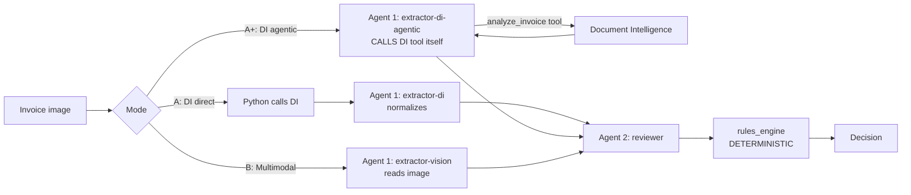

# 03 · The three extraction modes

All three modes end with the **same reviewer agent** and the **same deterministic rules
engine**. Only the **extraction stage (Agent 1)** differs — and, importantly, *who calls
Document Intelligence* differs. Pick the mode with the radio at the top of the review page.

| Mode | Who calls DI? | Agents used | Agentic? |
|------|---------------|-------------|----------|
| **A · DI direct** | **Python** (orchestrator) | extractor-di + reviewer | reviewer is agentic; extractor is a light normalizer |
| **A+ · DI agentic** | **Agent 1 itself** (via `analyze_invoice` tool) | extractor-di-agentic + reviewer | ✅ fully agentic extraction |
| **B · Multimodal** | nobody — vision model *reads* the image | extractor-vision + reviewer | ✅ fully agentic extraction |

## Mode A — DI direct (Python calls DI)

**How:** the orchestrator calls `prebuilt-invoice` (OCR + fields + **per-field confidence**),
then Agent 1 (`bca-invoice-extractor-di`) normalizes to the canonical schema
(dates → `YYYY-MM-DD`, numbers cleaned, term computed, math reconciled).

| ✅ Advantages | ❌ Disadvantages |
|--------------|-----------------|
| Deterministic & repeatable (audit-friendly) | Best on known document types |
| **Confidence scores** per field | The extractor agent is a thin normalizer |
| Cheaper & faster at scale | Rigid; less "reasoning" |
| Low hallucination risk | — |

**Best for:** high-volume, structured, regulated invoices where consistency + auditability win.

## Mode A+ — DI agentic (the agent calls DI as a tool) ⭐

**How:** Agent 1 (`bca-invoice-extractor-di-agentic`) has the **`analyze_invoice` tool**
attached in Foundry (an OpenAPI tool pointing at the `ca-bcafinance-tools` service). The
orchestrator only uploads the image and hands the agent an `image_id`; **the agent decides
to call the tool**, receives the DI fields, reasons over them, and returns canonical JSON.

This is the **textbook agentic pattern**: the agent — not your code — drives the tool call.
(It's also how the parent `finance` repo's agents call `ca-bns-systems`.)

| ✅ Advantages | ❌ Disadvantages |
|--------------|-----------------|
| Genuinely agentic — agent owns the tool call | More infra: a tools service + OpenAPI tool |
| Same DI confidence + determinism underneath | Slightly slower (extra hop) |
| Extensible — add more tools the agent can pick | Agent could, in theory, skip the tool |

**Best for:** demoing real agentic tool-use, or when the extractor needs to choose among
several tools.

## Mode B — Multimodal (vision model reads the image)

**How:** the image is sent **directly** to a vision model (`gpt-4o-mini`) hosted as agent
`bca-invoice-extractor-vision`. One model does "see + extract". No DI at all.

| ✅ Advantages | ❌ Disadvantages |
|--------------|-----------------|
| Zero training; handles any layout | Non-deterministic (harder to audit) |
| Reasons about messy/free-form images | Can **hallucinate** a plausible-but-wrong value |
| Handles handwriting, angles, languages | No native confidence scores |
| Simplest pipeline (one model) | More expensive & slower per image |

**Best for:** varied/unpredictable images, prototypes, non-standard docs.

## Head-to-head

| Criterion | A · DI direct | A+ · DI agentic | B · Multimodal |
|-----------|:---:|:---:|:---:|
| Determinism / auditability | 🟢 High | 🟢 High | 🔴 Lower |
| Confidence scores | 🟢 Native | 🟢 Native | 🔴 Weak |
| Hallucination risk | 🟢 Low | 🟢 Low | 🔴 Higher |
| "Truly agentic" extraction | 🟡 Partial | 🟢 Yes | 🟢 Yes |
| Infra needed | 🟢 DI only | 🟡 DI + tools svc | 🟢 model only |
| Accuracy on messy inputs | 🔴 Weak | 🔴 Weak | 🟢 Strong |
| Cost at scale | 🟢 Lower | 🟢 Lower | 🔴 Higher |

## Recommendation for finance

- **Production, regulated:** **Mode A** (or **A+** if you want the agentic story) — DI gives
  confidence + determinism, and the binding decision stays in Python.
- **Show real agentic tool-use:** **Mode A+**.
- **Messy long-tail / no training:** **Mode B**, ideally as a fallback when A/A+ confidence is low.

## Try it

In the portal, run the **same sample invoice** through all three modes and compare the
extraction tab (confidence!), the technical log (see `tools:upload-image` +
`foundry:extractor-di-agentic` for A+), tokens/cost, and whether the final decision agrees.

Next → [04 · Azure services](04-azure-services.md)
