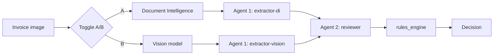

# 03 · The two options — Document Intelligence vs Multimodal

Both options end with the **same reviewer agent** and the **same rules engine**. Only the
extraction stage (Agent 1) differs.

## Option A — Azure AI Document Intelligence

**How:** `prebuilt-invoice` model runs OCR + field extraction and returns fields with
**per-field confidence** and bounding boxes. Agent 1 (`extractor-di`) then normalizes to
the canonical schema (dates → `YYYY-MM-DD`, numbers cleaned, term computed).

| ✅ Advantages | ❌ Disadvantages |
|--------------|-----------------|
| Deterministic & repeatable (audit-friendly) | Best on known document types |
| **Confidence scores** per field | Custom layouts may need training |
| Cheaper & faster at scale | Rigid; less "reasoning" |
| Low hallucination risk | Two services to manage |
| Great for tables, key-value pairs | Weaker on handwriting/odd scans |

**Best for:** high-volume, structured, regulated invoices where consistency and
auditability matter.

## Option B — Multimodal (vision) model

**How:** the invoice image is sent **directly** to a vision-capable model
(`gpt-4o` / `gpt-4o-mini`) hosted as a Foundry agent (`extractor-vision`). One model
does "see + extract".

| ✅ Advantages | ❌ Disadvantages |
|--------------|-----------------|
| Zero training; handles any layout | Non-deterministic (harder to audit) |
| Reasons about messy/free-form images | Can **hallucinate** a plausible-but-wrong value |
| Handles handwriting, angles, languages | No native confidence scores |
| Simpler pipeline (one model) | More expensive & slower per image |

**Best for:** varied/unpredictable images, prototypes, low-volume, non-standard docs.

## Head-to-head

| Criterion | A · Doc Intelligence | B · Multimodal |
|-----------|:---:|:---:|
| Accuracy on known docs | 🟢 High | 🟡 Good |
| Accuracy on messy inputs | 🔴 Weak | 🟢 Strong |
| Determinism / auditability | 🟢 High | 🔴 Lower |
| Confidence scores | 🟢 Native | 🔴 Weak |
| Hallucination risk | 🟢 Low | 🔴 Higher |
| Setup effort | 🟡 Training possible | 🟢 None |
| Cost at scale | 🟢 Lower | 🔴 Higher |

## Recommendation for finance

Default to **Option A** for regulated production (confidence + determinism). Keep **Option
B** for the messy long-tail. A future **hybrid** can run A first and fall back to B when
confidence is low or the doc type is unknown.

## Try it

In the portal, pick the **same sample invoice** and run it once with Option A and once
with Option B. Compare the extraction tab (confidence!), tokens/cost, and whether the
final decision agrees. The provided samples include clean, missing-NPWP, missing-PO,
math-error, over-limit, expired-tenor, and low-quality scans.

Next → [04 · Azure services](04-azure-services.md)
