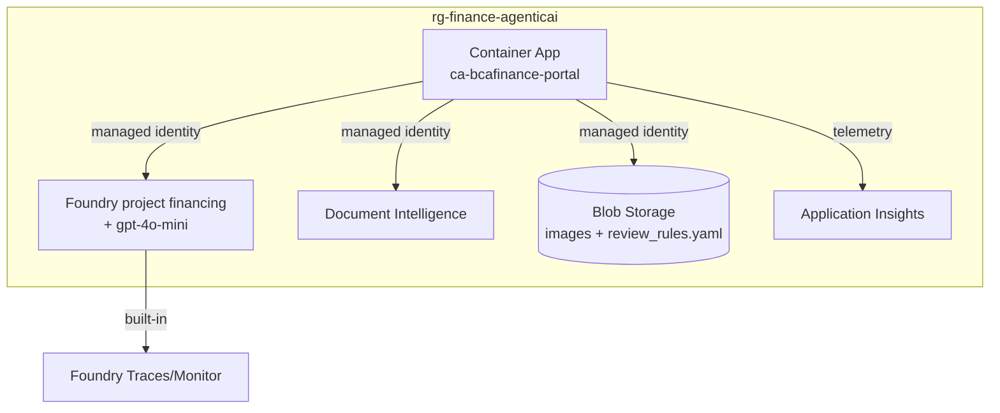

# 04 · Azure services used (and why)

Everything lives in the **same resource group as the parent**: `rg-finance-agenticai`.

| Service | Role in this demo | Why this one |
|---------|-------------------|--------------|
| **Microsoft Foundry** (project `financing`) | Hosts the 3 prompt agents; runs the model | Reused from the parent — one place for agents, versioning, and Traces |
| **Azure OpenAI model** (gpt-4o-mini, vision-capable) | The brains behind all agents; also does the Multimodal vision path | `gpt-4o-mini` accepts images → serves both text and multimodal modes cheaply |
| **Azure AI Document Intelligence** | OCR for the DI modes (`prebuilt-invoice`) | Purpose-built for invoices; returns fields + confidence + boxes |
| **Azure Container Apps** (`ca-bcafinance-portal`) | Runs the Streamlit portal | Reuses the parent's Container Apps environment; scales to zero |
| **Azure Container Apps** (`ca-bcafinance-tools`) | Hosts the `analyze_invoice` **tool** the agentic extractor calls (Mode A+) | Small FastAPI wrapper over DI; single replica (in-memory image store) |
| **Azure Container Apps** (`ca-bcafinance-sql`) | **SQL Server 2019** (sidecar) + credit-context tools (REST + MCP) | Real SQL 2019 engine for structured enrichment; Azure SQL blocked by policy (see doc 09) |
| **Application Insights** | App-level telemetry (traces/metrics/logs) | Standard APM; pairs with Foundry Traces |
| **Managed Identity** (on the Container App) | Passwordless auth to Foundry, Document Intelligence, and Blob | No secrets in the app |
| **Azure App Configuration** *(optional)* | Enterprise alternative for hot-reload config | Versioning, labels, change audit (not required) |

## How they connect

## Identity & roles (least privilege)

The portal's **managed identity** needs:

| Scope | Role |
|-------|------|
| Foundry resource | `Azure AI Developer` + `Cognitive Services User` |
| Document Intelligence | `Cognitive Services User` |
| Storage account | `Storage Blob Data Contributor` (Reader is enough if you never write config from the app) |

The exact `az role assignment create` commands are in
[infra/azure-setup.ps1](../infra/azure-setup.ps1).

Next → [05 · Provision & deploy](05-provision-and-deploy.md)
