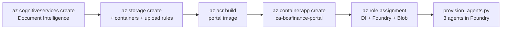

# 05 · Provision & deploy (step by step)

Two parts: **(A)** run locally, **(B)** deploy to Azure. Everything goes in the same
resource group as the parent: `rg-finance-agenticai`.

## A · Run locally

### 0. Prerequisites
- Python 3.11+ and `az login` working (`DefaultAzureCredential`).
- Access to the Foundry project `financing` with role **Azure AI Developer**.

### 1. Virtual environment + deps
```powershell
cd bcafinance
python -m venv .venv
.\.venv\Scripts\Activate.ps1
pip install -r requirements.txt
```

### 2. Environment
```powershell
Copy-Item .env.example .env
```
Fill in at minimum:
- `FOUNDRY_PROJECT_ENDPOINT` (reuse the parent's `financing` endpoint)
- `FOUNDRY_MODEL=gpt-4o-mini`
- For the **DI modes** (A / A+): `DOC_INTELLIGENCE_ENDPOINT` (and optionally `DOC_INTELLIGENCE_KEY`).
- Leave `BLOB_ACCOUNT_URL` empty to use the local `config/review_rules.yaml`.

### 3. Samples + agents
```powershell
python scripts/generate_sample_invoices.py     # 20 invoices (PDF+PNG) into data/sample_invoices
az login
python scripts/provision_agents.py             # creates the 3 agents in Foundry, writes data/agents.json
```

### 4. Launch
```powershell
$env:PYTHONPATH="."
streamlit run app/portal/Home.py --server.port 8502
```
Open http://localhost:8502.

> **Offline check (no Azure):** `$env:PYTHONPATH="."; python scripts/smoke_offline.py`

## B · Deploy to Azure

Open [infra/azure-setup.ps1](../infra/azure-setup.ps1), edit the variables at the top
(`$ACA_ENV`, `$ACR`, storage name), then run it section-by-section. It:

1. Creates **Document Intelligence** (`FormRecognizer`, S0).
2. Creates a **Storage account** + `bca-invoices` and `bca-config` containers, and uploads
   `review_rules.yaml` to `bca-config`.
3. Builds & pushes the portal image with `az acr build`.
4. Creates the Container App `ca-bcafinance-portal` (system-assigned identity) in the
   **parent's** Container Apps environment, with all env vars set.
5. Assigns the managed identity roles on Document Intelligence, Foundry, and Blob.
6. Reminds you to run `python scripts/provision_agents.py` once.



### RBAC quick reference
```powershell
$PID = az containerapp show -n ca-bcafinance-portal -g rg-finance-agenticai --query identity.principalId -o tsv
az role assignment create --assignee $PID --role "Cognitive Services User"        --scope <di-id>
az role assignment create --assignee $PID --role "Azure AI Developer"             --scope <foundry-id>
az role assignment create --assignee $PID --role "Cognitive Services User"        --scope <foundry-id>
az role assignment create --assignee $PID --role "Storage Blob Data Contributor"  --scope <storage-id>
```

Next → [06 · Code walkthrough](06-code-walkthrough.md)
