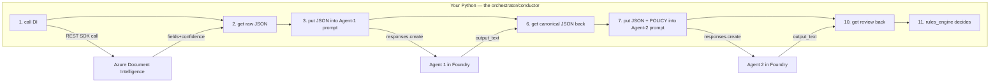
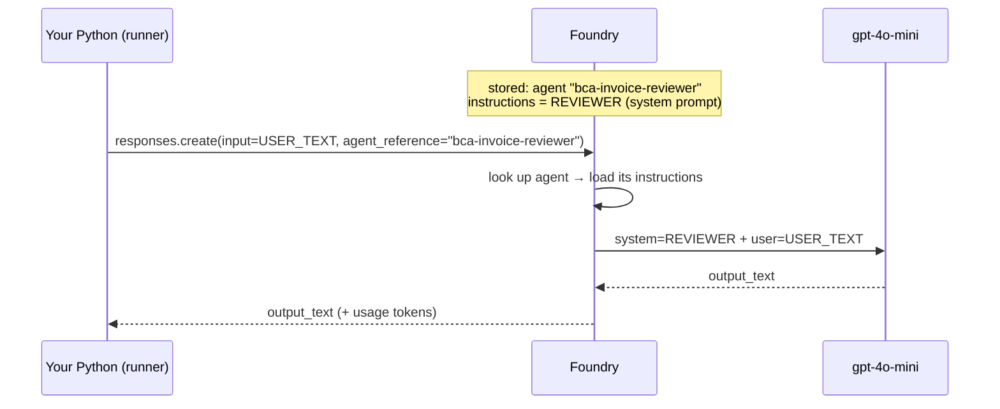

# 06 · Code walkthrough — following one request

We trace a single click of **"Jalankan Review"** through the code.

## ⚠️ First, clear up the #1 confusion: the agent does NOT call Document Intelligence

A natural assumption is *"Agent 1 calls Document Intelligence (DI)."* **It does not.**

- **Your Python orchestration** ([invoice_review_workflow.py](../app/workflows/invoice_review_workflow.py))
  is the **conductor**. It calls DI directly (a normal REST SDK call), gets back raw JSON,
  and then **passes that JSON as text into Agent 1's prompt**.
- **Agent 1** never touches DI. It only receives text (the DI JSON) and its job is to
  *normalize* that text into the clean canonical schema.
- These agents have **no tools attached** in Foundry — so they literally *cannot* call DI
  or anything else. They are pure "text in → text out" reasoners.

Think of it as: **conductor (Python) operates the scanner (DI), then hands the scan to the
musician (Agent 1).** The musician doesn't operate the scanner.



For **Option B (multimodal)** there is no DI at all — Python sends the **image itself**
inside Agent 1's request, and the vision model reads it. Steps 1–2 above are skipped.

## 1. UI captures input
[app/portal/views/1_Invoice_Review.py](../app/portal/views/1_Invoice_Review.py)
- Radio picks `mode = DOC_INTELLIGENCE | MULTIMODAL`.
- File uploader or sample picker gives `image_bytes`, `source_name`, `mime`.
- On run, it calls `run_invoice_review(...)` via `run_async` and streams events to the
  live flow (`flow_viz.render_flow_html`) and the log box.

## 2. Orchestration — where the whole flow lives
[app/workflows/invoice_review_workflow.py](../app/workflows/invoice_review_workflow.py) →
`run_invoice_review(...)`. **This function IS the orchestration.** There is no framework
"magic" — it is plain Python that calls things in order. Annotated:

```python
with foundry_session(request_id) as (runner, cost):   # opens 1 Foundry client + cost meter

    # ===== STAGE 1: EXTRACTION =====
    if mode == DOC_INTELLIGENCE:                       # -------- OPTION A --------
        raw = doc_intelligence.analyze_invoice(image_bytes)   # (A1) PYTHON calls DI
        extract_text = runner.run(                            # (A2) send DI JSON to Agent 1
            agent_key="bca-invoice-extractor-di",
            prompt="Hasil OCR ...: " + json.dumps(raw) + "\nNormalisasi ke skema kanonik.")
    else:                                              # -------- OPTION B --------
        extract_text = runner.run_vision(                     # (B1) send IMAGE to Agent 1
            agent_key="bca-invoice-extractor-vision",
            prompt="Baca faktur pada gambar ...", image_bytes=image_bytes, mime=mime)

    extraction = _to_extraction(parse_json(extract_text))  # parse Agent-1 JSON → pydantic

    # ===== load the current policy FRESH (hot-reload) =====
    rules = rules_engine.load_rules(runner.tech)

    # ===== STAGE 2: REVIEW =====
    review_text = runner.run(                               # send extraction + POLICY to Agent 2
        agent_key="bca-invoice-reviewer",
        prompt="DATA FAKTUR (JSON): " + extraction.model_dump_json()
               + "\n\n" + rules_engine.policy_block(rules))
    review = _to_review(parse_json(review_text))

    # ===== STAGE 3: BINDING DECISION (no LLM) =====
    policy = rules_engine.evaluate(extraction, rules)      # pure Python → APPROVE/REFER/REJECT
```

So the **order of who-does-what** for Option A is:

| # | Actor | Action |
|---|-------|--------|
| A1 | **Python** (`doc_intelligence.py`) | REST call to **Document Intelligence** → raw fields |
| A2 | **Python** → **Agent 1** (Foundry) | send raw JSON as prompt; agent returns clean JSON |
| — | **Python** (`rules_engine.load_rules`) | read `review_rules.yaml` fresh |
| S2 | **Python** → **Agent 2** (Foundry) | send clean JSON + POLICY block; agent returns review |
| S3 | **Python** (`rules_engine.evaluate`) | compute the binding decision |

Governance is recorded at each step (`audit.record`, `cost.add`, `runner.tech.append`).

## 2b. Mode A+ (DI agentic) — the agent calls DI itself

This is the genuinely agentic path. The orchestrator does **not** call DI. Instead:

```python
elif mode == DOC_INTELLIGENCE_AGENTIC:
    image_id = tools_client.upload_image(image_bytes)      # Python pre-uploads image -> id
    extract_text = runner.run(
        agent_key="bca-invoice-extractor-di-agentic",       # this agent HAS the analyze_invoice tool
        prompt=f'Ekstrak faktur ini. image_id="{image_id}". '
               f'Panggil tool analyze_invoice, lalu normalisasi.')
```

What happens on the wire:
1. Python uploads the image to [tools_service/server.py](../tools_service/server.py) `POST /images` → gets an `image_id`.
2. Python calls the agent with just that `image_id` (no DI call, no image inline).
3. **Foundry runs the agent**, which decides to call its attached tool `analyze_invoice({image_id})`.
4. Foundry invokes the tool **server-side** → the tools service runs Document Intelligence → returns fields.
5. The agent reasons over the fields and returns canonical JSON.

The tool is attached at provisioning time in [scripts/provision_agents.py](../scripts/provision_agents.py)
via `OpenApiTool(OpenApiFunctionDefinition(spec=<tools /openapi.json>))`. So in this mode
the "who calls DI" answer flips to: **the agent does.**

## 3. The runner — how Python actually invokes a Foundry agent
[app/agents/shared/foundry_runner.py](../app/agents/shared/foundry_runner.py)

`runner.run(...)` makes exactly one HTTP call:
```python
response = self.openai.responses.create(
    input=prompt,                                          # <-- the ONLY thing you send: user text
    extra_body={"agent_reference": {"name": agent_name,   # <-- which Foundry agent to run
                                    "type": "agent_reference"}},
)
text = response.output_text                                # the agent's answer
```
`run_vision(...)` is identical except `input` is a list containing an `input_text` part
**and** an `input_image` part (a base64 `data:` URL) — that's how the image reaches the
vision model. Both then read `response.usage` for tokens, add to `CostTracker`, append to
the technical log, and write an audit row. **No `Agent` object is built in code** — the
agent already exists in Foundry; we only reference it by `name`.

## 4. Extraction tool (Option A)
[app/tools/doc_intelligence.py](../app/tools/doc_intelligence.py)
- Calls `prebuilt-invoice`, maps DI field names (`InvoiceId`, `InvoiceTotal`, …) to the
  canonical keys, and keeps per-field `confidence`.

## 5. Config-driven rules
[app/review/rules_engine.py](../app/review/rules_engine.py)
- `load_rules()` reads Blob first (if configured) else `config/review_rules.yaml`,
  **fresh every call** (no cache) → genuine hot-reload.
- `policy_block(rules)` renders the current thresholds into a text block that is injected
  into the reviewer prompt.
- `evaluate(extraction, rules)` computes the **binding** decision:
  - over `max_facility_idr` or over `max_tenor_days` → `REJECT`
  - missing required fields / low confidence / math mismatch → `REFER`
  - otherwise → `APPROVE`

## 6. How does the agent "read" its system prompt?

This is the second common confusion. **The system prompt is NOT sent from your code on
each call.** It lives *inside Foundry*, attached to the named agent. Two phases:

**Phase 1 — provisioning (once):**
[scripts/provision_agents.py](../scripts/provision_agents.py) reads the instruction strings
from [app/agents/invoice/agents.py](../app/agents/invoice/agents.py) (`EXTRACTOR_DI`,
`EXTRACTOR_VISION`, `REVIEWER`) and uploads them:
```python
project.agents.create_version(
    agent_name="bca-invoice-reviewer",
    definition=PromptAgentDefinition(model="gpt-4o-mini", instructions=REVIEWER),
)                                   #        ^^^^^^^^^^^^ THIS is the system prompt, stored in Foundry
```
Now Foundry holds a persistent agent named `bca-invoice-reviewer` whose system prompt =
the `REVIEWER` text.

**Phase 2 — runtime (every request):**
When `runner.run(agent_key="bca-invoice-reviewer", prompt=...)` fires, Foundry:
1. receives your request with `agent_reference.name = "bca-invoice-reviewer"` and your `input`;
2. **looks up that agent** and retrieves its stored `instructions` (the system prompt);
3. runs the model as `[system: REVIEWER instructions] + [user: your input]`;
4. returns `output_text`.

So your code sends **only the user input** (the DI JSON, or the image, or the extraction +
POLICY). The role/system prompt is added **server-side by Foundry**. That's why changing
the role means re-running provisioning (new version), while changing *policy numbers* does
not — those ride along in the user input via the injected POLICY block (see doc 07).



## 7. Governance & models
- [app/core/models.py](../app/core/models.py): `InvoiceExtraction`, `ReviewResult`, `PolicyDecision`.
- [app/governance/*](../app/governance): audit (SQLite), cost (tokens/USD), technical log.

## Data contract (the canonical JSON)

Both extractors emit the same schema, so the reviewer and rules engine don't care which
option produced it:
```json
{ "invoice_number": "...", "issue_date": "YYYY-MM-DD", "due_date": "YYYY-MM-DD",
  "seller": {"name":"...","account":"..."}, "buyer": {"name":"...","npwp":"..."},
  "subtotal_idr": 0, "tax_idr": 0, "total_amount_idr": 0, "po_number": "",
  "confidence": {"total_amount_idr": 0.99} }
```

Next → [07 · Config hot-reload](07-config-hot-reload.md)
