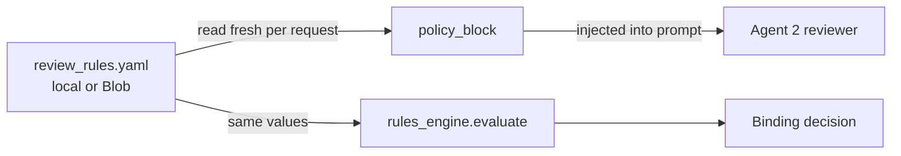

# 07 · Config hot-reload — change the review "on the fly"

A common question: *"Isn't the policy just in the agent's system prompt?"* — Yes and no.
There are **two layers**, and separating them is what makes on-the-fly changes possible.

## The two layers

| Layer | Where it lives | How to change it | Speed |
|-------|----------------|------------------|-------|
| **1 · Role & output schema** ("you are the reviewer… return this JSON") | Baked into the **Foundry agent version** | Edit `app/agents/invoice/agents.py` → re-run `provision_agents.py` (new version) | ❌ Slow (re-provision) |
| **2 · Policy parameters** (limits, advance rate, tenor, required fields, guidance) | External **config** ([config/review_rules.yaml](../config/review_rules.yaml) or Blob) | Edit the value | ✅ Instant (next request) |

The agent's stable instruction says: *"apply the POLICY block provided in the input."*
The workflow reads the config **fresh every request** and injects the current values:



So **both** the reviewer's narrative and the deterministic decision react to a config
edit — with **no redeploy and no re-provisioning**.

## The config file

[config/review_rules.yaml](../config/review_rules.yaml):
```yaml
policy:
  max_facility_idr: 1000000000
  advance_rate: 0.80
  max_tenor_days: 180
  min_confidence: 0.75
required_fields: [invoice_number, issue_date, due_date, total_amount_idr,
                  seller_name, buyer_name, buyer_npwp]
reviewer_guidance: >
  Terapkan kebijakan anjak piutang BCA Finance ...
```

## Where the config lives

| Source | Local dev | Cloud |
|--------|-----------|-------|
| **Local YAML** (`config/review_rules.yaml`) | ✅ edit → instant | ❌ needs redeploy (baked in image) |
| **Blob** (`bca-config/review_rules.yaml`) | ✅ (if `BLOB_ACCOUNT_URL` set) | ✅ edit blob in portal → **instant, no redeploy** |
| **Azure App Configuration** *(optional)* | ✅ | ✅ + versioning/audit (enterprise) |

Precedence in [rules_engine.load_rules()](../app/review/rules_engine.py): **Blob → local
YAML → built-in defaults**. Nothing is cached, so every request picks up the latest.

## Demo: watch the decision flip

1. Run sample `INV-01-clean` → **APPROVE** (total under `max_facility_idr`).
2. Lower `max_facility_idr` in `review_rules.yaml` (local) — or edit the blob in cloud —
   to below that invoice's total.
3. Re-run the **same** invoice → now **REJECT**, with a matching reason — and you never
   restarted the app or touched the agent.

Next → [08 · Observability](08-observability.md)
