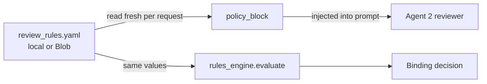

# 07 · Config hot-reload — change the review "on the fly"

A common question: *"Isn't the policy just in the agent's system prompt?"* — Yes and no.
There are **two layers**, and separating them is what makes on-the-fly changes possible.

## The two layers

| Layer | Where it lives | How to change it | Speed |
|-------|----------------|------------------|-------|
| **1 · Role & output schema** ("you are the reviewer… return this JSON") | Baked into the **Foundry agent version** | Edit `app/agents/invoice/agents.py` → re-run `provision_agents.py` (new version) | ❌ Slow (re-provision) |
| **2 · Policy parameters** (limits, advance rate, tenor, required fields, guidance) | External **config** ([config/review_rules.yaml](../config/review_rules.yaml) or Blob) | Edit the value | ✅ Instant (next request) |

The agent's stable instruction says: *"apply the POLICY block provided in the input."*
The workflow reads the config **fresh every request** and injects the current values:



So **both** the reviewer's narrative and the deterministic decision react to a config
edit — with **no redeploy and no re-provisioning**.

## Newbie deep-dive: is the YAML put in the agent's *system prompt*?

Short answer: **No.** A chat model gets two kinds of text:

- **System prompt (instructions)** — the agent's *fixed identity/role*. It lives inside the
  Foundry agent version. It does **not** change per request.
- **User message (input)** — the *fresh data* you send for this one request. This is where
  the YAML policy goes, re-built on **every** call.

Think of it like a form-checker at a bank:

> The **system prompt** is the checker's job description ("you check invoices against
> whatever policy sheet I hand you"). The **YAML → policy block** is the **policy sheet you
> hand them today**. Change the sheet → the very next invoice is checked against the new
> numbers. You never re-hire (re-provision) the checker.

### BEFORE injection — what's fixed (the system prompt, never changes per request)
This is baked into the agent in Foundry ([agents.py](../app/agents/invoice/agents.py) `REVIEWER`), shortened:

```text
Anda adalah Invoice Financing Reviewer di BCA Finance ...
Anda MENERIMA: (1) data faktur (JSON) dan (2) sebuah blok "POLICY" ...
TERAPKAN blok POLICY tersebut secara persis — jangan memakai nilai dari ingatan Anda.
... Kembalikan HANYA JSON dengan skema { data_sufficiency, policy_flags, ... }
```

Notice it says *"apply the POLICY block I give you"* — it has **no numbers of its own**.

### The message the code builds — the *template* (before values are filled in)
Every request the workflow assembles one **user message** like this
([invoice_review_workflow.py](../app/workflows/invoice_review_workflow.py)):

```text
DATA FAKTUR (JSON):
{ ...extracted invoice fields... }

{{ POLICY BLOCK — filled in from the YAML, fresh every request }}

Nilai kelengkapan data & kepatuhan; kembalikan JSON review.
```

### AFTER injection — the *real* message sent (YAML rendered into text)
`policy_block()` ([rules_engine.py](../app/review/rules_engine.py)) turns the YAML values
into this exact text, which replaces the placeholder above:

```text
POLICY (berlaku saat ini — patuhi persis):
- Batas fasilitas maksimal: Rp 1.000.000.000
- Advance rate: 80% dari nilai faktur
- Tenor maksimal (issue->due): 180 hari
- Keyakinan minimal per field: 0.75
- Field wajib: invoice_number. issue_date. due_date. total_amount_idr. seller_name. buyer_name. buyer_npwp
PANDUAN: Terapkan kebijakan anjak piutang BCA Finance sesuai norma OJK/BI.
```

Those numbers came **straight from the YAML** — `max_facility_idr: 1000000000` became
`Rp 1.000.000.000`, `advance_rate: 0.80` became `80%`, and so on.

### Now change ONE value → see the "after" change
Edit the YAML: `advance_rate: 0.80` → `0.70`, `max_tenor_days: 180` → `120`. Save. On the
**next** request (no restart), the injected block becomes:

```diff
  POLICY (berlaku saat ini — patuhi persis):
  - Batas fasilitas maksimal: Rp 1.000.000.000
- - Advance rate: 80% dari nilai faktur
+ - Advance rate: 70% dari nilai faktur
- - Tenor maksimal (issue->due): 180 hari
+ - Tenor maksimal (issue->due): 120 hari
  - Keyakinan minimal per field: 0.75
```

The reviewer agent now narrates against 70% / 120 days, **and** the deterministic rules
engine (which reads the *same* YAML) enforces them. Two effects, one edit, zero redeploys.

> 🔑 Key point for beginners: the YAML is **not** hidden config the model memorised. It is
> **plain text appended to the user message on every call**. That's exactly why editing it
> takes effect immediately — the model literally reads new text next time.

## The config file

[config/review_rules.yaml](../config/review_rules.yaml):
```yaml
policy:
  max_facility_idr: 1000000000
  advance_rate: 0.80
  max_tenor_days: 180
  min_confidence: 0.75
required_fields: [invoice_number, issue_date, due_date, total_amount_idr,
                  seller_name, buyer_name, buyer_npwp]
reviewer_guidance: >
  Terapkan kebijakan anjak piutang BCA Finance ...
```

## Where the config lives

| Source | Local dev | Cloud |
|--------|-----------|-------|
| **Local YAML** (`config/review_rules.yaml`) | ✅ edit → instant | ❌ needs redeploy (baked in image) |
| **Blob** (`bca-config/review_rules.yaml`) | ✅ (if `BLOB_ACCOUNT_URL` set) | ✅ edit blob in portal → **instant, no redeploy** |
| **Azure App Configuration** *(optional)* | ✅ | ✅ + versioning/audit (enterprise) |

Precedence in [rules_engine.load_rules()](../app/review/rules_engine.py): **Blob → local
YAML → built-in defaults**. Nothing is cached, so every request picks up the latest.

## Demo: watch the decision flip

1. Run sample `INV-01-clean` → **APPROVE** (total under `max_facility_idr`).
2. Lower `max_facility_idr` in `review_rules.yaml` (local) — or edit the blob in cloud —
   to below that invoice's total.
3. Re-run the **same** invoice → now **REJECT**, with a matching reason — and you never
   restarted the app or touched the agent.

Next → [08 · Observability](08-observability.md)
