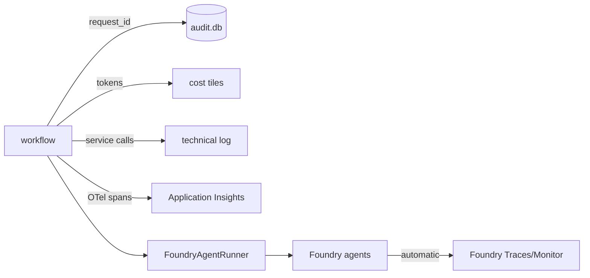

# 08 · Observability — logs in code + Foundry Traces

You get **two complementary views** of every run, correlated by `request_id`
(e.g. `BCA-1a2b3c4d`).

## 1 · In-code governance & telemetry

| What | Where | Shown in portal |
|------|-------|-----------------|
| **Audit trail** (every step + decision) | SQLite `data/audit.db` via [audit_log.py](../app/governance/audit_log.py) | "🛡️ Audit & Biaya" tab + Governance page |
| **Token & cost** per request | [cost_tracker.py](../app/governance/cost_tracker.py) | metric tiles + budget bar |
| **Technical log** (real service calls) | [tech_log.py](../app/governance/tech_log.py) | "🔧 Log Teknis" tab |
| **OpenTelemetry** (traces/metrics/logs) | [otel_setup.py](../app/observability/otel_setup.py) | Application Insights / local Aspire |

Enable app telemetry by setting in `.env`:
```
ENABLE_INSTRUMENTATION=true
APPLICATIONINSIGHTS_CONNECTION_STRING=<from your App Insights>
# or, locally:
OTEL_EXPORTER_OTLP_ENDPOINT=http://localhost:4318
```
The local `docker-compose.yml` includes an **Aspire dashboard** (OTLP viewer).

## 2 · Foundry Traces (agent side)

Because the agents are **hosted in Foundry**, every `responses.create` call is recorded in
the Foundry project's **Traces / Monitor** tab automatically — prompts, latency, token
usage, and errors — with no extra code. Open the `financing` project in the Foundry portal.

## How they fit together



## What to look at when debugging

- **"Decision looks wrong"** → Audit tab: read the `final` row's decision + the technical
  log's `rules:evaluate` result; then check `config/review_rules.yaml`.
- **"Extraction is off"** → Extraction tab: check `confidence`; compare Option A vs B.
- **"Slow / expensive"** → cost tiles + technical log latency; Foundry Traces for the
  model-side breakdown.
- **"Agent error"** → the portal surfaces the exception; Foundry Traces show the failed call.

That's the full tour. Back to [docs index](README.md).
