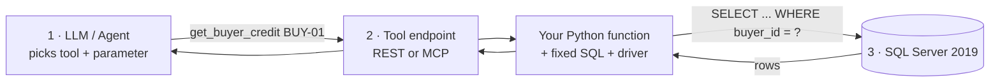
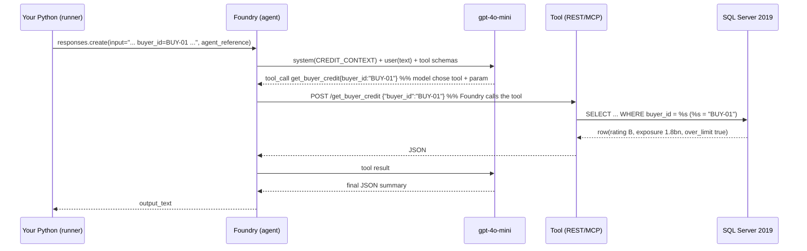
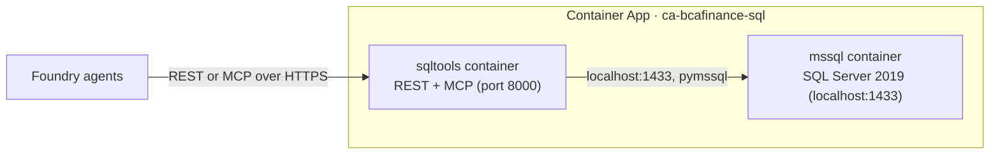

# 09 · Structured data from SQL Server — REST vs MCP (newbie guide)

This is the deep-dive you asked for: **how an AI agent reads structured data from a SQL
Server 2019 database**, how the **LLM gets parameters and passes them to a tool**, and the
**difference between REST and MCP** — with the real code and flows from this project.

> Everything here is **live and verified** in the deployed app. The database is a real
> **SQL Server 2019** engine, the same one BCA Finance runs on-prem.

---

## 1. Why structured data? (the business reason)

Reading one invoice (doc 01–08) tells you *what the invoice says*. But to actually decide
an **invoice-financing** (anjak piutang) advance, you need facts the image can't give you:

- Does the **client** (seller) have **facility headroom** left?
- Is the **buyer** (who must pay the invoice) **creditworthy**? Are we already **over-exposed** to them?
- Has this invoice **already been financed** (duplicate)?
- Is anyone on the **DTTOT/PPATK watchlist**?

Those facts live in a **relational database** (SQL Server). So the agent must **query SQL**.

---

## 2. The three actors (the whole idea in one picture)

The LLM **never writes SQL**. It only decides *which named tool* to call and *what
parameter* to pass. The SQL lives in code **you** wrote.



| Actor | Who writes it | What it does |
|-------|---------------|--------------|
| **1. LLM/agent** | Foundry (the model) | reads the task, **chooses** `get_buyer_credit`, fills `buyer_id="BUY-01"` |
| **2. Tool** (REST or MCP) | **you** | receives the call, runs a **fixed parameterized query** |
| **3. SQL Server** | DBA | executes the SELECT, returns rows |

---

## 3. How the LLM gets a parameter and passes it to a tool

This is the "function calling / tool calling" mechanic — the crux of your question.

### 3.1 What the agent *knows* about the tool
When we **provisioned** the agent, we attached a **tool schema** that describes each
callable operation and its parameters. For the REST agent it's an **OpenAPI** snippet
([scripts/provision_agents.py](../scripts/provision_agents.py) → `_build_sql_openapi`):

```json
"/get_buyer_credit": {
  "post": {
    "operationId": "get_buyer_credit",
    "requestBody": { "content": { "application/json": {
      "schema": { "type": "object",
        "properties": { "buyer_id": { "type": "string" } },
        "required": ["buyer_id"] } } } }
  }
}
```

So the model is told: *"there's a tool `get_buyer_credit`; it needs a string `buyer_id`."*
For the MCP agent the same thing is described by the `@mcp.tool()` function signature
`get_buyer_credit(buyer_id: str)` ([sql_service/mcp_server.py](../sql_service/mcp_server.py)).

### 3.2 Where the parameter *value* comes from
Two ways, both used here:

1. **From the task text (the model extracts it).** We send the agent a prompt like:
   ```
   client_id=CLI-01, buyer_id=BUY-01, invoice_no=INV-2026-1000,
   buyer_npwp=01.234.567.8-901.000. Panggil semua tool lalu rangkum.
   ```
   The model **reads** `buyer_id=BUY-01` out of that text and puts it into the tool call.
2. **From an upstream step (the workflow computes it).** The orchestrator can pass the ids
   it already knows (e.g. mapping the extracted invoice's seller/buyer → `CLI-01`/`BUY-01`).

Either way, the **model emits a structured tool call**, e.g.:
```json
{ "tool": "get_buyer_credit", "arguments": { "buyer_id": "BUY-01" } }
```

### 3.3 What happens on the wire (real trace)


Key: **you never parse the parameter yourself** — Foundry does the model↔tool round trip
server-side. You only (a) describe the tool at provisioning and (b) implement the function.

---

## 4. REST vs MCP — same SQL, two wrappers

Both wrappers call the **identical** function in [sql_service/queries.py](../sql_service/queries.py).
Only the "envelope" differs.

**The shared function (the SQL lives here — you wrote it):**
```python
# sql_service/queries.py
def get_buyer_credit(buyer_id: str) -> dict:
    row = _one(
        "SELECT b.buyer_id, b.internal_rating, b.credit_limit_idr, b.pd_pct, "
        "e.total_outstanding_idr FROM buyers b "
        "LEFT JOIN buyer_exposure e ON e.buyer_id = b.buyer_id "
        "WHERE b.buyer_id = %s", (buyer_id,))     # %s = safe parameter binding
    ...
    return row
```

**REST wrapper** ([sql_service/rest_app.py](../sql_service/rest_app.py)):
```python
@rest.post("/get_buyer_credit", operation_id="get_buyer_credit")
def _buyer(req: BuyerReq) -> dict:
    return queries.get_buyer_credit(req.buyer_id)   # same function
```

**MCP wrapper** ([sql_service/mcp_server.py](../sql_service/mcp_server.py)):
```python
@mcp.tool()
def get_buyer_credit(buyer_id: str) -> dict:
    return queries.get_buyer_credit(buyer_id)       # same function
```

| | REST / OpenAPI | MCP |
|---|----------------|-----|
| Protocol | plain HTTPS + OpenAPI spec | MCP (Streamable HTTP) |
| Foundry attaches it as | `OpenApiTool` | `MCPTool` |
| Tool schema comes from | hand-written OpenAPI 3.0.3 | the `@mcp.tool()` signature (auto) |
| Agent here | `bca-credit-context-rest` | `bca-credit-context-mcp` |
| Behind it | **same** `queries.py` → same SQL | **same** `queries.py` → same SQL |
| Enterprise fit | universal, easy behind APIM | agent-native, self-describing |

Both agents were verified returning identical data — see [scripts/test_credit.py](../scripts/test_credit.py).

---

## 5. The SQL layer — safe by construction

- **Read-only, parameterized** (`%s` bound values) → no SQL injection, no LLM-written SQL.
- The model can only pick from **5 named tools**; it cannot run arbitrary queries.
- Connection ([sql_service/db.py](../sql_service/db.py)) uses **pymssql** to reach the
  SQL Server 2019 engine. (The Microsoft driver equivalent is `pyodbc` +
  `ODBC Driver 18 for SQL Server`; placeholder becomes `?` instead of `%s`.)

```python
# sql_service/db.py — the ONE thing that changes for on-prem
import pymssql
def connect(database="bcacredit"):
    return pymssql.connect(server=SQL_HOST, port=SQL_PORT, user=SQL_USER,
                           password=SQL_PASSWORD, database=database, as_dict=True)
```

---

## 6. Where the database runs (and why not Azure SQL)

We wanted **Azure SQL Database Free**, but the subscription's **MCAPS policy** forces the
server's public network access **off** and reverts any attempt to enable it — and our
Container Apps environment has no VNet, so the app could never reach it. (Details: the
policy `AzureSQL_WithoutAzureADOnlyAuthentication_Deny` + public-access deny.)

So the database runs as **SQL Server 2019 in a container**, as a **sidecar** next to the
tools service, inside the existing Container Apps environment:



Why this is good: it's the **real SQL Server 2019 engine** (identical to on-prem), reached
over the **internal** network (no public-access policy fight), and **lowest cost**
(scale-to-zero possible). **On-prem swap = change `SQL_HOST`** to the on-prem instance
(via VPN/ExpressRoute or an APIM self-hosted gateway) — the query code doesn't change.

---

## 7. The data model (seeded, aligned to the 20 invoices)

[sql_service/seed.py](../sql_service/seed.py) creates + seeds these tables (idempotent on
startup). Sellers = the invoice `VendorName`s; buyers = the invoice `CustomerName`s.

| Table | Enriches the decision because… |
|-------|-------------------------------|
| `clients` (sellers) | who we finance + KYC tier |
| `facilities` | headroom: does the advance even fit the limit? |
| `buyers` (debtors) | **the payer's** rating / credit limit / PD |
| `buyer_exposure` | are we **over-exposed** to this buyer? |
| `payment_behaviour` | do they pay on time? disputes? |
| `invoice_history` | **duplicate** detection (incl. `INV-2026-1000`) |
| `watchlist` | DTTOT/PPATK sanctions by NPWP |

Deliberate demo scenarios: `BUY-01` is **over its credit limit** (1.8bn > 1.5bn);
`INV-2026-1000/CLI-01` is a **duplicate**; `BUY-05`'s NPWP is on the **DTTOT watchlist**.

---

## 8. Try it

```powershell
# REST (what the OpenAPI-tool agent calls):
$u = "https://ca-bcafinance-sql.<env>.azurecontainerapps.io"
Invoke-RestMethod "$u/get_buyer_credit" -Method Post -ContentType application/json `
  -Body '{"buyer_id":"BUY-01"}'          # -> over_credit_limit: true

# Both agents (REST tool + MCP tool) end-to-end:
$env:PYTHONPATH="."; python scripts/test_credit.py
```

Next: this enrichment feeds the reviewer + the deterministic rules so a duplicate or an
over-exposed buyer flips APPROVE → REFER — a decision the invoice image alone can't make.

Back to [docs index](README.md).
