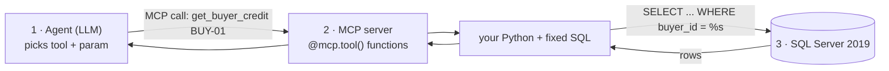
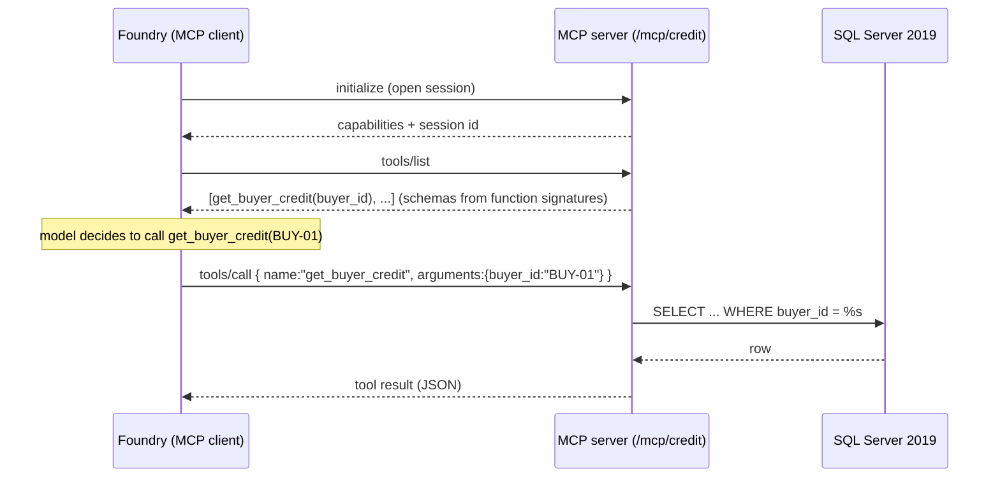

# 10 · MCP deep-dive — what, why, how, connect, and the code (newbie)

Read this once and you'll understand **Model Context Protocol (MCP)** end-to-end: what it
is, why it exists, **how an agent connects to an MCP server**, **how you define MCP tools**,
and **what the code looks like** — using the real `bca-credit-context-mcp` agent + SQL
Server in this project.

> Companion: [09 · Structured data (REST vs MCP)](09-sql-structured-data.md) shows the same
> queries exposed as REST. This doc zooms into the **MCP** half.

---

## 1. What is MCP? (plain definition)

**MCP (Model Context Protocol)** is an **open standard** that lets an AI agent discover and
call **tools** on a server in a uniform way. Think of it as **"USB-C for AI tools"**: any
MCP-speaking agent can plug into any MCP server and immediately see its tools, their
parameters, and call them — without custom glue per tool.

- An **MCP server** = a program that **exposes tools** (functions the agent can call).
- An **MCP client** = the agent runtime (here, **Microsoft Foundry**) that **connects** to
  the server, **lists** its tools, and **invokes** them on the model's behalf.

In this project the MCP server exposes 5 credit-lookup tools that run SQL on **SQL Server 2019**.

---

## 2. Why MCP? (and why not just REST)

Both MCP and REST are just HTTPS underneath. The difference is **who describes the tools**
and **how the agent discovers them**.

| Aspect | REST / OpenAPI | **MCP** |
|--------|----------------|---------|
| Tool description | you hand-write an OpenAPI spec | **auto** from the `@mcp.tool()` function signature |
| Discovery | agent is given the static spec | agent **asks the server** "list your tools" at runtime |
| Standard | generic HTTP | purpose-built for **agent ↔ tool** |
| Add a tool | edit spec + endpoint | just add one `@mcp.tool()` function |
| Streaming / sessions | not native | **built-in** (Streamable HTTP + sessions) |
| Best when | fronting behind APIM, existing APIs | agent-native tools, many tools, rapid iteration |

Rule of thumb: **REST** for existing enterprise APIs behind a gateway; **MCP** when you're
building tools *for agents* and want self-describing, low-boilerplate tools.

---

## 3. The three actors (same as REST — the agent never writes SQL)



---

## 4. How MCP **connects** (the transport + handshake) — TABLE

MCP can run over **stdio** (local subprocess) or **Streamable HTTP** (network). Foundry (a
cloud agent) uses **Streamable HTTP**. Here is exactly how the connection works in this project:

| # | Connection detail | Value / how it works in this project |
|---|-------------------|--------------------------------------|
| 1 | **Transport** | Streamable HTTP (HTTP POST + optional SSE stream) |
| 2 | **Server URL** | `https://ca-bcafinance-sql.<env>.azurecontainerapps.io/mcp/credit/` |
| 3 | **Who hosts it** | the `sqltools` container (FastMCP mounted in a Starlette app) |
| 4 | **Who connects (client)** | Microsoft Foundry, when the agent runs |
| 5 | **How Foundry is told the URL** | an `MCPTool(server_url=…)` attached at **provisioning** |
| 6 | **Handshake** | client `initialize` → server returns capabilities → client `tools/list` → gets tool schemas |
| 7 | **Session** | a session id is established; managed by `mcp.session_manager` (started in the app lifespan) |
| 8 | **Tool call** | client sends `tools/call {name, arguments}` → server runs the function → returns JSON |
| 9 | **Auth** | anonymous here (demo). Production: put it behind APIM / a token, or use MCP auth |
| 10 | **DNS-rebinding guard** | disabled here (`enable_dns_rebinding_protection=False`) so Foundry can reach it |

So "how MCP connects" = **Foundry opens a Streamable-HTTP session to the server URL,
asks it to list tools, then calls a tool by name with JSON arguments.**



---

## 5. How you **DEFINE** an MCP server + tools — TABLE + code

You define an MCP server in ~3 lines and each tool is **one decorated function**. The tool's
**name, parameters, and description are inferred** from the function.

| To define… | You write… | Becomes… |
|------------|------------|----------|
| the **server** | `FastMCP("bca-credit", stateless_http=True, streamable_http_path="/")` | an MCP server object |
| a **tool** | a function decorated `@mcp.tool()` | a callable tool the agent can list & invoke |
| the tool **name** | the function name (`get_buyer_credit`) | the MCP tool name |
| the tool **parameters** | the function args + type hints (`buyer_id: str`) | the input schema |
| the tool **description** | the function docstring | shown to the model to help it choose |
| the tool **result** | whatever the function `return`s (a dict) | the JSON the agent receives |

**The real code** ([sql_service/mcp_server.py](../sql_service/mcp_server.py)):
```python
from mcp.server.fastmcp import FastMCP
from mcp.server.transport_security import TransportSecuritySettings
from sql_service import queries

mcp = FastMCP(                                   # (1) define the server
    "bca-credit", stateless_http=True, streamable_http_path="/",
    transport_security=TransportSecuritySettings(enable_dns_rebinding_protection=False))

@mcp.tool()                                      # (2) define a tool = one function
def get_buyer_credit(buyer_id: str) -> dict:     #     name + params + result inferred
    """Get a buyer's credit rating, credit limit, PD and our exposure."""  # description
    return queries.get_buyer_credit(buyer_id)    # (3) run the fixed parameterized SQL
```

That's it — the model now sees a tool `get_buyer_credit(buyer_id: string)` with that
description, and can call it. Adding a 6th tool = add one more decorated function.

---

## 6. What's inside the code (how the server is hosted + mounted)

The MCP server is mounted into one ASGI app alongside REST, and its **session manager** is
started in the app **lifespan** ([sql_service/server.py](../sql_service/server.py)):

```python
from sql_service.mcp_server import mcp as credit_mcp
_credit_app = credit_mcp.streamable_http_app()          # build the Streamable-HTTP sub-app

@contextlib.asynccontextmanager
async def _lifespan(app):
    async with contextlib.AsyncExitStack() as stack:
        await stack.enter_async_context(credit_mcp.session_manager.run())  # <-- required!
        yield

app = Starlette(routes=[
    Route("/health", _health),
    Mount("/mcp/credit", app=_credit_app),              # <-- MCP lives here
    Mount("/", app=rest_app),                           # <-- REST lives at root
], lifespan=_lifespan)
```

| File | Role |
|------|------|
| [sql_service/mcp_server.py](../sql_service/mcp_server.py) | defines the MCP server + 5 tools |
| [sql_service/queries.py](../sql_service/queries.py) | the fixed parameterized SQL (shared with REST) |
| [sql_service/db.py](../sql_service/db.py) | connects to SQL Server 2019 (pymssql) |
| [sql_service/server.py](../sql_service/server.py) | mounts MCP at `/mcp/credit`, runs the session manager |

> **Gotcha #1:** you *must* run `mcp.session_manager.run()` in the app lifespan, or the
> mounted MCP app returns errors. **Gotcha #2:** disable DNS-rebinding protection for a
> cloud client, or the connection is refused.

---

## 7. How the **agent** connects to it (the client side)

Foundry becomes the MCP client when you attach an **`MCPTool`** to the agent at provisioning
([scripts/provision_agents.py](../scripts/provision_agents.py)):

```python
from azure.ai.projects.models import MCPTool
sql_mcp_tool = MCPTool(server_label="bca_credit",
                       server_url=f"{base}/mcp/credit/",   # the Streamable-HTTP URL
                       require_approval="never")
project.agents.create_version(
    agent_name="bca-credit-context-mcp",
    definition=PromptAgentDefinition(model=model, instructions=CREDIT_CONTEXT,
                                     tools=[sql_mcp_tool]))   # <-- attach the MCP tool
```

Now when the agent runs, **Foundry** opens the MCP session, lists the tools, and calls them —
you write **no client code**. (Compare: the REST agent gets an `OpenApiTool` instead.)

---

## 8. Minimal MCP server skeleton (copy-paste starter)

The smallest working Streamable-HTTP MCP server you can host and attach to Foundry:

```python
# my_mcp.py
from mcp.server.fastmcp import FastMCP
from mcp.server.transport_security import TransportSecuritySettings

mcp = FastMCP("my-tools", stateless_http=True, streamable_http_path="/",
              transport_security=TransportSecuritySettings(enable_dns_rebinding_protection=False))

@mcp.tool()
def add(a: int, b: int) -> dict:
    """Add two numbers."""
    return {"sum": a + b}

app = mcp.streamable_http_app()     # ASGI app; serve with: uvicorn my_mcp:app --port 8000
```
Then attach it: `MCPTool(server_label="my_tools", server_url="https://…/", require_approval="never")`.
For **multiple** MCP servers or MCP+REST in one app, use the Starlette `Mount` + lifespan
pattern from §6.

---

## 9. Troubleshooting — TABLE

| Symptom | Likely cause | Fix |
|---------|--------------|-----|
| Agent call hangs / no tools | session manager not started | run `mcp.session_manager.run()` in lifespan (§6) |
| Connection refused from Foundry | DNS-rebinding protection on | `TransportSecuritySettings(enable_dns_rebinding_protection=False)` |
| 404 at the MCP URL | wrong mount path / missing trailing slash | use `.../mcp/credit/` (trailing slash) |
| Tool not listed | function not decorated | add `@mcp.tool()` and a type-hinted signature |
| Empty/odd results | SQL/connection issue | check `sql_service/db.py` env + SQL Server logs |
| "Invalid OpenAPI spec" | that's the **REST** path, not MCP | MCP has no OpenAPI; see doc 09 for the REST 3.0.3 fix |

---

## 10. Try it

```powershell
# Both credit agents (REST tool + MCP tool) end-to-end against SQL Server:
$env:PYTHONPATH="."; python scripts/test_credit.py
```
In the portal, choose **🟢 MCP tool → SQL** in step 3, run a review, and open **Log Teknis**:
you'll see `foundry:credit-context-mcp` — proof the agent reached SQL Server **via MCP**.

Compare with **🔵 REST tool → SQL** to see the identical data fetched over the other protocol.

Back to [docs index](README.md) · REST side: [doc 09](09-sql-structured-data.md).
