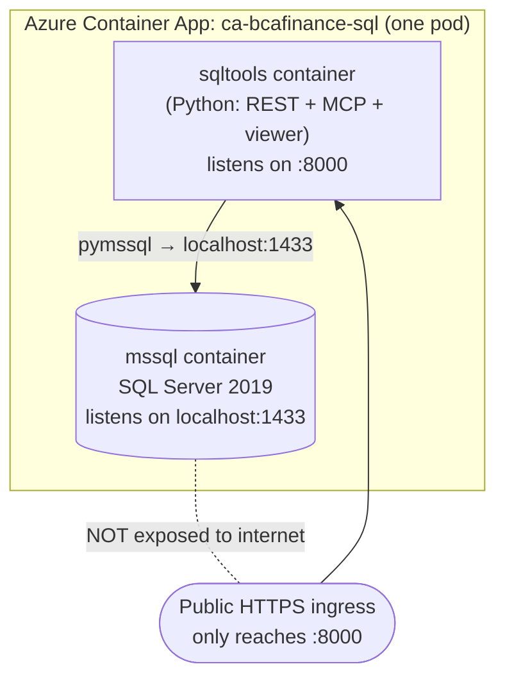
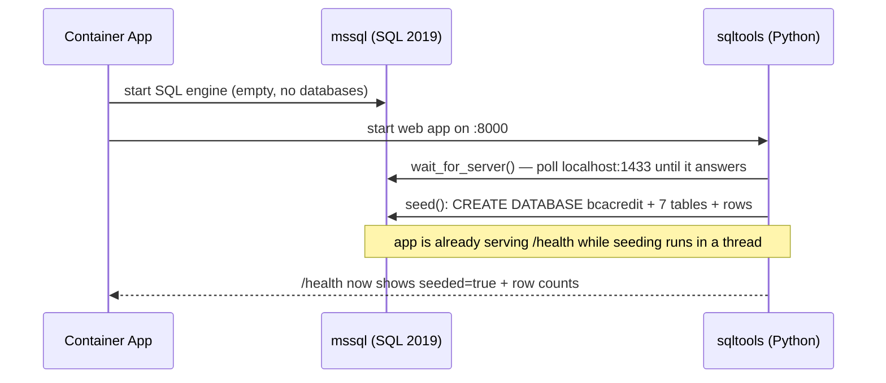

# 11 · The database inside the container — how it works, how to view it (newbie guide)

Doc 09 and 10 explained **how an agent reads** the SQL database (REST vs MCP). This doc
answers a different, very practical question:

> "The SQL Server runs *inside a container* — so **where is it**, **how does it work**,
> and **how do I actually open it and look at the tables**?"

Everything below is **live and verified** on the deployed app.

---

## 1. Where the database lives (the mental picture)

The credit-context service is **one Azure Container App** (`ca-bcafinance-sql`) that runs
**two containers side-by-side** in the same pod. Containers in the same app share
`localhost`, so they talk over `localhost:1433` with **no network hop and no public port**.



| Container | Image | Port | Reachable from internet? |
|-----------|-------|------|--------------------------|
| `sqltools` | `bcafinance-sql` (our Python) | `8000` | **Yes** — via HTTPS ingress |
| `mssql` | `mcr.microsoft.com/mssql/server:2019-latest` | `1433` | **No** — only `sqltools` (localhost) can reach it |

**Key takeaway:** you can **never connect SSMS / Azure Data Studio directly** to this
database over the internet — port 1433 has no public route. You reach the data **through
the `sqltools` container** (HTTP) or by **shelling into the pod**. Both are covered below.

---

## 2. How it works — the lifecycle (what happens on startup)

The `sqltools` container is the "brain"; the `mssql` container is a **blank SQL engine**
every time it starts. Here's the startup sequence
([sql_service/server.py](../sql_service/server.py) `_do_seed` + `_lifespan`):



Three consequences a newbie must internalise:

1. **The data is ephemeral (throw-away).** The `mssql` container has **no persistent
   disk** in this demo. Restart the app → the engine starts empty → `sqltools` **re-seeds**
   the same fixed demo rows. You never lose "important" data because there isn't any — it's
   a training dataset ([sql_service/seed.py](../sql_service/seed.py)).
2. **Seeding is idempotent.** `seed()` drops and recreates the `bcacredit` database, so you
   always get the exact same 5 clients / 5 buyers / etc. Re-running is safe.
3. **Startup is not instant.** SQL Server 2019 takes a few seconds to boot, so right after a
   restart `/health` may briefly show `seeded=false`. Wait ~10–30s.

### Scale-to-zero note (cost vs cold start)
Today `ca-bcafinance-sql` runs **min-replicas = 1** (always on) so the DB is instantly
available. If you set **min-replicas = 0** to save money, the whole pod shuts down when
idle; the **next request** cold-starts SQL Server **and** re-seeds (~30–60s). For a demo
that's usually fine — pick based on whether you want $0 idle or instant response.

---

## 3. Four ways to access / view the data

| # | Method | Who it's for | Sees |
|---|--------|--------------|------|
| A | **HTTP table viewer** `/admin/tables` | anyone, in a browser | **all** rows of all 7 tables (JSON) |
| B | **Health / row counts** `/health` | quick sanity check | table names + row counts |
| C | **The 5 REST lookups** | test a specific query the agent uses | one focused result |
| D | **Shell into the pod + `sqlcmd`** | "real DBA" raw SQL | anything (run any SELECT) |

Set this once in PowerShell (used by A–C):

```powershell
$sqlUrl = "https://ca-bcafinance-sql.delightfulisland-5bc416ad.eastus2.azurecontainerapps.io"
```

### Method A — HTTP table viewer (easiest, recommended)
A **read-only** endpoint that dumps every row of every table as JSON. It runs a fixed
`SELECT * FROM <table>` for the 7 known tables — **no user SQL is ever accepted**, so it
can't be abused ([sql_service/queries.py](../sql_service/queries.py) `dump_tables`).

Open it straight in a browser:

```
<your $sqlUrl>/admin/tables
```

Or from PowerShell (pretty-printed):

```powershell
$t = Invoke-RestMethod "$sqlUrl/admin/tables"
$t.tables.buyers | Format-Table          # look at just the buyers table
$t.tables.PSObject.Properties | ForEach-Object { "$($_.Name): $($_.Value.Count) rows" }
```

Response shape:

```json
{
  "database": "bcacredit",
  "tables": {
    "clients":  [ { "client_id": "CLI-01", "legal_name": "PT Maju Bersama", ... } ],
    "buyers":   [ { "buyer_id": "BUY-01", "credit_limit_idr": 1500000000, ... } ],
    "...": []
  }
}
```

### Method B — health / row counts (fastest check)
```powershell
Invoke-RestMethod "$sqlUrl/health"
# { status: ok, seeded: true, counts: { clients: 5, buyers: 5, invoice_history: 6, ... } }
```
Use this to confirm the DB finished seeding after a restart.

### Method C — the 5 REST lookups (what the agent actually calls)
These are the **same functions the agent uses** — great for testing one path
([sql_service/rest_app.py](../sql_service/rest_app.py)):

```powershell
Invoke-RestMethod "$sqlUrl/get_client_facility"  -Method Post -ContentType application/json -Body '{"client_id":"CLI-05"}'
Invoke-RestMethod "$sqlUrl/get_buyer_credit"     -Method Post -ContentType application/json -Body '{"buyer_id":"BUY-01"}'
Invoke-RestMethod "$sqlUrl/check_duplicate_invoice" -Method Post -ContentType application/json -Body '{"invoice_no":"INV-2026-1000","client_id":"CLI-01"}'
Invoke-RestMethod "$sqlUrl/check_watchlist"      -Method Post -ContentType application/json -Body '{"npwp":"05.678.901.2-345.000"}'
```

### Method D — shell into the pod and run raw SQL (`sqlcmd`)
For real "open the database and run any query" access, exec **into the `mssql`
container** and use the built-in `sqlcmd` client. Nothing leaves the pod — you're inside it.

**Step 1 — get the SA password** (stored as a Container App *secret*, never in git):
```powershell
az containerapp secret show -n ca-bcafinance-sql -g rg-finance-agenticai `
  --secret-name sa-password --query value -o tsv
```

**Step 2 — open an interactive shell in the `mssql` container:**
```powershell
az containerapp exec -n ca-bcafinance-sql -g rg-finance-agenticai --container mssql
```

**Step 3 — inside that shell, find and run `sqlcmd`** (the SQL 2019 image ships the client
under `/opt/mssql-tools/bin`; newer images use `/opt/mssql-tools18/bin` and need a `-C`
flag to trust the self-signed cert). Replace `<SA_PASSWORD>` with the value from step 1:

```bash
# list databases (you should see bcacredit)
/opt/mssql-tools/bin/sqlcmd -S localhost -U sa -P '<SA_PASSWORD>' \
  -Q "SELECT name FROM sys.databases"

# view a table
/opt/mssql-tools/bin/sqlcmd -S localhost -U sa -P '<SA_PASSWORD>' -d bcacredit \
  -Q "SELECT buyer_id, internal_rating, credit_limit_idr, pd_pct FROM buyers"

# interactive session (type GO to run, :quit to exit)
/opt/mssql-tools/bin/sqlcmd -S localhost -U sa -P '<SA_PASSWORD>' -d bcacredit
```

> If `/opt/mssql-tools/bin/sqlcmd` is not found, run `ls /opt` to locate it, and add `-C`
> if you use the `mssql-tools18` client (it enforces TLS by default).

### Reset the data (`/admin/reseed`)
Blew up your rows while experimenting? Reset to the pristine demo set without a restart:
```powershell
Invoke-RestMethod "$sqlUrl/admin/reseed" -Method Post
```

---

## 4. Schema reference (the 7 tables, with the real seeded rows)

Database name: **`bcacredit`**. Money columns are Indonesian Rupiah (`_idr`). These are the
exact rows the app seeds, tuned so the demo invoices trigger interesting decisions.

### `clients` — the sellers who ask for financing
| client_id | legal_name | npwp | sector | rm | kyc_risk |
|---|---|---|---|---|---|
| CLI-01 | PT Maju Bersama | 8820-1177-9043 | Energi Terbarukan | Budi Santoso | low |
| CLI-02 | PT Sinar Teknologi | 8811-2244-1090 | Teknologi | Sari Dewi | low |
| CLI-03 | CV Karya Mandiri | 8890-5533-2211 | Konstruksi | Andi Wijaya | medium |
| CLI-04 | PT Nusantara Logistik | 8802-7788-6655 | Logistik | Rina Putri | low |
| CLI-05 | PT Agro Sejahtera | 8877-1122-3344 | Agrikultur | Dewi Lestari | medium |

### `facilities` — each client's credit line (limit vs used)
| facility_id | client_id | facility_limit_idr | outstanding_idr | advance_rate | status |
|---|---|---|---|---|---|
| FAC-01 | CLI-01 | 1,000,000,000 | 800,000,000 | 0.80 | active |
| FAC-02 | CLI-02 | 3,000,000,000 | 1,200,000,000 | 0.80 | active |
| FAC-03 | CLI-03 | 500,000,000 | 450,000,000 | 0.75 | active |
| FAC-04 | CLI-04 | 2,000,000,000 | 300,000,000 | 0.80 | active |
| FAC-05 | CLI-05 | 1,500,000,000 | 1,450,000,000 | 0.80 | **suspended** |

*Headroom = limit − outstanding. CLI-03 has only 50M left; CLI-05 is nearly full **and**
suspended.*

### `buyers` — who must pay the invoice (the credit risk)
| buyer_id | legal_name | npwp | internal_rating | credit_limit_idr | pd_pct |
|---|---|---|---|---|---|
| BUY-01 | PT Karya Retail Nusantara | 01.234.567.8-901.000 | B | 1,500,000,000 | 4.0 |
| BUY-02 | PT Global Distribusi | 02.345.678.9-012.000 | A | 5,000,000,000 | 1.2 |
| BUY-03 | PT Prima Konstruksi | 03.456.789.0-123.000 | C | 800,000,000 | 9.5 |
| BUY-04 | PT Sentosa Manufaktur | 04.567.890.1-234.000 | B | 2,000,000,000 | 3.5 |
| BUY-05 | PT Bahari Niaga | 05.678.901.2-345.000 | D | 300,000,000 | 18.0 |

*`pd_pct` = probability of default. BUY-05 is rating D / 18% — the risky one.*

### `buyer_exposure` — how much we already lent against each buyer
| buyer_id | total_outstanding_idr | invoice_count |
|---|---|---|
| BUY-01 | **1,800,000,000** | 6 |
| BUY-02 | 900,000,000 | 3 |
| BUY-03 | 620,000,000 | 4 |
| BUY-04 | 400,000,000 | 2 |
| BUY-05 | 120,000,000 | 1 |

*BUY-01's exposure (1.8B) is **already above** its 1.5B limit → **over-exposed**.*

### `payment_behaviour` — how this buyer pays historically
| buyer_id | avg_days_to_pay | on_time_rate | disputes_12m |
|---|---|---|---|
| BUY-01 | 12 | 0.88 | 0 |
| BUY-02 | 4 | 0.98 | 0 |
| BUY-03 | 25 | 0.71 | 2 |
| BUY-04 | 9 | 0.93 | 0 |
| BUY-05 | 40 | 0.55 | 3 |

### `invoice_history` — already-seen invoices (for duplicate detection)
| invoice_no | client_id | buyer_id | amount_idr | status | dpd |
|---|---|---|---|---|---|
| **INV-2026-1000** | CLI-01 | BUY-01 | 109,179,600 | financed | 0 |
| INV-2026-0500 | CLI-01 | BUY-02 | 250,000,000 | paid | 0 |
| INV-2026-0611 | CLI-03 | BUY-03 | 180,000,000 | overdue | 12 |
| INV-2026-0722 | CLI-02 | BUY-04 | 420,000,000 | financed | 0 |
| INV-2026-0733 | CLI-04 | BUY-02 | 300,000,000 | paid | 0 |
| INV-2026-0810 | CLI-05 | BUY-05 | 120,000,000 | financed | 0 |

*Submitting **INV-2026-1000** for **CLI-01** again = a **duplicate** hit.*

### `watchlist` — sanctions / AML screening (DTTOT/PPATK)
| npwp | list_type | reason |
|---|---|---|
| 05.678.901.2-345.000 | DTTOT | Terduga pendanaan terlarang (contoh demo) |

*That NPWP belongs to **BUY-05** → any invoice with buyer BUY-05 trips the watchlist.*

### The three "traps" built into the data
| Scenario | How to trigger | Which lookup catches it |
|---|---|---|
| **Over-exposed buyer** | any invoice to **BUY-01** | `get_buyer_credit` → exposure 1.8B > limit 1.5B |
| **Duplicate invoice** | resubmit **INV-2026-1000 / CLI-01** | `check_duplicate_invoice` |
| **Watchlist hit** | any invoice to **BUY-05** (npwp `05.678...`) | `check_watchlist` |

---

## 5. Swapping in a real (on-prem or Azure) database

Nothing in the app code is tied to "a container." The connection is driven entirely by
environment variables ([sql_service/db.py](../sql_service/db.py)):

| Env var | Demo value | Point at your own DB |
|---|---|---|
| `SQL_HOST` | `localhost` | your server hostname / IP |
| `SQL_PORT` | `1433` | your port |
| `SQL_USER` / `SQL_PASSWORD` | `sa` / secret | your login (ideally a read-only account) |
| `SQL_DB` | `bcacredit` | your database name |

To use a **real** SQL Server:
1. Remove the `mssql` sidecar container.
2. Point `SQL_HOST` at the real server (and open network access from the Container App —
   e.g. VNet + private endpoint).
3. **Delete the seed step** from `_lifespan` (you don't seed someone else's production DB!).
4. Keep the 5 fixed queries in [queries.py](../sql_service/queries.py) — just make sure the
   column names match your schema.

> Driver note: this demo uses **`pymssql`** (FreeTDS, no OS driver install). If your
> environment standardises on the Microsoft ODBC driver, switch to **`pyodbc`** and change
> the parameter placeholder from `%s` to `?` — the SQL itself is identical.

---

## 6. Security notes (why this is safe for a demo)

- **No public SQL port.** Port 1433 is never exposed; only the `sqltools` HTTP app is.
- **No arbitrary SQL.** The agent and every endpoint call **fixed, parameterized**
  functions — the LLM supplies only a parameter, never a query string.
- **The viewer is read-only** and limited to a hard-coded list of 7 tables.
- **The SA password is a Container App secret**, injected via `secretRef`, kept out of git
  (the generated deployment YAML with the password is in `.gitignore`).
- For production you would additionally: use a **least-privilege read-only login** (not
  `sa`), enable **TLS**, and place the database behind a **private endpoint / VNet**.

---

**Next:** back to the [docs index](README.md), or re-read
[09 · Structured data: REST vs MCP](09-sql-structured-data.md) and
[10 · MCP deep-dive](10-mcp-deep-dive.md) now that you can see the data behind them.
