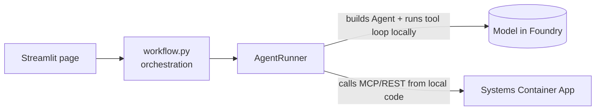
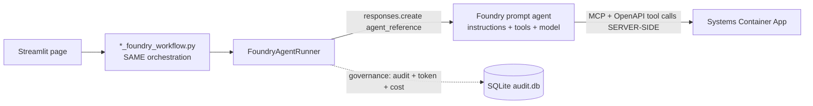
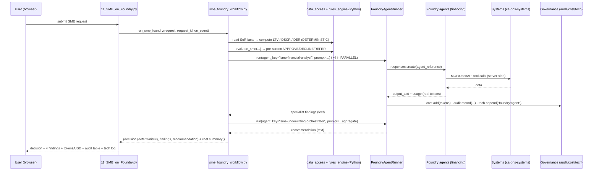

# 2 · Architecture & Flow (v2 — Foundry-hosted)

This mirrors [../docs/02-architecture-and-flow.md](../docs/02-architecture-and-flow.md) but shows the
**one boundary that moves** in v2: the agent + its tool-calling loop move **into Foundry**.

---

## Where the boundary moves

**v1** — the tool-calling loop runs **in your Python process**; the model is remote:



**v2** — you hand the task to a **hosted agent**; Foundry runs the tool loop and calls the systems:



Key point: in v2 your code **never** calls MCP/REST directly for reasoning steps — the **Foundry
agent** does, because the tools are attached to the agent (see
[doc 04](04-surrounding-systems-foundry.md)). Your code still calls the systems directly only for
**deterministic** facts (e.g. reading financials to compute DSCR) and for **A2A** (syndication).

---

## Layer map (v2)

| Layer | Files | Role |
|-------|-------|------|
| **UI** | [app/portal/views/11..18](../app/portal/views) | v2 pages; same live viz + governance panels as v1 |
| **Orchestration** | [app/workflows/*_foundry_workflow.py](../app/workflows) | order / parallel / loops / gates — **plain Python** |
| **Runner** | [app/agents/shared/foundry_runner.py](../app/agents/shared/foundry_runner.py) | calls Foundry agents by reference; records governance |
| **Agent registry** | [data/foundry_agents.json](../data/foundry_agents.json) | maps `agent_key` → Foundry agent name |
| **Agents (remote)** | Microsoft Foundry project `financing` | persistent prompt agents (instructions + tools + model) |
| **Deterministic rules** | [app/governance/rules_engine.py](../app/governance/rules_engine.py), [mock_services/policy.py](../mock_services/policy.py) | OJK/BI gates — **no LLM** |
| **Governance** | [audit_log.py](../app/governance/audit_log.py) · [cost_tracker.py](../app/governance/cost_tracker.py) · [tech_log.py](../app/governance/tech_log.py) | identical to v1 |
| **Systems** | [mock_services](../mock_services) on `ca-bns-systems` | REST + 3 MCP servers — called **by the Foundry agent** |
| **Observability** | [otel_setup.py](../app/observability/otel_setup.py) + Foundry Traces | app OTel → App Insights **and** Foundry's built-in monitor |

---

## End-to-end request trace (v2 SME example)

Follow one click of **"Jalankan Analisis (agen Foundry)"** on
[11_SME_on_Foundry.py](../app/portal/views/11_SME_on_Foundry.py):



The shape is the **same** as the v1 trace — only the "who runs the agent + tools" step changed
from `AgentRunner` (local) to `FoundryAgentRunner` → Foundry (remote).

---

## What stays deterministic (and why it matters)

Exactly as in v1, the **decision** in v2 is **not** taken by the LLM for regulated flows. Example
from [sme_foundry_workflow.py](../app/workflows/sme_foundry_workflow.py):

```python
pol = evaluate_sme(years_operating=..., ltv_ratio=ltv, dscr=dscr_val, ...)   # pure Python
...
audit.record(request_id, "sme", "final", "foundry:sme-underwriting-orchestrator",
             recommendation[:400], decision=pol["decision"], tokens=cost.total_tokens)
```

The Foundry orchestrator agent writes the **narrative recommendation**; the **binding decision**
(`APPROVE/DECLINE/REFER`) is the deterministic `pol["decision"]`. This keeps v2 auditable and
regulator-safe, and means the LLM (local or hosted) can never approve through a hard policy breach.

---

## Two things your code still calls directly

1. **Deterministic data reads** — `data_access` + `mock_services.data.load(...)` to compute ratios.
   These are facts, not reasoning, so they stay in Python.
2. **A2A (syndication only)** — [a2a_client.py](../app/tools/a2a_client.py) `a2a_send(...)` to the
   partner bank agent. That is agent-to-agent across organisations and is unchanged in v2
   (only the BNS-side Lead Arranger/Synthesizer moved to Foundry).

Next: [03-use-cases-foundry.md](03-use-cases-foundry.md) — the 8 use cases, v2 edition.
