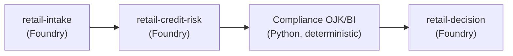
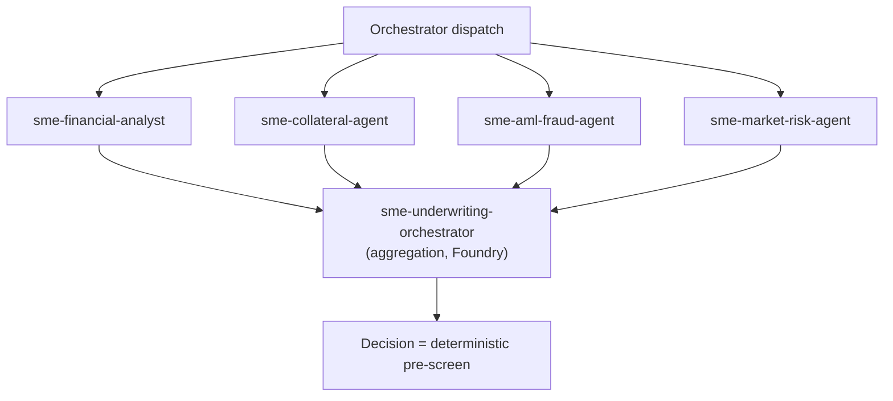
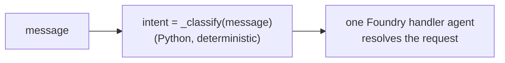
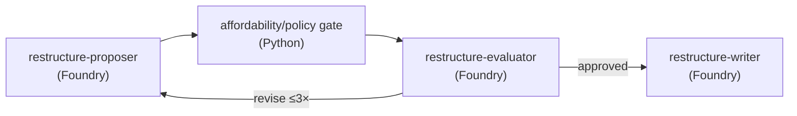
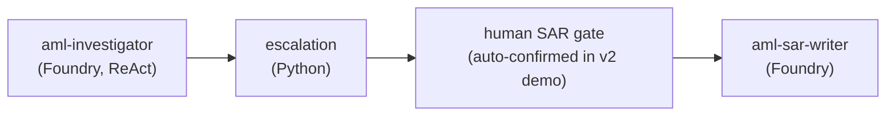
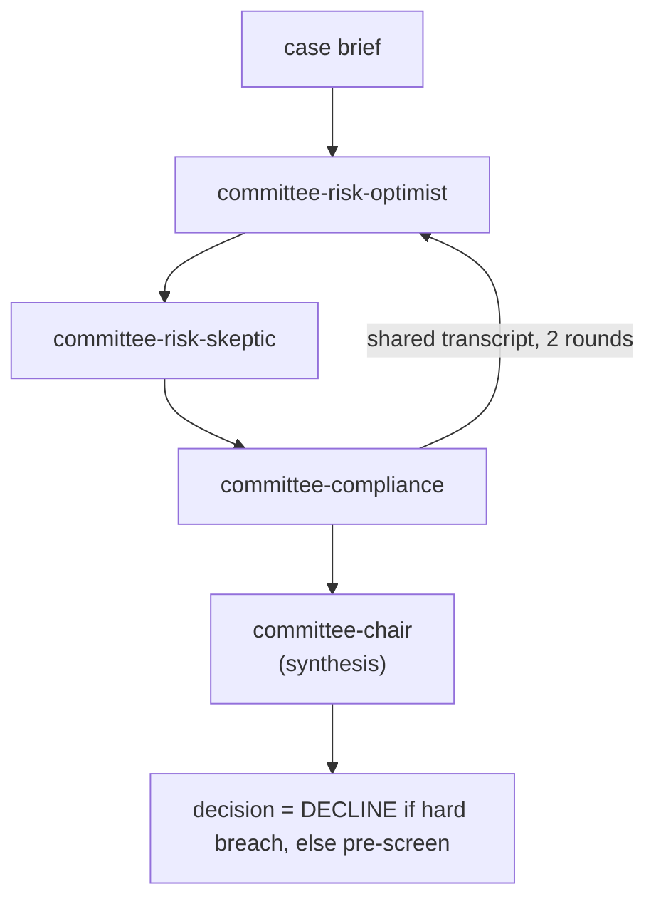
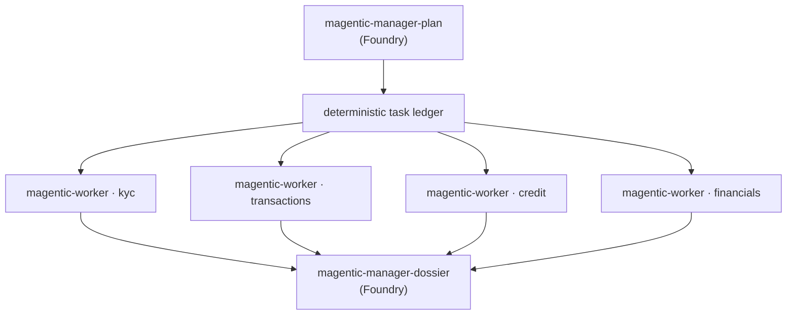
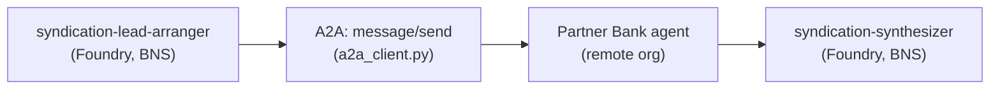

# 3 · The 8 Use Cases — v2 (Foundry-hosted)

Same 8 use cases and same orchestration **patterns** as
[../docs/03-use-cases.md](../docs/03-use-cases.md). This page gives the **v2 specifics**: the page,
the workflow, the **Foundry agent keys** each one calls, what stays deterministic, and the flow
diagram. Every v2 page lives under the portal nav group **🟣 Hosted di Foundry (v2)**.

> All 8 v2 pages were verified end-to-end against Foundry (see the smoke test in
> [scripts/smoke_foundry_v2.py](../scripts/smoke_foundry_v2.py)).

---

## Legend

- **Page** = the Streamlit entry file (`app/portal/views/…`).
- **Workflow** = the orchestration function (`app/workflows/…_foundry_workflow.py`).
- **Foundry agents** = `agent_key`s looked up in [data/foundry_agents.json](../data/foundry_agents.json).
- **Deterministic** = the parts computed in plain Python (no LLM) — the auditable decision.

---

## 1 · Retail Loan — Sequential

| | |
|---|---|
| Page | [12_Retail_on_Foundry.py](../app/portal/views/12_Retail_on_Foundry.py) |
| Workflow | [retail_foundry_workflow.py](../app/workflows/retail_foundry_workflow.py) → `run_retail_foundry` |
| Foundry agents | `retail-intake` → `retail-credit-risk` → `retail-decision` |
| Deterministic | rate, installment, **DBR**, and the **OJK/BI decision** via `evaluate_retail(...)` |

The three Foundry agents produce **narrative** (verification note, credit commentary, customer
explanation); the **APPROVE/DECLINE/REFER** is the deterministic gate.

---

## 2 · SME Underwriting — Concurrent (star)

| | |
|---|---|
| Page | [11_SME_on_Foundry.py](../app/portal/views/11_SME_on_Foundry.py) |
| Workflow | [sme_foundry_workflow.py](../app/workflows/sme_foundry_workflow.py) → `run_sme_foundry` |
| Foundry agents | 4 specialists in **parallel** (`sme-financial-analyst`, `sme-collateral-agent`, `sme-aml-fraud-agent`, `sme-market-risk-agent`) → `sme-underwriting-orchestrator` |
| Deterministic | LTV, DSCR, DER + **pre-screen** via `evaluate_sme(...)` |

The 4 specialists run concurrently via `asyncio.to_thread(runner.run, ...)` + `asyncio.gather`.

---

## 3 · Customer Servicing — Routing

| | |
|---|---|
| Page | [13_Servicing_on_Foundry.py](../app/portal/views/13_Servicing_on_Foundry.py) |
| Workflow | [servicing_foundry_workflow.py](../app/workflows/servicing_foundry_workflow.py) → `run_servicing_foundry` |
| Foundry agents | `servicing-router` (rationale) + **one** of `servicing-dispute` / `-limit-increase` / `-hardship` / `-balance` / `-general` |
| Deterministic | **intent classification** (keyword rules) → picks the single handler |

The router agent explains the routing; the **intent** itself is deterministic so it is auditable
(only one handler agent ever runs — token-cheap).

---

## 4 · Restructuring — Evaluator–Optimizer (reflection)

| | |
|---|---|
| Page | [14_Restructuring_on_Foundry.py](../app/portal/views/14_Restructuring_on_Foundry.py) |
| Workflow | [restructure_foundry_workflow.py](../app/workflows/restructure_foundry_workflow.py) → `run_restructure_foundry` |
| Foundry agents | `restructure-proposer` ⇄ `restructure-evaluator` (loop) → `restructure-writer` |
| Deterministic | the scheme numbers + **affordability gate** via `evaluate_restructure(...)` |

The scheme (tenor/rate/grace) is generated deterministically per iteration (conservative → more
relief), the installment/DBR is recomputed in Python, and the **approve verdict is the gate**.

---

## 5 · AML Investigation — ReAct + human SAR gate

| | |
|---|---|
| Page | [15_AML_on_Foundry.py](../app/portal/views/15_AML_on_Foundry.py) |
| Workflow | [aml_foundry_workflow.py](../app/workflows/aml_foundry_workflow.py) → `run_aml_foundry` |
| Foundry agents | `aml-investigator` (ReAct, tools server-side) → `aml-sar-writer` |
| Deterministic | escalation: **DTTOT sanctions ⇒ must file**; risk level from alert type |

> **v2 demo note:** the v1 human queue (case store) is simplified to an **auto-confirmed** gate so
> the page is self-contained. v1's full human-in-the-loop queue is unchanged on the v1 page.

---

## 6 · Credit Committee — Group Chat

| | |
|---|---|
| Page | [16_Credit_Committee_on_Foundry.py](../app/portal/views/16_Credit_Committee_on_Foundry.py) |
| Workflow | [committee_foundry_workflow.py](../app/workflows/committee_foundry_workflow.py) → `run_committee_foundry` |
| Foundry agents | `committee-risk-optimist` ⇄ `committee-risk-skeptic` ⇄ `committee-compliance` (×2 rounds) → `committee-chair` |
| Deterministic | **pre-screen** `evaluate_sme(...)`; hard breach ⇒ Chair may not APPROVE |

---

## 7 · Complex Investigation — Magentic

| | |
|---|---|
| Page | [17_Complex_Investigation_on_Foundry.py](../app/portal/views/17_Complex_Investigation_on_Foundry.py) |
| Workflow | [magentic_foundry_workflow.py](../app/workflows/magentic_foundry_workflow.py) → `run_magentic_foundry` |
| Foundry agents | `magentic-manager-plan` → `magentic-worker` (×4 ledger steps) → `magentic-manager-dossier` |
| Deterministic | the task ledger (kyc / transactions / credit / financials); risk from KYC |

> **Robustness:** each worker step is wrapped in `try/except` and the prompt tells the worker the
> subject is an **individual** (not a company), so one flaky tool call can't fail the whole run.

---

## 8 · Syndication — A2A (Agent2Agent)

| | |
|---|---|
| Page | [18_Syndication_on_Foundry.py](../app/portal/views/18_Syndication_on_Foundry.py) |
| Workflow | [syndication_foundry_workflow.py](../app/workflows/syndication_foundry_workflow.py) → `run_syndication_foundry` |
| Foundry agents | `syndication-lead-arranger` → **A2A to partner** → `syndication-synthesizer` |
| Deterministic | single-obligor cap → BNS hold vs syndicated target; blended rate; decision |

Only the **BNS-side** agents moved to Foundry; the cross-organisation **A2A** call to the partner is
unchanged. If the partner is unreachable, v2 **degrades gracefully** to `REFER` (wrapped in
`try/except`).

Next: [04-surrounding-systems-foundry.md](04-surrounding-systems-foundry.md) — how the tools are
attached to these Foundry agents.
