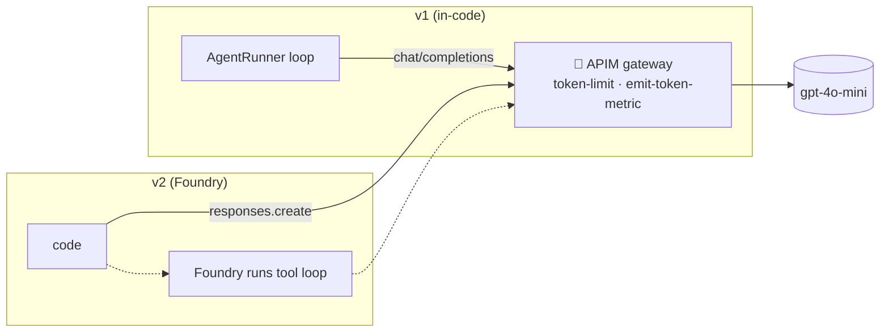

# 9 · APIM AI Gateway — control & see token usage for BOTH v1 and v2 · Bilingual EN/ID

This documents the **Azure API Management (APIM) AI Gateway** we put *optionally* in front of the
agents so you can **control** (token limits) and **see** (token metrics) usage centrally — and flip
it **per transaction** from the portal. It works for **both** the in-code (v1) agents and the
Foundry-hosted (v2) agents.

Dokumen ini menjelaskan **AI Gateway (APIM)** yang dipasang **opsional** di depan agen agar kita bisa
**mengontrol** (batas token) dan **melihat** (metrik token) pemakaian secara terpusat, dan bisa
**di-toggle per transaksi** dari portal. Berlaku untuk agen **v1 (di kode)** maupun **v2 (Foundry)**.

---

## 1) The core idea — a toll booth on the model call / Ide inti — gerbang tol di panggilan model

**EN:** APIM does not govern "the agent" — it governs the **HTTPS call to the model**. Both v1 and v2
make model calls; APIM sits on that path and can count tokens, cap them (429), and log them.
**ID:** APIM tidak mengatur "agen"-nya, melainkan **panggilan HTTPS ke model**. v1 dan v2 sama-sama
memanggil model; APIM berada di jalur itu untuk menghitung token, membatasi (429), dan mencatatnya.



| | v1 (in-code) | v2 (Foundry) |
|---|---|---|
| Surface APIM sees | **chat/completions** (per model turn) | **responses/agents** (per agent run) |
| Granularity | fine (per turn) | coarse (per run) |
| Code hook | `OpenAIChatClient(base_url=APIM/openai)` | `openai.OpenAI(base_url=APIM/foundry)` |

---

## 2) The per-transaction toggle / Toggle per transaksi

**Off by default, additive.** Each portal page has a sidebar toggle **"Route via APIM"**; the choice is
passed as `via_apim` into the workflow, which routes that single run direct or through APIM. If APIM
isn't configured, it safely falls back to **direct** (the badge shows the effective route).

**Mati secara default, aditif.** Tiap halaman punya toggle **"Route via APIM"** di sidebar; pilihan
dikirim sebagai `via_apim` ke workflow. Bila APIM belum dikonfigurasi, otomatis kembali ke **direct**.

Code map / Peta kode:
- Decision helper: [app/agents/shared/gateway.py](../app/agents/shared/gateway.py) — `use_apim()`,
  `apim_base_url()`, `apim_headers()`.
- Config: [app/core/config.py](../app/core/config.py) — `ROUTE_VIA_APIM`, `APIM_GATEWAY_URL`,
  `APIM_SUBSCRIPTION_KEY`, `APIM_CHAT_PATH`, `APIM_RESPONSES_PATH`, `APIM_API_VERSION`.
- v2 runner switch: [foundry_runner.py](../app/agents/shared/foundry_runner.py) `foundry_session(via_apim=…)`.
- v1 runner switch: [model_client.py](../app/agents/shared/model_client.py) `make_chat_client(via_apim=…)`.
- Portal toggle: [portal_utils.py](../app/portal/portal_utils.py) `render_gateway_toggle()`.

```python
# gateway.py — graceful fallback: APIM only when requested AND configured
def use_apim(via_apim=None):
    want = get_settings().route_via_apim if via_apim is None else bool(via_apim)
    return want and apim_configured()
```

The effective route is recorded in the **audit log** (`actor=route:apim|direct`) and the **technical
log** (`route` field), so you can compare direct vs APIM side by side.

---

## 3) One model, attribute per agent — no need to split the model / Satu model, atribusi per agen

**EN:** With a single `gpt-4o-mini` you still separate usage by **tagging each call**. Our runner sends
headers on APIM-routed calls; APIM policies use them for **metrics dimensions** and **limit keys**.
**ID:** Dengan satu model pun, pemakaian dipisah dengan **menandai tiap panggilan**. Runner mengirim
header pada panggilan lewat APIM; policy APIM memakainya untuk **dimensi metrik** dan **kunci limit**.

```python
# foundry_runner.py (v2) — per-call headers when routing via APIM
if self.route == "apim":
    kwargs["extra_headers"] = {"x-bns-agent": agent_name, "x-bns-usecase": self.use_case}
# model_client.py (v1) — session header (use-case granularity)
headers["x-bns-usecase"] = use_case
```

---

## 4) Policies — see the most-used agent + cap per agent / Policy — lihat agen terbesar + batasi per agen

### a) Per-agent token **metrics** (emit-token-metric)
```xml
<azure-openai-emit-token-metric namespace="bns-genai">
  <dimension name="Agent"   value="@(context.Request.Headers.GetValueOrDefault('x-bns-agent','?'))" />
  <dimension name="UseCase" value="@(context.Request.Headers.GetValueOrDefault('x-bns-usecase','?'))" />
</azure-openai-emit-token-metric>
```
Query which agent burns the most tokens / Query agen paling boros:
```kusto
customMetrics
| where name == "Total Tokens" and timestamp > ago(1d)
| extend agent = tostring(customDimensions.Agent)
| summarize tokens = sum(valueSum) by agent
| order by tokens desc
```

### b) Per-agent token **threshold** (token-limit)
Independent bucket per agent (each agent its own budget):
```xml
<azure-openai-token-limit
    counter-key="@(context.Request.Headers.GetValueOrDefault('x-bns-agent','unknown'))"
    tokens-per-minute="2000" estimate-prompt-tokens="true"
    remaining-tokens-header-name="x-tokens-remaining" />
```
Different limit for a specific agent / Batas berbeda untuk agen tertentu:
```xml
<choose>
  <when condition="@(context.Request.Headers.GetValueOrDefault('x-bns-agent','')=='magentic-worker')">
    <azure-openai-token-limit counter-key="magentic-worker" tokens-per-minute="20000" estimate-prompt-tokens="true" />
  </when>
  <otherwise>
    <azure-openai-token-limit counter-key="default" tokens-per-minute="3000" estimate-prompt-tokens="true" />
  </otherwise>
</choose>
```
Over-limit → **HTTP 429** for that agent only; others unaffected. / Melebihi batas → **429** hanya untuk
agen itu; agen lain tidak terpengaruh.

> **Surface note:** the specialized `azure-openai-*` policies target the **chat/completions** shape
> (v1). For the **v2** Responses/agents surface, use the model-agnostic **`llm-token-limit` /
> `llm-emit-token-metric`** equivalents (same attributes) or a small custom policy that reads `usage`.

---

## 5) Why Developer (classic) in Indonesia Central / Kenapa Developer (classic) di Indonesia Central

- **There is no "Developer v2".** Developer exists only on the **classic (v1) APIM platform**; the v2
  tiers are Basic v2 / Standard v2 / Premium v2. / **Tidak ada "Developer v2"**. Developer hanya di
  platform **classic**; tier v2 = Basic v2 / Standard v2 / Premium v2.
- **All AI-gateway token policies work on Developer** — identical to the pricey tiers. Developer has
  **no SLA** and is single-unit (fine for demo/POC). / Semua policy token berjalan di Developer; tanpa
  SLA, cocok untuk demo.
- **Region:** verified that **Indonesia Central** offers classic Developer/Basic/Standard/Premium (the
  v2 tiers were *not* listed there). / Indonesia Central menyediakan tier classic (Developer dst).
- **Latency caveat:** the model (Foundry) is in **East US 2**, so APIM in Jakarta adds ~+250 ms per
  call (Jakarta→US→Jakarta). Fine for a demo; co-locate the model for production. / Model di East US 2,
  jadi APIM di Jakarta menambah ~250 ms; untuk produksi, dekatkan model.
- **Cost ≈ $50/mo** (prorated hourly), deletable after the demo. Provisioning takes **~30–45 min**
  (classic tiers). / Biaya ~$50/bln, bisa dihapus; provisioning ~30–45 menit.

| | Classic (Developer) | v2 (Basic v2 …) |
|---|---|---|
| AI token policies | ✅ | ✅ |
| SLA | ❌ (Developer) | ✅ |
| Provision time | ~30–45 min | ~minutes |
| In Indonesia Central | ✅ | ❌ (not listed) |
| Price | ~$50/mo | higher |

---

## 6) Provisioning steps / Langkah provisioning

```powershell
# 1. Create the gateway (classic Developer, Jakarta) — ~30-45 min
az apim create -n apim-bns-fin-idc01 -g rg-finance-agenticai -l indonesiacentral `
  --sku-name Developer --publisher-email you@org.com --publisher-name "BNS Financing" `
  --enable-managed-identity true

# 2. Grant APIM's managed identity data-plane access to Foundry
$mi = az apim show -n apim-bns-fin-idc01 -g rg-finance-agenticai --query identity.principalId -o tsv
$foundry = az cognitiveservices account show -n bnsfoundryer3wj7 -g rg-finance-agenticai --query id -o tsv
az role assignment create --assignee $mi --role "Cognitive Services User"        --scope $foundry
az role assignment create --assignee $mi --role "Cognitive Services OpenAI User" --scope $foundry

# 3. Backend → Foundry, then two APIs (chat-completions for v1, responses for v2) with policies above.
#    Backend policy authenticates with the managed identity:
#      <set-backend-service backend-id="foundry-backend" />
#      <authentication-managed-identity resource="https://cognitiveservices.azure.com" />

# 4. Create a subscription key, then point the portal at APIM:
az containerapp update -n ca-bns-portal -g rg-finance-agenticai --set-env-vars `
  APIM_GATEWAY_URL="https://apim-bns-fin-idc01.azure-api.net" `
  APIM_SUBSCRIPTION_KEY="<key>" `
  APIM_CHAT_PATH="/openai" `
  APIM_RESPONSES_PATH="/foundry"
```

After the env vars are set, the portal toggle's **effective route** becomes **APIM** when switched on.
/ Setelah env di-set, toggle portal akan efektif ke **APIM** saat dinyalakan.

---

## 7) Governance (app) vs Gateway (APIM) / Governance aplikasi vs Gateway

| Question | Where |
|---|---|
| Per-step tokens for a request, for audit | app **audit log** (`data/audit.db`) — already per-agent (`actor`) |
| Token/cost shown in the UI | app **CostTracker** |
| **Central**, cross-app token **metrics** + **hard limits** | **APIM** policies (this doc) |
| Which hosted agent called which tool | **Foundry Traces** ([doc 08](08-observability-and-analytics-foundry.md)) |

**EN:** Keep both — the app governance is the auditable business record; APIM is the enforce-able,
central AI-gateway control. **ID:** Pakai keduanya — governance aplikasi = catatan bisnis; APIM =
kontrol gateway terpusat yang bisa *enforce*.
