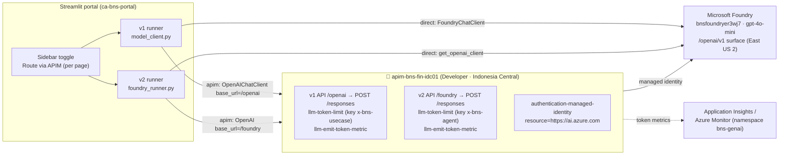
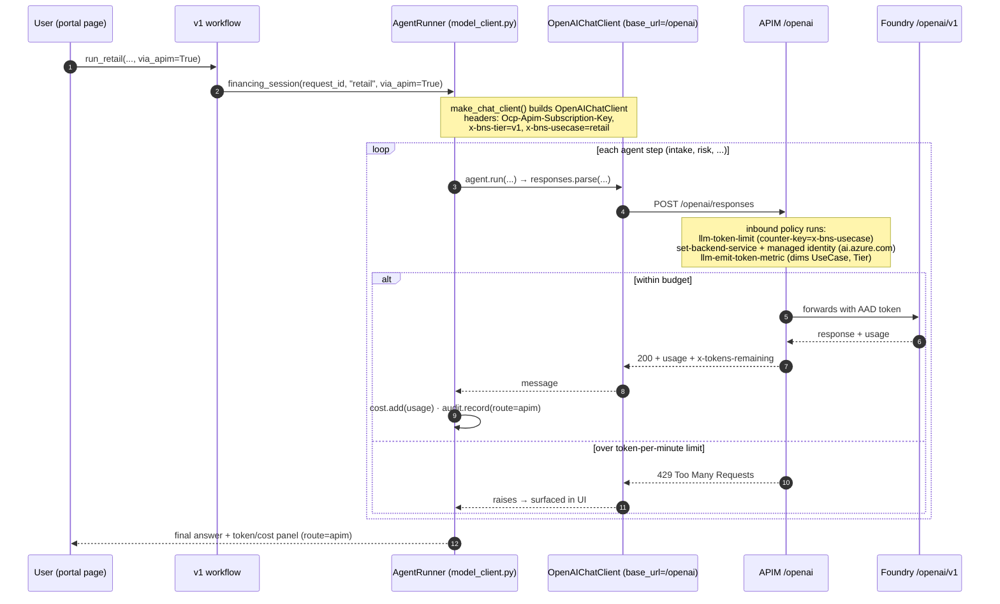
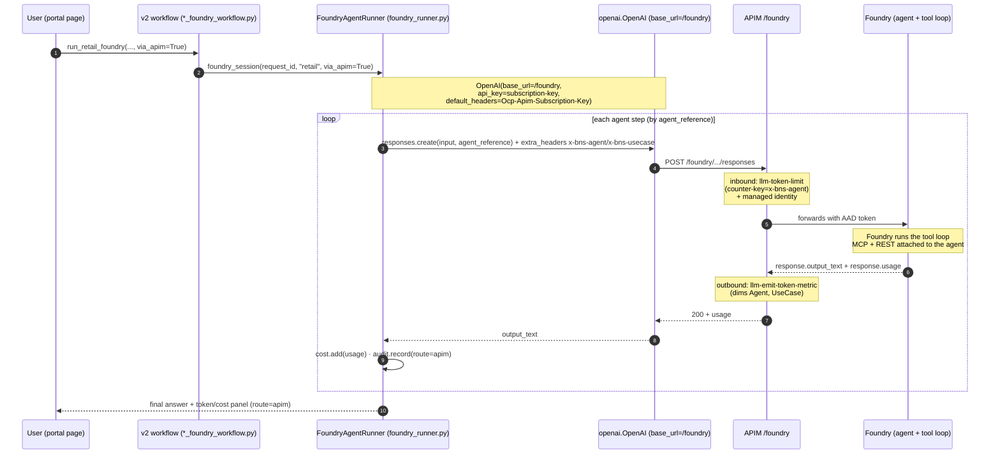
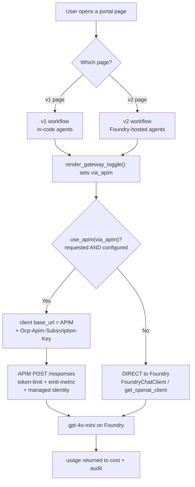

# 10 · APIM AI Gateway — Implementation Reference (setup · code · policies · diagrams) · Bilingual EN/ID

This is the **deep-dive companion** to [09-apim-ai-gateway.md](09-apim-ai-gateway.md). Doc 09 explains
the *concept* (a toll booth on the model call) and the *per-transaction toggle*. **This doc is the
hands-on reference**: exactly how to **set it up**, **how the code calls it**, the **full policy XML**
for **both v1 and v2**, **sample threshold use cases**, **everything else APIM can do**, plus
**high-level and low-level diagrams** for each path.

Ini adalah **dokumen mendalam** pendamping [09-apim-ai-gateway.md](09-apim-ai-gateway.md). Dok 09
menjelaskan *konsep* dan *toggle per transaksi*. **Dokumen ini adalah referensi praktik**: cara
**setup**, cara **kode memanggilnya**, **XML policy lengkap** untuk **v1 dan v2**, **contoh use case
threshold**, **semua kemampuan lain APIM**, plus **diagram high-level dan low-level** tiap jalur.

> **Live values in this deployment / Nilai nyata di deployment ini**
>
> | Thing | Value |
> |---|---|
> | APIM instance | `apim-bns-fin-idc01` (SKU **Developer**, region **Indonesia Central**) |
> | Gateway base URL | `https://apim-bns-fin-idc01.azure-api.net` |
> | Resource group | `rg-finance-agenticai` |
> | Foundry (backend) | `bnsfoundryer3wj7` — model `gpt-4o-mini` |
> | v1 path (chat/completions) | `APIM_CHAT_PATH` = `/openai` |
> | v2 path (responses) | `APIM_RESPONSES_PATH` = `/foundry` |
> | APIM managed-identity principal | `c0ec5fd4-b8c1-4da1-b5ae-ad222930d4ff` |

> **✅ Verified implementation notes (what actually works in this deployment)**
>
> - **Both v1 and v2 call the Responses API** (`POST /responses`) on the **same** OpenAI-compatible
>   Foundry surface `https://bnsfoundryer3wj7.services.ai.azure.com/api/projects/financing/openai/v1`.
>   v1's `OpenAIChatClient` (Agent Framework) calls `responses.parse` under the hood; v2 calls
>   `responses.create` with an `agent_reference`. So each APIM API just needs a **`POST /responses`**
>   operation pointed at that one backend.
> - **Managed-identity token audience is `https://ai.azure.com`** (not `cognitiveservices.azure.com`).
> - **`llm-*` policies are used for BOTH** APIs (the surface is OpenAI-compatible, model-agnostic).
> - **`llm-emit-token-metric` and `llm-token-limit` both live in the `inbound` section.**
> - This CLI has **no** `az apim backend` / `az apim api policy` groups — we use
>   `<set-backend-service base-url="…"/>` inline and apply policies via `az rest` (ARM).

---

## Contents / Isi

1. [High-level architecture — both paths](#1-high-level-architecture)
2. [Low-level sequence — v1 (chat/completions)](#2-low-level-sequence--v1-chatcompletions)
3. [Low-level sequence — v2 (responses / agents)](#3-low-level-sequence--v2-responses--agents)
4. [How the code calls APIM (v1 & v2)](#4-how-the-code-calls-apim)
5. [Setup from scratch (complete CLI)](#5-setup-from-scratch)
6. [Full policy XML — v1 API](#6-full-policy-xml--v1-api-chatcompletions)
7. [Full policy XML — v2 API](#7-full-policy-xml--v2-api-responses)
8. [How each policy line works](#8-how-each-policy-line-works)
8b. [Token sources + App Insights vs Log Analytics (newbie)](#8b-where-token-numbers-come-from--app-insights-vs-log-analytics-newbie)
8c. [KQL cookbook — daily ops & optimization](#8c-kql-cookbook--daily-operations--optimization)
9. [Sample threshold use cases](#9-sample-threshold-use-cases)
10. [Everything else APIM can do](#10-everything-else-apim-can-do)
11. [Verify, test & troubleshoot](#11-verify-test--troubleshoot)
12. [Cleanup / cost control](#12-cleanup--cost-control)

---

## 1) High-level architecture

**EN:** The portal decides *per run* whether to go **direct** to Foundry or **through APIM**. When it
routes via APIM, the model call carries two tags (`x-bns-agent`, `x-bns-usecase`) so a single
`gpt-4o-mini` deployment can still be metered and capped **per agent**. **ID:** Portal memutuskan
*per run* apakah **direct** ke Foundry atau **lewat APIM**. Saat lewat APIM, panggilan membawa dua tag
sehingga satu model bisa dimeter & dibatasi **per agen**.



Key point / Poin kunci: **APIM governs the HTTPS model call, not "the agent."** Both v1 and v2 hit the
**Responses API** (`/responses`) on the same `/openai/v1` surface. The difference is *where the tool
loop runs*: **v1 loops in-process** (Agent Framework), so APIM sees a call **per agent step**; **v2
loops server-side** in Foundry, so APIM sees **one call per agent run**.

---

## 2) Low-level sequence — v1 (Responses API, in-process loop)

**EN:** v1 builds the agent in-process and loops locally. Each agent step is a `responses` POST (the
Agent Framework `OpenAIChatClient` calls `responses.parse`), so APIM sees per-step traffic and can
meter/limit at that granularity. **ID:** v1 membangun agen di proses lokal dan me-loop lokal. Tiap
langkah agen = satu POST `responses`, jadi APIM melihat trafik per-langkah dan bisa meter/limit.



---

## 3) Low-level sequence — v2 (responses / agents)

**EN:** v2 calls an **already-provisioned Foundry agent by reference**. Foundry runs the whole tool
loop server-side, so APIM sees **one `responses.create` call per agent run** (coarser, but simpler).
**ID:** v2 memanggil **agen Foundry yang sudah dibuat, by reference**. Foundry menjalankan loop tool
di server, jadi APIM melihat **satu panggilan `responses.create` per run** (lebih kasar, lebih simpel).



---

## 4) How the code calls APIM

### 4.0 The full chain: portal → (code or Foundry) → APIM → model

**One clarification first / Klarifikasi:** the portal does **not** decide "code vs Foundry" at runtime —
that is simply **which page you open**: the v1 pages run the **in-code** agents, the v2 pages call the
**Foundry-hosted** agents. What the portal decides **per run** is the **Route via APIM** toggle. When
that toggle is on (and APIM is configured), *both* v1 and v2 point their model client at APIM, and
**APIM forwards the call to the model**. / Portal tidak memilih "code vs Foundry" saat runtime — itu
tergantung **halaman** yang dibuka; yang dipilih **per run** adalah toggle **Route via APIM**.



**Step by step, with the real code:**

**1) The portal page reads the toggle** — [app/portal/portal_utils.py](../app/portal/portal_utils.py):
```python
via_apim = render_gateway_toggle("retail")   # sidebar "Route via APIM"; True/False/None
# ... passed straight into the workflow for THIS run:
result, cost = await run_retail(application, request_id, via_apim=via_apim)          # v1 page
result, cost = await run_retail_foundry(application, request_id, via_apim=via_apim)  # v2 page
```

**2) The gateway helper decides direct vs APIM** — [app/agents/shared/gateway.py](../app/agents/shared/gateway.py):
```python
def use_apim(via_apim=None) -> bool:
    want = get_settings().route_via_apim if via_apim is None else bool(via_apim)
    return want and apim_configured()          # True only if requested AND configured
```

**3a) v1 (code) builds a client pointed at APIM** — [model_client.py](../app/agents/shared/model_client.py):
```python
if use_apim(via_apim):
    return OpenAIChatClient(base_url=apim_base_url("chat"),   # https://apim.../openai
                            api_key=s.apim_subscription_key,
                            default_headers={**apim_headers(), "x-bns-usecase": use_case})
# else: FoundryChatClient(...) -> DIRECT to Foundry
```

**3b) v2 (Foundry) injects an OpenAI client pointed at APIM** — [foundry_runner.py](../app/agents/shared/foundry_runner.py):
```python
if use_apim(via_apim):
    openai_client = OpenAI(base_url=apim_base_url("responses"),  # https://apim.../foundry
                           api_key=s.apim_subscription_key,
                           default_headers=apim_headers())
# runner.run() also sends per-call: extra_headers={"x-bns-agent":..., "x-bns-usecase":...}
```

**4) APIM receives `POST /responses`, applies policy, and calls the model** — [infra/apim/policy-v1.xml](../infra/apim/policy-v1.xml):
```xml
<set-backend-service base-url="https://bnsfoundryer3wj7.services.ai.azure.com/api/projects/financing/openai/v1" />
<authentication-managed-identity resource="https://ai.azure.com" />  <!-- APIM's own AAD token -->
<llm-token-limit counter-key="@(context.Request.Headers.GetValueOrDefault(&quot;x-bns-usecase&quot;,&quot;unknown&quot;))" tokens-per-minute="6000" />
<llm-emit-token-metric namespace="bns-genai"> ... </llm-emit-token-metric>
```
So yes — **APIM is the one that calls the model** (`gpt-4o-mini`): the client only ever talks to the
gateway URL; APIM swaps in its managed-identity token, meters/limits, then forwards to Foundry and
returns the response `usage` back to the app. / **APIM yang memanggil model**; klien hanya bicara ke
URL gateway.

---

### 4.1 The routing helper

The whole routing decision lives in one tiny module — [app/agents/shared/gateway.py](../app/agents/shared/gateway.py):

```python
def apim_configured() -> bool:
    s = get_settings()
    return bool(s.apim_gateway_url and s.apim_subscription_key)

def use_apim(via_apim=None) -> bool:
    want = get_settings().route_via_apim if via_apim is None else bool(via_apim)
    return want and apim_configured()          # requested AND configured → else direct

def apim_headers() -> dict:
    return {"Ocp-Apim-Subscription-Key": get_settings().apim_subscription_key}

def apim_base_url(kind: str) -> str:           # kind: "chat" (v1) | "responses" (v2)
    s = get_settings()
    suffix = s.apim_responses_path if kind == "responses" else s.apim_chat_path
    return s.apim_gateway_url.rstrip("/") + (suffix or "")
```

### v1 — swap the chat client (per agent step)

[app/agents/shared/model_client.py](../app/agents/shared/model_client.py) — when routing via APIM we
build an **OpenAI-compatible** client pointed at the gateway instead of `FoundryChatClient`. The Agent
Framework `OpenAIChatClient` calls the **Responses API** (`responses.parse`) under the hood, so this
lands on the gateway's `POST /responses` operation:

```python
def make_chat_client(credential, via_apim=None, use_case=None):
    s = get_settings()
    if use_apim(via_apim):
        headers = dict(apim_headers())
        headers["x-bns-tier"] = "v1"
        if use_case:
            headers["x-bns-usecase"] = use_case      # APIM meters/limits per use-case (v1)
        return OpenAIChatClient(
            model=s.foundry_model,
            base_url=apim_base_url("chat"),           # https://…/openai
            api_key=s.apim_subscription_key,          # sent as the APIM key
            api_version=s.apim_api_version or None,
            default_headers=headers,
        )
    return FoundryChatClient(                          # direct path (unchanged)
        project_endpoint=s.foundry_project_endpoint,
        model=s.foundry_model, credential=credential,
    )
```

### v2 — inject an OpenAI client at the gateway (per agent run)

[app/agents/shared/foundry_runner.py](../app/agents/shared/foundry_runner.py) — `foundry_session`
injects an `openai.OpenAI` client at the APIM base URL; the runner adds **per-call** tags:

```python
# foundry_session(...)
if use_apim(via_apim):
    openai_client = OpenAI(
        base_url=apim_base_url("responses"),          # https://…/foundry
        api_key=s.apim_subscription_key,
        default_headers=apim_headers(),               # Ocp-Apim-Subscription-Key
    )

# FoundryAgentRunner.run(...)
kwargs = {}
if self.route == "apim":
    kwargs["extra_headers"] = {"x-bns-agent": agent_name, "x-bns-usecase": self.use_case}
response = self.openai.responses.create(
    input=prompt,
    extra_body={"agent_reference": {"name": agent_name, "type": "agent_reference"}},
    **kwargs,
)
```

### The effective route is auditable

Both runners write a `gateway` audit row (`actor=route:apim|direct`, `decision=APIM|DIRECT`) and stamp
`route` on every technical-log entry, so you can compare **direct vs APIM** side by side in the portal
and in `data/audit.db`. / Kedua runner menulis baris audit `gateway` dan menandai `route` pada tiap
entri tech-log, sehingga **direct vs APIM** bisa dibandingkan.

---

## 5) Setup from scratch

> Run in PowerShell. For `az` commands that print Unicode, set UTF-8 first:
> `chcp 65001 | Out-Null; $env:PYTHONIOENCODING="utf-8"`.

```powershell
$RG      = "rg-finance-agenticai"
$APIM    = "apim-bns-fin-idc01"
$LOC     = "indonesiacentral"
$FOUNDRY = "bnsfoundryer3wj7"
# Both v1 and v2 hit the SAME OpenAI-compatible Responses surface:
$BASE    = "https://$FOUNDRY.services.ai.azure.com/api/projects/financing/openai/v1"

# 1. Create the gateway (classic Developer, system-assigned identity) — ~30–45 min
az apim create -n $APIM -g $RG -l $LOC `
  --sku-name Developer `
  --publisher-email "you@org.com" --publisher-name "BNS Financing" `
  --enable-managed-identity true

# 2. Grant APIM's managed identity data-plane access to Foundry
$MI    = az apim show -n $APIM -g $RG --query identity.principalId -o tsv
$SCOPE = az cognitiveservices account show -n $FOUNDRY -g $RG --query id -o tsv
az role assignment create --assignee $MI --role "Cognitive Services User"        --scope $SCOPE
az role assignment create --assignee $MI --role "Cognitive Services OpenAI User" --scope $SCOPE

# 3. Two APIs, each with a POST /responses operation, both pointed at the SAME /openai/v1 backend.
#    NOTE: this CLI has no `az apim backend` group — the API service-url IS the backend, and the
#    policy also sets it inline via <set-backend-service base-url=…/>.
az apim api create -g $RG --service-name $APIM --api-id bns-v1-openai `
  --path openai --display-name "BNS v1 (responses)" --service-url $BASE --protocols https --subscription-required true
az apim api operation create -g $RG --service-name $APIM --api-id bns-v1-openai `
  --operation-id responses --display-name responses --method POST --url-template "/responses"

az apim api create -g $RG --service-name $APIM --api-id bns-v2-foundry `
  --path foundry --display-name "BNS v2 (responses/agents)" --service-url $BASE --protocols https --subscription-required true
az apim api operation create -g $RG --service-name $APIM --api-id bns-v2-foundry `
  --operation-id responses --display-name responses --method POST --url-template "/responses"

# 4. Attach the policies. This CLI has no `az apim api policy` group — apply via az rest / ARM.
$sub = az account show --query id -o tsv
function Set-ApimPolicy($apiId, $xmlPath) {
  $body = @{ properties = @{ format = "rawxml"; value = (Get-Content $xmlPath -Raw) } } | ConvertTo-Json -Depth 5
  [IO.File]::WriteAllText("$PWD\_body.json", $body)   # BOM-free (az rest rejects a UTF-8 BOM)
  $uri = "https://management.azure.com/subscriptions/$sub/resourceGroups/$RG/providers/Microsoft.ApiManagement/service/$APIM/apis/$apiId/policies/policy?api-version=2022-08-01"
  az rest --method put --uri $uri --body '@_body.json' --headers "Content-Type=application/json" --output-file ./_out.json
}
Set-ApimPolicy bns-v1-openai  ./infra/apim/policy-v1.xml   # section 6
Set-ApimPolicy bns-v2-foundry ./infra/apim/policy-v2.xml   # section 7

# 5. Get the built-in master subscription key, then point the portal at APIM
$KEY = az rest --method post --query primaryKey -o tsv --uri `
  "https://management.azure.com/subscriptions/$sub/resourceGroups/$RG/providers/Microsoft.ApiManagement/service/$APIM/subscriptions/master/listSecrets?api-version=2022-08-01"
az containerapp update -n ca-bns-portal -g $RG --set-env-vars `
  ROUTE_VIA_APIM="false" `
  APIM_GATEWAY_URL="https://$APIM.azure-api.net" `
  APIM_SUBSCRIPTION_KEY="$KEY" `
  APIM_CHAT_PATH="/openai" `
  APIM_RESPONSES_PATH="/foundry" `
  APIM_API_VERSION=""
```

> `ROUTE_VIA_APIM="false"` keeps direct as the **default**; the per-page toggle opts a single run into
> APIM. `APIM_API_VERSION` is left **empty** because the `/openai/v1` surface is the OpenAI-style
> (no `api-version`) API. Once the env vars are set, the portal badge shows **🟢 APIM** when the toggle
> is on. / Toggle per-halaman meng-*opt-in* satu run ke APIM; `APIM_API_VERSION` dikosongkan.

The config keys read by the app live in [app/core/config.py](../app/core/config.py):
`ROUTE_VIA_APIM`, `APIM_GATEWAY_URL`, `APIM_SUBSCRIPTION_KEY`, `APIM_CHAT_PATH`,
`APIM_RESPONSES_PATH`, `APIM_API_VERSION`.

---

## 6) Full policy XML — v1 API (responses)

The deployed policy is [infra/apim/policy-v1.xml](../infra/apim/policy-v1.xml), attached at the **API
scope** of `bns-v1-openai`. Because the backend is the OpenAI-compatible `/openai/v1` surface, we use
the model-agnostic **`llm-*`** policies. Both the limit **and** the metric policy live in **`inbound`**.

```xml
<policies>
  <inbound>
    <base />
    <!-- Route to the Foundry OpenAI-compatible (/openai/v1) backend -->
    <set-backend-service base-url="https://bnsfoundryer3wj7.services.ai.azure.com/api/projects/financing/openai/v1" />
    <!-- Authenticate to Foundry with APIM's managed identity (audience = ai.azure.com) -->
    <authentication-managed-identity resource="https://ai.azure.com" />

    <!-- Per-use-case token budget: each use-case gets its own bucket (v1 tags x-bns-usecase) -->
    <llm-token-limit
        counter-key="@(context.Request.Headers.GetValueOrDefault(&quot;x-bns-usecase&quot;,&quot;unknown&quot;))"
        tokens-per-minute="6000"
        estimate-prompt-tokens="false"
        remaining-tokens-header-name="x-tokens-remaining" />

    <!-- Per-use-case token metrics to Azure Monitor (emit policies go in inbound) -->
    <llm-emit-token-metric namespace="bns-genai">
      <dimension name="UseCase" value="@(context.Request.Headers.GetValueOrDefault(&quot;x-bns-usecase&quot;,&quot;?&quot;))" />
      <dimension name="Tier"    value="v1" />
    </llm-emit-token-metric>
  </inbound>
  <backend><base /></backend>
  <outbound><base /></outbound>
  <on-error><base /></on-error>
</policies>
```

> The `&quot;` entities are literal double-quotes inside the policy-expression string arguments — they
> must be escaped because they sit inside an XML attribute value. / `&quot;` = tanda kutip ganda yang
> di-escape karena berada di dalam nilai atribut XML.

---

## 7) Full policy XML — v2 API (responses)

The deployed policy is [infra/apim/policy-v2.xml](../infra/apim/policy-v2.xml), attached at the **API
scope** of `bns-v2-foundry`. Same backend and auth as v1; the only difference is the **counter-key and
dimensions are keyed on `x-bns-agent`** (v2 tags the agent per call).

```xml
<policies>
  <inbound>
    <base />
    <set-backend-service base-url="https://bnsfoundryer3wj7.services.ai.azure.com/api/projects/financing/openai/v1" />
    <authentication-managed-identity resource="https://ai.azure.com" />

    <!-- Per-agent token budget: each agent (magentic-worker, retail-intake, …) its own bucket -->
    <llm-token-limit
        counter-key="@(context.Request.Headers.GetValueOrDefault(&quot;x-bns-agent&quot;,&quot;unknown&quot;))"
        tokens-per-minute="8000"
        estimate-prompt-tokens="false"
        remaining-tokens-header-name="x-tokens-remaining" />

    <!-- Per-agent + per-use-case token metrics -->
    <llm-emit-token-metric namespace="bns-genai">
      <dimension name="Agent"   value="@(context.Request.Headers.GetValueOrDefault(&quot;x-bns-agent&quot;,&quot;?&quot;))" />
      <dimension name="UseCase" value="@(context.Request.Headers.GetValueOrDefault(&quot;x-bns-usecase&quot;,&quot;?&quot;))" />
      <dimension name="Tier"    value="v2" />
    </llm-emit-token-metric>
  </inbound>
  <backend><base /></backend>
  <outbound><base /></outbound>
  <on-error><base /></on-error>
</policies>
```

> **Which policy set?** In this deployment both surfaces are the **OpenAI-compatible `/openai/v1`**
> API, so **`llm-*`** policies are used for both. If you instead front the **classic Azure OpenAI**
> `chat/completions` endpoint (`*.openai.azure.com/openai/deployments/…`), you can use the specialized
> **`azure-openai-*`** variants (same attributes). Both meter real tokens from the response `usage`.
> / Di sini keduanya OpenAI-compatible, jadi pakai `llm-*`; untuk endpoint Azure OpenAI klasik bisa
> pakai `azure-openai-*`.

---

## 8) How each policy line works

| Policy element | What it does / Fungsinya |
|---|---|
| `set-backend-service base-url` | Points this API at the Foundry `/openai/v1` backend (inline, no separate backend entity needed). |
| `authentication-managed-identity resource="https://ai.azure.com"` | APIM fetches an AAD token for its **managed identity** (audience `ai.azure.com`) and puts it in the `Authorization` header of the backend call — **no key** to Foundry. |
| `llm-token-limit` | **The throttle.** Counts tokens per `counter-key` bucket; over `tokens-per-minute` → **HTTP 429**. `estimate-prompt-tokens="true"` counts the prompt *before* calling the model (protects the backend). |
| `counter-key=…GetValueOrDefault("x-bns-agent"…)` | The **bucket selector**. Because we key on our own header, one model deployment is split into **per-agent** (or per-use-case) budgets. |
| `remaining-tokens-header-name` | APIM returns how many tokens are left this minute — handy to display or log. |
| `llm-emit-token-metric` | **The meter.** Emits `Total/Prompt/Completion Tokens` custom metrics to Azure Monitor with your `<dimension>`s (Agent, UseCase, Tier) so you can slice usage without touching the app. |
| `namespace="bns-genai"` | The metric namespace you'll query in App Insights `customMetrics`. |

**Section placement:** both `llm-token-limit` **and** `llm-emit-token-metric` live in the **`inbound`**
section (APIM hooks the response automatically to read `usage`). Putting `llm-emit-token-metric` in
`outbound` fails validation ("Policy is not allowed in this section"). / **Penempatan:** `llm-token-limit`
dan `llm-emit-token-metric` keduanya di **`inbound`**; menaruh emit di `outbound` gagal validasi.

---

## 8b) Where token numbers come from + App Insights vs Log Analytics (newbie)

**EN:** There are **two separate token “meters,”** and beginners often mix them up. **ID:** Ada **dua
“pengukur” token** yang berbeda — pemula sering tertukar.

| Meter | Who counts it | Where it lives | Needs a logging backend? |
|---|---|---|---|
| **App-measured** | your **code** reads `response.usage` after each call | `data/audit.db` (audit log) + the cost panel in the UI; app traces also go to App Insights `appi-finance-agenticai` | ❌ No — it's just your app |
| **Gateway-measured** | **APIM** via `llm-emit-token-metric` | App Insights **only if a logger is attached to APIM** → `customMetrics` namespace `bns-genai` | ✅ Yes (App Insights) |

### Enforcement vs observability / Penegakan vs visibilitas

- **The threshold (HTTP 429) needs NO logging backend.** APIM counts tokens in its own memory and
  rejects when over budget. So limits work even with zero App Insights / Log Analytics. / **Batas (429)
  tidak butuh backend log apa pun** — APIM menghitung sendiri.
- **Seeing the numbers** is the only thing that needs a backend — and even then, the **app already
  records per-agent tokens** in the audit log + cost panel. / **Melihat angka** yang butuh backend; tapi
  app sudah mencatat token per-agen.

### App Insights vs Log Analytics for APIM — which one? / Yang mana?

**EN:** They are different tools for different questions; you can use **both**. **ID:** Dua alat beda
untuk pertanyaan beda; boleh pakai **keduanya**.

| You want to see… | Use | Why |
|---|---|---|
| **Per-agent / per-use-case token totals** (the `emit-token-metric` numbers, §9 KQL) | **Application Insights** (a *logger* attached to APIM) | The emit-metric policy publishes to the App Insights instance wired as APIM's logger. |
| **Raw request logs** — who called, status code, latency, backend | **Log Analytics** (a *Diagnostic setting* → `GatewayLogs`) | Gateway request logs are a resource-log category, sent to a Log Analytics workspace. |
| **A single per-call policy trace** (what each policy did) | Nothing — use the **Test tab → Trace** or header `Ocp-Apim-Trace: true` | Built-in, no setup. |

> **✅ Done in this deployment:** an Application Insights **logger** (`appinsights` →
> `appi-finance-agenticai`) plus per-API **diagnostics** are attached to both APIs, so the
> `llm-emit-token-metric` numbers now flow and the §9 KQL works. Log Analytics (request logs) is
> **optional** and not wired. / **Sudah dipasang:** logger App Insights + diagnostic per-API, jadi
> metrik token mengalir dan KQL §9 jalan. Log Analytics opsional.

**How it was attached (App Insights logger, via ARM):**
```powershell
$base = "https://management.azure.com/subscriptions/$sub/resourceGroups/$RG/providers/Microsoft.ApiManagement/service/$APIM"
# 1. logger -> App Insights instance
az rest --method put --uri "$base/loggers/appinsights?api-version=2022-08-01" --body (@{
  properties=@{ loggerType="applicationInsights"; resourceId=$AI_RESOURCE_ID;
                credentials=@{ instrumentationKey=$AI_IKEY } } } | ConvertTo-Json -Depth 8)
# 2. per-API diagnostic (metrics=true enables emit-token-metric)
az rest --method put --uri "$base/apis/bns-v2-foundry/diagnostics/applicationinsights?api-version=2022-08-01" --body (@{
  properties=@{ loggerId="$base/loggers/appinsights"; alwaysLog="allErrors";
                sampling=@{ samplingType="fixed"; percentage=100 }; metrics=$true } } | ConvertTo-Json -Depth 8)
```

**Optional — add Log Analytics for request logs:**
```powershell
az monitor diagnostic-settings create -n apim-logs --resource "<apim-resource-id>" `
  --workspace "<log-analytics-workspace-id>" `
  --logs '[{"category":"GatewayLogs","enabled":true}]' --metrics '[{"category":"AllMetrics","enabled":true}]'
```

### Example use case (newbie) / Contoh kasus

> *“Which agent burned the most tokens yesterday, and did anyone hit the limit?”*
>
> - **Most tokens** → App Insights (§9 KQL on `customMetrics`, dimension `Agent`). Needs the App
>   Insights logger (now attached). Or, without any backend, read `data/audit.db` grouped by `actor`.
> - **Who hit the limit (429)** → the app's **audit log** already has it (the run recorded route + a
>   failure), or Log Analytics `GatewayLogs | where ResponseCode == 429` if you add the diagnostic.

---

## 8c) KQL cookbook — daily operations & optimization

**Where to run:** App Insights `appi-finance-agenticai` → **Logs** (or Log Analytics). Token queries use
the `customMetrics` table (fed by APIM `llm-emit-token-metric`, namespace `bns-genai`). Request/latency
queries use the `requests` table (fed by the APIM App Insights diagnostic). Gateway request-log queries
(`ApiManagementGatewayLogs`) need the optional **Log Analytics** diagnostic. / Jalankan di App Insights
→ Logs.

> **Note on metric fields:** an aggregated custom metric stores `valueSum` (sum of the emitted values)
> and `valueCount` (number of calls). For `Total Tokens`, `sum(valueSum)` = total tokens; `sum(valueCount)`
> = number of model calls.

### A. Daily operations

**A1 — Tokens per agent (last 24h), the go-to “who used what”:**
```kusto
customMetrics
| where timestamp > ago(24h) and name == "Total Tokens"
| extend Agent = tostring(customDimensions.Agent),
         UseCase = tostring(customDimensions.UseCase),
         Tier = tostring(customDimensions.Tier)
| summarize Tokens = sum(valueSum), Calls = sum(valueCount) by Agent, UseCase, Tier
| order by Tokens desc
```

**A2 — Hourly token trend (spot spikes):**
```kusto
customMetrics
| where timestamp > ago(7d) and name == "Total Tokens"
| summarize Tokens = sum(valueSum) by bin(timestamp, 1h)
| render timechart
```

**A3 — Prompt vs completion split per agent (find verbose outputs):**
```kusto
customMetrics
| where timestamp > ago(24h) and name in ("Prompt Tokens", "Completion Tokens")
| extend Agent = tostring(customDimensions.Agent)
| summarize Tokens = sum(valueSum) by name, Agent
| evaluate pivot(name, sum(Tokens))
```

**A4 — Estimated cost per agent (gpt-4o-mini: $0.15 / 1M in, $0.60 / 1M out — adjust to your rate):**
```kusto
customMetrics
| where timestamp > ago(1d) and name in ("Prompt Tokens", "Completion Tokens")
| extend Agent = tostring(customDimensions.Agent)
| summarize Prompt = sumif(valueSum, name == "Prompt Tokens"),
            Completion = sumif(valueSum, name == "Completion Tokens") by Agent
| extend CostUSD = round(Prompt/1000000*0.15 + Completion/1000000*0.60, 4)
| order by CostUSD desc
```

**A5 — Calls, p95 latency, and errors per API (health at a glance):**
```kusto
requests
| where timestamp > ago(1d) and tostring(customDimensions["API Name"]) != ""
| summarize Calls = count(),
            p95_ms = round(percentile(duration, 95), 0),
            Errors = countif(success == false)
         by API = tostring(customDimensions["API Name"])
| order by Calls desc
```

**A6 — Throttle (429) events — did any agent hit its limit?:**
```kusto
requests
| where timestamp > ago(1d) and resultCode == "429"
| summarize Throttled = count() by API = tostring(customDimensions["API Name"]), bin(timestamp, 1h)
| order by timestamp desc
```

### B. Optimization

**B1 — Right-size `tokens-per-minute` from real usage (set the limit ~=1.5× p95):**
```kusto
customMetrics
| where timestamp > ago(7d) and name == "Total Tokens"
| extend Agent = tostring(customDimensions.Agent)
| summarize TokensPerMin = sum(valueSum) by Agent, bin(timestamp, 1m)
| summarize p50 = percentile(TokensPerMin, 50),
            p95 = percentile(TokensPerMin, 95),
            peak = max(TokensPerMin) by Agent
| extend suggested_tpm = toint(p95 * 1.5)
| order by p95 desc
```

**B2 — Most expensive per call (candidates to trim prompts / cache):**
```kusto
customMetrics
| where timestamp > ago(1d) and name == "Total Tokens"
| extend Agent = tostring(customDimensions.Agent), UseCase = tostring(customDimensions.UseCase)
| summarize Tokens = sum(valueSum), Calls = sum(valueCount) by Agent, UseCase
| extend TokensPerCall = round(Tokens * 1.0 / Calls, 0)
| order by TokensPerCall desc
```

**B3 — Latency hotspots (slowest operations — co-locate model or cache):**
```kusto
requests
| where timestamp > ago(1d) and tostring(customDimensions["API Name"]) != ""
| summarize p50 = percentile(duration,50), p95 = percentile(duration,95), Calls = count()
         by Op = tostring(customDimensions["Operation Name"])
| order by p95 desc
```

**B4 — Error breakdown (fix the noisiest failure first):**
```kusto
requests
| where timestamp > ago(1d) and success == false
| summarize Count = count() by resultCode, API = tostring(customDimensions["API Name"])
| order by Count desc
```

**B5 (needs Log Analytics diagnostic) — backend vs gateway errors:**
```kusto
ApiManagementGatewayLogs
| where TimeGenerated > ago(1d)
| summarize Calls = count(), Backend5xx = countif(BackendResponseCode >= 500),
            Gateway4xx = countif(ResponseCode between (400 .. 499))
         by ApiId
| order by Calls desc
```

> **No-backend fallback:** every query above has an app-side equivalent in `data/audit.db` (per-agent
> `actor`, `tokens`, `decision`) — the threshold and per-agent totals never *require* App Insights.
> / Semua query punya padanan di `data/audit.db`; threshold & total per-agen tak wajib App Insights.

### C. Direct vs APIM — see the difference side by side

**EN:** Every run is tagged with its **route** (`direct` or `apim`), so you can compare the two paths
directly. The trick: a **direct** call never touches APIM, so it has an **app record but no gateway
metric** — that *absence* is the signal. **ID:** Tiap run ditandai `direct`/`apim`; panggilan `direct`
tak lewat APIM jadi tak punya metrik gateway — ketiadaannya itulah sinyalnya.

**C1 — App-side, instant (no backend needed): count runs per route** — SQL on `data/audit.db`:
```sql
-- how many runs went direct vs through APIM
SELECT decision AS route, COUNT(*) AS runs
FROM audit_events WHERE step = 'gateway' GROUP BY decision;
-- example real output: APIM = 5, DIRECT = 24
```

**C2 — App-side: tokens per request, tagged by route** — `data/audit.db`:
```sql
WITH g AS (SELECT request_id, decision AS route FROM audit_events WHERE step = 'gateway')
SELECT g.route, a.use_case, SUM(a.tokens) AS tokens
FROM audit_events a JOIN g ON a.request_id = g.request_id
GROUP BY a.request_id ORDER BY MIN(a.ts) DESC LIMIT 20;
```

**C3 — Gateway-side (App Insights): only APIM runs appear here** — KQL:
```kusto
customMetrics
| where timestamp > ago(1h) and name == "Total Tokens"
| extend Tier = tostring(customDimensions.Tier), UseCase = tostring(customDimensions.UseCase)
| summarize GatewayTokens = sum(valueSum), Calls = sum(valueCount) by Tier, UseCase
```
> If a run shows in the **audit log** (`route:apim`) **and** here in `customMetrics`, it truly went
> through the gateway. If it's only in the audit log, it went **direct**. / Ada di audit *dan* di
> `customMetrics` = lewat gateway; hanya di audit = direct.

**C4 — Latency difference (the real cost of the extra hop)** — KQL on `requests`:
```kusto
requests
| where timestamp > ago(1d) and tostring(customDimensions["API Name"]) != ""
| summarize apim_p95_ms = round(percentile(duration, 95), 0), Calls = count()
// compare against a direct run's wall-time from the app's technical log (tech_log `ms`)
```

**Example use cases / Contoh kasus:**

| Question | Where to look |
|---|---|
| *"Are my runs actually going through APIM, or silently falling back to direct?"* | **C1** — if `APIM` count is 0 while the toggle is on, the `APIM_*` env vars aren't set (graceful fallback). |
| *"Did routing via APIM change my token counts?"* | **C2** vs **C3** — the app-measured tokens (C2, `route:apim`) should match the gateway-measured tokens (C3) for the same run; a mismatch means a ret/streaming edge case. |
| *"How much latency does the Jakarta→East US 2 hop add?"* | **C4** — compare APIM `p95` against the direct run's `ms` in the app tech log (expect ~+250 ms). |
| *"Prove to auditors which requests used the governed gateway."* | **C1/C2** give the auditable business record (`data/audit.db`); **C3** is the independent gateway confirmation. |

> **Note on timing:** the app record (C1/C2) is **instant**; the gateway metric (C3/C4) has a **1–3 min
> ingestion delay** and only exists for calls made **after** the App Insights logger was attached.
> / Catatan waktu: catatan app instan; metrik gateway telat 1–3 menit & hanya untuk call setelah logger dipasang.

---

## 9) Sample threshold use cases

### 9.1 Cap a chatty orchestrator so it can't starve others
The Magentic "complex investigation" worker loops many times. Give it a **large** private budget and
everyone else a **small default** — one busy agent can't exhaust the shared model.

```xml
<choose>
  <when condition="@(context.Request.Headers.GetValueOrDefault('x-bns-agent','')=='magentic-worker')">
    <llm-token-limit counter-key="magentic-worker" tokens-per-minute="20000" estimate-prompt-tokens="false" />
  </when>
  <otherwise>
    <llm-token-limit counter-key="@(context.Request.Headers.GetValueOrDefault('x-bns-agent','default'))"
                     tokens-per-minute="4000" estimate-prompt-tokens="false" />
  </otherwise>
</choose>
```

| Agent | Bucket | Limit/min | Behavior over limit |
|---|---|---|---|
| `magentic-worker` | own | 20 000 | its own 429, others fine |
| `retail-intake` | own | 4 000 | its own 429 |
| `aml-screening` | own | 4 000 | its own 429 |

### 9.2 Per-use-case budget (v1)
Retail is high-volume/low-value; SME underwriting is low-volume/high-value. Different budgets:

```xml
<choose>
  <when condition="@(context.Request.Headers.GetValueOrDefault(&quot;x-bns-usecase&quot;,&quot;&quot;)==&quot;retail&quot;)">
    <llm-token-limit counter-key="uc-retail" tokens-per-minute="10000" estimate-prompt-tokens="false" />
  </when>
  <when condition="@(context.Request.Headers.GetValueOrDefault(&quot;x-bns-usecase&quot;,&quot;&quot;)==&quot;sme&quot;)">
    <llm-token-limit counter-key="uc-sme" tokens-per-minute="3000" estimate-prompt-tokens="false" />
  </when>
  <otherwise>
    <llm-token-limit counter-key="uc-default" tokens-per-minute="5000" estimate-prompt-tokens="false" />
  </otherwise>
</choose>
```

### 9.3 Daily/monthly spend guard (quota, not just rate)
`token-limit` is **per minute**. To cap total tokens over a **longer window** use `quota-by-key`:

```xml
<quota-by-key calls="0" bandwidth="0"
    counter-key="@(context.Subscription.Id)"
    renewal-period="86400" />  <!-- reset every 24h; combine with token-limit for a per-minute rate -->
```

### 9.4 Observe first, then enforce
Deploy **only the metric** policy for a week, look at which agent/use-case dominates, then set limits
from real data. Query the most expensive agent:

```kusto
customMetrics
| where name == "Total Tokens" and timestamp > ago(7d)
| extend agent = tostring(customDimensions.Agent), uc = tostring(customDimensions.UseCase)
| summarize tokens = sum(valueSum) by agent, uc
| order by tokens desc
```

---

## 10) Everything else APIM can do

Beyond token metrics + limits, the same gateway can add these **without touching app code** (the app
already routes through APIM; you just add policy):

| Capability | Policy | Why you'd use it here |
|---|---|---|
| **Rate limit by calls** | `rate-limit-by-key` | Cap requests/sec per agent or subscription (protect the backend from bursts). |
| **Spend/quota cap** | `quota-by-key` | Hard daily/monthly token ceiling (§9.3). |
| **Semantic caching** | `azure-openai-semantic-cache-lookup` / `-store` | Return a cached answer for semantically-similar prompts → cut tokens & latency (needs a vector store + embeddings; **not** enabled here to keep it simple). |
| **Content safety** | `llm-content-safety` | Block prompt-injection / jailbreak / disallowed content **before** it reaches the model. |
| **PII masking** | `set-body` / regex or the content-safety policy | Strip sensitive fields on the way in or out (defense in depth on top of the app's `redact_pii`). |
| **Load balancing / failover** | backend **pool** + `set-backend-service` | Spread across multiple model deployments/regions; retry the next on 429/5xx. |
| **Retry with backoff** | `retry` | Transparently retry transient `429/503` from the backend. |
| **Regional co-location** | second APIM/backend | Put APIM next to the model to remove the Jakarta→US hop (see doc 09 latency caveat). |
| **MCP governance** | import an API as MCP + rate-limit | Rate-limit / auth tool servers exposed to agents. |

> This deployment ships **token-limit + emit-token-metric + managed-identity auth** on purpose — the
> smallest set that demonstrates central **control + visibility**. Everything above is a drop-in policy
> addition. / Deployment ini sengaja hanya memasang tiga policy inti; sisanya tinggal ditambah.

---

## 11) Verify, test & troubleshoot

**Local end-to-end test (opt one run into APIM):**
```powershell
$env:PYTHONPATH="."; $env:PYTHONIOENCODING="utf-8"
$env:APIM_GATEWAY_URL="https://apim-bns-fin-idc01.azure-api.net"
$env:APIM_SUBSCRIPTION_KEY="<key>"
$env:APIM_CHAT_PATH="/openai"; $env:APIM_RESPONSES_PATH="/foundry"
.\.venv\Scripts\python.exe -m scripts.smoke_v1          # v1 path
.\.venv\Scripts\python.exe -m scripts.smoke_foundry_v2  # v2 path
```
Confirm the audit row shows `route:apim` and the tech log entries carry `"route": "apim"`.

**Common issues / Masalah umum:**

| Symptom | Likely cause | Fix |
|---|---|---|
| Toggle stays **⚪ Direct** even when on | `APIM_GATEWAY_URL` or `APIM_SUBSCRIPTION_KEY` unset → `apim_configured()` false | set both env vars on `ca-bns-portal`. |
| **401** from APIM | wrong/missing subscription key | send `Ocp-Apim-Subscription-Key` (the master/product key). |
| **401** from the backend (`audience is incorrect (https://ai.azure.com)`) | wrong managed-identity audience | set `authentication-managed-identity resource="https://ai.azure.com"`. |
| **403** from the backend | APIM identity lacks a Foundry role | assign *Cognitive Services User* + *OpenAI User* to the APIM MI. |
| **404** `{"statusCode":404,"message":"Resource not found"}` at the gateway | no APIM operation matched the path | the client posts to `/responses` — add a `POST /responses` operation (both v1 & v2). |
| **429** immediately | `tokens-per-minute` too low for that bucket | raise the limit or widen the counter-key. |
| No metrics in App Insights | metric policy missing / wrong namespace | ensure `emit-token-metric` in **outbound** and query `customMetrics` namespace `bns-genai`. |
| Extra ~250 ms/call | model in East US 2, APIM in Jakarta | expected; co-locate for prod. |

---

## 12) Cleanup / cost control

Developer SKU ≈ **$50/mo** (prorated hourly). To stop charges after the demo, delete the instance —
the app falls back to **direct** automatically (unset the env vars or leave them; `apim_configured()`
just returns false once the gateway is gone).

```powershell
az apim delete -n apim-bns-fin-idc01 -g rg-finance-agenticai --yes --no-wait
az containerapp update -n ca-bns-portal -g rg-finance-agenticai --remove-env-vars `
  APIM_GATEWAY_URL APIM_SUBSCRIPTION_KEY APIM_CHAT_PATH APIM_RESPONSES_PATH
```

---

### See also
- [09-apim-ai-gateway.md](09-apim-ai-gateway.md) — concept + per-transaction toggle (start here).
- [07-governance-token-cost-foundry.md](07-governance-token-cost-foundry.md) — app-side governance (audit/cost/tech logs).
- [08-observability-and-analytics-foundry.md](08-observability-and-analytics-foundry.md) — App Insights + Foundry Traces.
