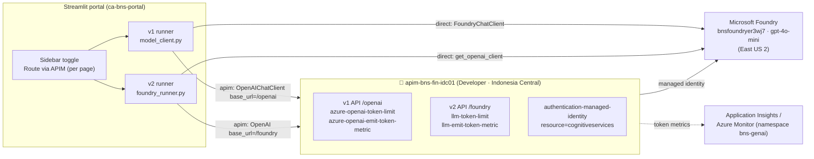
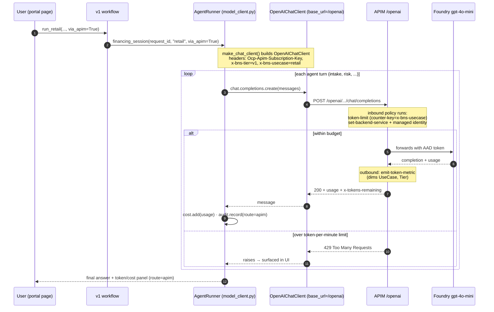

# 10 · APIM AI Gateway — Implementation Reference (setup · code · policies · diagrams) · Bilingual EN/ID

This is the **deep-dive companion** to [09-apim-ai-gateway.md](09-apim-ai-gateway.md). Doc 09 explains
the *concept* (a toll booth on the model call) and the *per-transaction toggle*. **This doc is the
hands-on reference**: exactly how to **set it up**, **how the code calls it**, the **full policy XML**
for **both v1 and v2**, **sample threshold use cases**, **everything else APIM can do**, plus
**high-level and low-level diagrams** for each path.

Ini adalah **dokumen mendalam** pendamping [09-apim-ai-gateway.md](09-apim-ai-gateway.md). Dok 09
menjelaskan *konsep* dan *toggle per transaksi*. **Dokumen ini adalah referensi praktik**: cara
**setup**, cara **kode memanggilnya**, **XML policy lengkap** untuk **v1 dan v2**, **contoh use case
threshold**, **semua kemampuan lain APIM**, plus **diagram high-level dan low-level** tiap jalur.

> **Live values in this deployment / Nilai nyata di deployment ini**
>
> | Thing | Value |
> |---|---|
> | APIM instance | `apim-bns-fin-idc01` (SKU **Developer**, region **Indonesia Central**) |
> | Gateway base URL | `https://apim-bns-fin-idc01.azure-api.net` |
> | Resource group | `rg-finance-agenticai` |
> | Foundry (backend) | `bnsfoundryer3wj7` — model `gpt-4o-mini` |
> | v1 path (chat/completions) | `APIM_CHAT_PATH` = `/openai` |
> | v2 path (responses) | `APIM_RESPONSES_PATH` = `/foundry` |
> | APIM managed-identity principal | `c0ec5fd4-b8c1-4da1-b5ae-ad222930d4ff` |

---

## Contents / Isi

1. [High-level architecture — both paths](#1-high-level-architecture)
2. [Low-level sequence — v1 (chat/completions)](#2-low-level-sequence--v1-chatcompletions)
3. [Low-level sequence — v2 (responses / agents)](#3-low-level-sequence--v2-responses--agents)
4. [How the code calls APIM (v1 & v2)](#4-how-the-code-calls-apim)
5. [Setup from scratch (complete CLI)](#5-setup-from-scratch)
6. [Full policy XML — v1 API](#6-full-policy-xml--v1-api-chatcompletions)
7. [Full policy XML — v2 API](#7-full-policy-xml--v2-api-responses)
8. [How each policy line works](#8-how-each-policy-line-works)
9. [Sample threshold use cases](#9-sample-threshold-use-cases)
10. [Everything else APIM can do](#10-everything-else-apim-can-do)
11. [Verify, test & troubleshoot](#11-verify-test--troubleshoot)
12. [Cleanup / cost control](#12-cleanup--cost-control)

---

## 1) High-level architecture

**EN:** The portal decides *per run* whether to go **direct** to Foundry or **through APIM**. When it
routes via APIM, the model call carries two tags (`x-bns-agent`, `x-bns-usecase`) so a single
`gpt-4o-mini` deployment can still be metered and capped **per agent**. **ID:** Portal memutuskan
*per run* apakah **direct** ke Foundry atau **lewat APIM**. Saat lewat APIM, panggilan membawa dua tag
sehingga satu model bisa dimeter & dibatasi **per agen**.



Key point / Poin kunci: **APIM governs the HTTPS model call, not "the agent."** v1 exposes the
`chat/completions` shape (one call **per model turn**); v2 exposes the `responses` shape (one call
**per agent run**, because Foundry runs the tool loop server-side).

---

## 2) Low-level sequence — v1 (chat/completions)

**EN:** v1 builds the agent in-process and loops locally. **Each model turn** is a separate
`chat/completions` POST, so APIM sees fine-grained per-turn traffic and can meter/limit at that
granularity. **ID:** v1 membangun agen di proses lokal dan me-loop lokal. **Tiap giliran model** =
satu POST `chat/completions`, jadi APIM melihat trafik per-giliran dan bisa meter/limit sehalus itu.



---

## 3) Low-level sequence — v2 (responses / agents)

**EN:** v2 calls an **already-provisioned Foundry agent by reference**. Foundry runs the whole tool
loop server-side, so APIM sees **one `responses.create` call per agent run** (coarser, but simpler).
**ID:** v2 memanggil **agen Foundry yang sudah dibuat, by reference**. Foundry menjalankan loop tool
di server, jadi APIM melihat **satu panggilan `responses.create` per run** (lebih kasar, lebih simpel).

```mermaid
sequenceDiagram
    autonumber
    participant U as User (portal page)
    participant W as v2 workflow (*_foundry_workflow.py)
    participant R as FoundryAgentRunner (foundry_runner.py)
    participant C as openai.OpenAI (base_url=/foundry)
    participant G as APIM /foundry
    participant F as Foundry (agent + tool loop)

    U->>W: run_retail_foundry(..., via_apim=True)
    W->>R: foundry_session(request_id, "retail", via_apim=True)
    Note over R,C: OpenAI(base_url=/foundry,<br/>api_key=subscription-key,<br/>default_headers=Ocp-Apim-Subscription-Key)
    loop each agent step (by agent_reference)
        R->>C: responses.create(input, agent_reference,<br/>extra_headers: x-bns-agent, x-bns-usecase)
        C->>G: POST /foundry/.../responses
        Note over G: inbound: llm-token-limit<br/>(counter-key=x-bns-agent)<br/>+ managed identity
        G->>F: forwards; Foundry runs the tool loop<br/>(MCP + REST attached to the agent)
        F-->>G: response.output_text + response.usage
        Note over G: outbound: llm-emit-token-metric<br/>(dims Agent, UseCase)
        G-->>C: 200 + usage
        C-->>R: output_text
        R->>R: cost.add(usage) · audit.record(route=apim)
    end
    R-->>U: final answer + token/cost panel (route=apim)
```

---

## 4) How the code calls APIM

The whole routing decision lives in one tiny module — [app/agents/shared/gateway.py](../app/agents/shared/gateway.py):

```python
def apim_configured() -> bool:
    s = get_settings()
    return bool(s.apim_gateway_url and s.apim_subscription_key)

def use_apim(via_apim=None) -> bool:
    want = get_settings().route_via_apim if via_apim is None else bool(via_apim)
    return want and apim_configured()          # requested AND configured → else direct

def apim_headers() -> dict:
    return {"Ocp-Apim-Subscription-Key": get_settings().apim_subscription_key}

def apim_base_url(kind: str) -> str:           # kind: "chat" (v1) | "responses" (v2)
    s = get_settings()
    suffix = s.apim_responses_path if kind == "responses" else s.apim_chat_path
    return s.apim_gateway_url.rstrip("/") + (suffix or "")
```

### v1 — swap the chat client (per model turn)

[app/agents/shared/model_client.py](../app/agents/shared/model_client.py) — when routing via APIM we
build an **OpenAI-compatible** client pointed at the gateway instead of `FoundryChatClient`:

```python
def make_chat_client(credential, via_apim=None, use_case=None):
    s = get_settings()
    if use_apim(via_apim):
        headers = dict(apim_headers())
        headers["x-bns-tier"] = "v1"
        if use_case:
            headers["x-bns-usecase"] = use_case      # APIM meters/limits per use-case (v1)
        return OpenAIChatClient(
            model=s.foundry_model,
            base_url=apim_base_url("chat"),           # https://…/openai
            api_key=s.apim_subscription_key,          # sent as the APIM key
            api_version=s.apim_api_version or None,
            default_headers=headers,
        )
    return FoundryChatClient(                          # direct path (unchanged)
        project_endpoint=s.foundry_project_endpoint,
        model=s.foundry_model, credential=credential,
    )
```

### v2 — inject an OpenAI client at the gateway (per agent run)

[app/agents/shared/foundry_runner.py](../app/agents/shared/foundry_runner.py) — `foundry_session`
injects an `openai.OpenAI` client at the APIM base URL; the runner adds **per-call** tags:

```python
# foundry_session(...)
if use_apim(via_apim):
    openai_client = OpenAI(
        base_url=apim_base_url("responses"),          # https://…/foundry
        api_key=s.apim_subscription_key,
        default_headers=apim_headers(),               # Ocp-Apim-Subscription-Key
    )

# FoundryAgentRunner.run(...)
kwargs = {}
if self.route == "apim":
    kwargs["extra_headers"] = {"x-bns-agent": agent_name, "x-bns-usecase": self.use_case}
response = self.openai.responses.create(
    input=prompt,
    extra_body={"agent_reference": {"name": agent_name, "type": "agent_reference"}},
    **kwargs,
)
```

### The effective route is auditable

Both runners write a `gateway` audit row (`actor=route:apim|direct`, `decision=APIM|DIRECT`) and stamp
`route` on every technical-log entry, so you can compare **direct vs APIM** side by side in the portal
and in `data/audit.db`. / Kedua runner menulis baris audit `gateway` dan menandai `route` pada tiap
entri tech-log, sehingga **direct vs APIM** bisa dibandingkan.

---

## 5) Setup from scratch

> Run in PowerShell. For `az` commands that print Unicode, set UTF-8 first:
> `chcp 65001 | Out-Null; $env:PYTHONIOENCODING="utf-8"`.

```powershell
$RG      = "rg-finance-agenticai"
$APIM    = "apim-bns-fin-idc01"
$LOC     = "indonesiacentral"
$FOUNDRY = "bnsfoundryer3wj7"

# 1. Create the gateway (classic Developer, system-assigned identity) — ~30–45 min
az apim create -n $APIM -g $RG -l $LOC `
  --sku-name Developer `
  --publisher-email "you@org.com" --publisher-name "BNS Financing" `
  --enable-managed-identity true

# 2. Grant APIM's managed identity data-plane access to Foundry (so it can call the model)
$MI      = az apim show -n $APIM -g $RG --query identity.principalId -o tsv
$SCOPE   = az cognitiveservices account show -n $FOUNDRY -g $RG --query id -o tsv
az role assignment create --assignee $MI --role "Cognitive Services User"        --scope $SCOPE
az role assignment create --assignee $MI --role "Cognitive Services OpenAI User" --scope $SCOPE

# 3. Backend → Foundry OpenAI endpoint
$FOUNDRY_OPENAI = "https://$FOUNDRY.openai.azure.com"
az apim backend create -g $RG --service-name $APIM `
  --backend-id foundry-backend --protocol http `
  --url "$FOUNDRY_OPENAI/openai"

# 4a. v1 API — chat/completions surface at path /openai
#     Import the Azure OpenAI inference OpenAPI, or create the API and add the operation, then
#     attach the v1 policy in section 6 at the API scope.
az apim api create -g $RG --service-name $APIM `
  --api-id bns-v1-openai --path openai --display-name "BNS v1 (chat/completions)" `
  --service-url "$FOUNDRY_OPENAI/openai" --protocols https

# 4b. v2 API — responses/agents surface at path /foundry (passthrough)
az apim api create -g $RG --service-name $APIM `
  --api-id bns-v2-foundry --path foundry --display-name "BNS v2 (responses/agents)" `
  --service-url "$FOUNDRY_OPENAI" --protocols https

# 5. Attach policies (section 6 to bns-v1-openai, section 7 to bns-v2-foundry).
#    Easiest via portal (APIs → <api> → Design → </> policy editor) or:
az apim api policy create -g $RG --service-name $APIM --api-id bns-v1-openai `
  --format xml --value (Get-Content ./policy-v1.xml -Raw)
az apim api policy create -g $RG --service-name $APIM --api-id bns-v2-foundry `
  --format xml --value (Get-Content ./policy-v2.xml -Raw)

# 6. Get a subscription key (built-in all-APIs product), then point the portal at APIM
$KEY = az apim subscription show -g $RG --service-name $APIM --sid master `
  --query primaryKey -o tsv
az containerapp update -n ca-bns-portal -g $RG --set-env-vars `
  ROUTE_VIA_APIM="false" `
  APIM_GATEWAY_URL="https://$APIM.azure-api.net" `
  APIM_SUBSCRIPTION_KEY="$KEY" `
  APIM_CHAT_PATH="/openai" `
  APIM_RESPONSES_PATH="/foundry" `
  APIM_API_VERSION="2024-10-21"
```

> `ROUTE_VIA_APIM="false"` keeps direct as the **default**; the per-page toggle opts a single run into
> APIM. Once the env vars are set, the portal badge shows **🟢 APIM** when the toggle is on. / Toggle
> per-halaman meng-*opt-in* satu run ke APIM; badge menampilkan **🟢 APIM** saat aktif.

The config keys read by the app live in [app/core/config.py](../app/core/config.py):
`ROUTE_VIA_APIM`, `APIM_GATEWAY_URL`, `APIM_SUBSCRIPTION_KEY`, `APIM_CHAT_PATH`,
`APIM_RESPONSES_PATH`, `APIM_API_VERSION`.

---

## 6) Full policy XML — v1 API (chat/completions)

Attach at the **API scope** of `bns-v1-openai`. Uses the specialized `azure-openai-*` policies (they
understand the chat/completions request/response shape and count tokens accurately).

```xml
<policies>
  <inbound>
    <base />
    <!-- Route to Foundry and authenticate with APIM's managed identity -->
    <set-backend-service backend-id="foundry-backend" />
    <authentication-managed-identity resource="https://cognitiveservices.azure.com" />

    <!-- Per-use-case token budget: each use-case gets its own bucket (v1 tags x-bns-usecase) -->
    <azure-openai-token-limit
        counter-key="@(context.Request.Headers.GetValueOrDefault('x-bns-usecase','unknown'))"
        tokens-per-minute="6000"
        estimate-prompt-tokens="true"
        remaining-tokens-header-name="x-tokens-remaining"
        tokens-consumed-header-name="x-tokens-consumed" />
  </inbound>
  <backend><base /></backend>
  <outbound>
    <base />
    <!-- Emit per-use-case token metrics to Azure Monitor / App Insights -->
    <azure-openai-emit-token-metric namespace="bns-genai">
      <dimension name="UseCase" value="@(context.Request.Headers.GetValueOrDefault('x-bns-usecase','?'))" />
      <dimension name="Tier"    value="@(context.Request.Headers.GetValueOrDefault('x-bns-tier','v1'))" />
      <dimension name="ApiId"   value="@(context.Api.Id)" />
    </azure-openai-emit-token-metric>
  </outbound>
  <on-error><base /></on-error>
</policies>
```

---

## 7) Full policy XML — v2 API (responses)

Attach at the **API scope** of `bns-v2-foundry`. The Responses/agents surface is model-agnostic, so
use the **`llm-*`** policies (same attributes as the `azure-openai-*` ones, but they parse the generic
LLM `usage` shape). v2 tags **`x-bns-agent`** per call, so we key on the agent.

```xml
<policies>
  <inbound>
    <base />
    <set-backend-service backend-id="foundry-backend" />
    <authentication-managed-identity resource="https://cognitiveservices.azure.com" />

    <!-- Per-agent token budget: each agent (magentic-worker, retail-intake, …) its own bucket -->
    <llm-token-limit
        counter-key="@(context.Request.Headers.GetValueOrDefault('x-bns-agent','unknown'))"
        tokens-per-minute="8000"
        estimate-prompt-tokens="false"
        remaining-tokens-header-name="x-tokens-remaining" />
  </inbound>
  <backend><base /></backend>
  <outbound>
    <base />
    <!-- Per-agent + per-use-case token metrics -->
    <llm-emit-token-metric namespace="bns-genai">
      <dimension name="Agent"   value="@(context.Request.Headers.GetValueOrDefault('x-bns-agent','?'))" />
      <dimension name="UseCase" value="@(context.Request.Headers.GetValueOrDefault('x-bns-usecase','?'))" />
      <dimension name="Tier"    value="v2" />
    </llm-emit-token-metric>
  </outbound>
  <on-error><base /></on-error>
</policies>
```

> **Which policy set?** Use `azure-openai-*` when the traffic is exactly the **Azure OpenAI
> chat/completions** shape (v1). Use `llm-*` for **any other LLM surface** including the **Responses /
> agents** shape (v2). Both meter real tokens from the response `usage`. / Pakai `azure-openai-*` untuk
> bentuk chat/completions (v1), `llm-*` untuk surface LLM lain termasuk Responses (v2).

---

## 8) How each policy line works

| Policy element | What it does / Fungsinya |
|---|---|
| `set-backend-service backend-id` | Points this API at the Foundry backend created in setup step 3. |
| `authentication-managed-identity resource=…cognitiveservices…` | APIM fetches an AAD token for its **managed identity** and attaches it to the backend call — **no key** to Foundry. |
| `azure-openai-token-limit` / `llm-token-limit` | **The throttle.** Counts tokens per `counter-key` bucket; over `tokens-per-minute` → **HTTP 429**. `estimate-prompt-tokens="true"` counts the prompt *before* calling the model (protects the backend). |
| `counter-key=…GetValueOrDefault('x-bns-agent'…)` | The **bucket selector**. Because we key on our own header, one model deployment is split into **per-agent** (or per-use-case) budgets. |
| `remaining-tokens-header-name` | APIM returns how many tokens are left this minute — handy to display or log. |
| `azure-openai-emit-token-metric` / `llm-emit-token-metric` | **The meter.** Emits a `Total/Prompt/Completion Tokens` custom metric to Azure Monitor with your `<dimension>`s (Agent, UseCase, Tier) so you can slice usage without touching the app. |
| `namespace="bns-genai"` | The metric namespace you'll query in App Insights `customMetrics`. |

**Order matters:** limit policies live **inbound** (reject early, before hitting the model); metric
policies live **outbound** (the real `usage` is only known after the response). / **Urutan penting:**
limit di **inbound** (tolak lebih awal), metric di **outbound** (usage baru diketahui setelah respons).

---

## 9) Sample threshold use cases

### 9.1 Cap a chatty orchestrator so it can't starve others
The Magentic "complex investigation" worker loops many times. Give it a **large** private budget and
everyone else a **small default** — one busy agent can't exhaust the shared model.

```xml
<choose>
  <when condition="@(context.Request.Headers.GetValueOrDefault('x-bns-agent','')=='magentic-worker')">
    <llm-token-limit counter-key="magentic-worker" tokens-per-minute="20000" estimate-prompt-tokens="false" />
  </when>
  <otherwise>
    <llm-token-limit counter-key="@(context.Request.Headers.GetValueOrDefault('x-bns-agent','default'))"
                     tokens-per-minute="4000" estimate-prompt-tokens="false" />
  </otherwise>
</choose>
```

| Agent | Bucket | Limit/min | Behavior over limit |
|---|---|---|---|
| `magentic-worker` | own | 20 000 | its own 429, others fine |
| `retail-intake` | own | 4 000 | its own 429 |
| `aml-screening` | own | 4 000 | its own 429 |

### 9.2 Per-use-case budget (v1)
Retail is high-volume/low-value; SME underwriting is low-volume/high-value. Different budgets:

```xml
<choose>
  <when condition="@(context.Request.Headers.GetValueOrDefault('x-bns-usecase','')=='retail')">
    <azure-openai-token-limit counter-key="uc-retail" tokens-per-minute="10000" estimate-prompt-tokens="true" />
  </when>
  <when condition="@(context.Request.Headers.GetValueOrDefault('x-bns-usecase','')=='sme')">
    <azure-openai-token-limit counter-key="uc-sme" tokens-per-minute="3000" estimate-prompt-tokens="true" />
  </when>
  <otherwise>
    <azure-openai-token-limit counter-key="uc-default" tokens-per-minute="5000" estimate-prompt-tokens="true" />
  </otherwise>
</choose>
```

### 9.3 Daily/monthly spend guard (quota, not just rate)
`token-limit` is **per minute**. To cap total tokens over a **longer window** use `quota-by-key`:

```xml
<quota-by-key calls="0" bandwidth="0"
    counter-key="@(context.Subscription.Id)"
    renewal-period="86400" />  <!-- reset every 24h; combine with token-limit for a per-minute rate -->
```

### 9.4 Observe first, then enforce
Deploy **only the metric** policy for a week, look at which agent/use-case dominates, then set limits
from real data. Query the most expensive agent:

```kusto
customMetrics
| where name == "Total Tokens" and timestamp > ago(7d)
| extend agent = tostring(customDimensions.Agent), uc = tostring(customDimensions.UseCase)
| summarize tokens = sum(valueSum) by agent, uc
| order by tokens desc
```

---

## 10) Everything else APIM can do

Beyond token metrics + limits, the same gateway can add these **without touching app code** (the app
already routes through APIM; you just add policy):

| Capability | Policy | Why you'd use it here |
|---|---|---|
| **Rate limit by calls** | `rate-limit-by-key` | Cap requests/sec per agent or subscription (protect the backend from bursts). |
| **Spend/quota cap** | `quota-by-key` | Hard daily/monthly token ceiling (§9.3). |
| **Semantic caching** | `azure-openai-semantic-cache-lookup` / `-store` | Return a cached answer for semantically-similar prompts → cut tokens & latency (needs a vector store + embeddings; **not** enabled here to keep it simple). |
| **Content safety** | `llm-content-safety` | Block prompt-injection / jailbreak / disallowed content **before** it reaches the model. |
| **PII masking** | `set-body` / regex or the content-safety policy | Strip sensitive fields on the way in or out (defense in depth on top of the app's `redact_pii`). |
| **Load balancing / failover** | backend **pool** + `set-backend-service` | Spread across multiple model deployments/regions; retry the next on 429/5xx. |
| **Retry with backoff** | `retry` | Transparently retry transient `429/503` from the backend. |
| **Regional co-location** | second APIM/backend | Put APIM next to the model to remove the Jakarta→US hop (see doc 09 latency caveat). |
| **MCP governance** | import an API as MCP + rate-limit | Rate-limit / auth tool servers exposed to agents. |

> This deployment ships **token-limit + emit-token-metric + managed-identity auth** on purpose — the
> smallest set that demonstrates central **control + visibility**. Everything above is a drop-in policy
> addition. / Deployment ini sengaja hanya memasang tiga policy inti; sisanya tinggal ditambah.

---

## 11) Verify, test & troubleshoot

**Local end-to-end test (opt one run into APIM):**
```powershell
$env:PYTHONPATH="."; $env:PYTHONIOENCODING="utf-8"
$env:APIM_GATEWAY_URL="https://apim-bns-fin-idc01.azure-api.net"
$env:APIM_SUBSCRIPTION_KEY="<key>"
$env:APIM_CHAT_PATH="/openai"; $env:APIM_RESPONSES_PATH="/foundry"
.\.venv\Scripts\python.exe -m scripts.smoke_v1          # v1 path
.\.venv\Scripts\python.exe -m scripts.smoke_foundry_v2  # v2 path
```
Confirm the audit row shows `route:apim` and the tech log entries carry `"route": "apim"`.

**Common issues / Masalah umum:**

| Symptom | Likely cause | Fix |
|---|---|---|
| Toggle stays **⚪ Direct** even when on | `APIM_GATEWAY_URL` or `APIM_SUBSCRIPTION_KEY` unset → `apim_configured()` false | set both env vars on `ca-bns-portal`. |
| **401** from APIM | wrong/missing subscription key | use the product/subscription key (`Ocp-Apim-Subscription-Key`). |
| **401/403** from the backend | APIM identity lacks Foundry role | assign *Cognitive Services User* + *OpenAI User* to the APIM MI. |
| **404** at the gateway | path mismatch | `APIM_CHAT_PATH` / `APIM_RESPONSES_PATH` must equal the API `path`. |
| **429** immediately | `tokens-per-minute` too low for that bucket | raise the limit or widen the counter-key. |
| No metrics in App Insights | metric policy missing / wrong namespace | ensure `emit-token-metric` in **outbound** and query `customMetrics` namespace `bns-genai`. |
| Extra ~250 ms/call | model in East US 2, APIM in Jakarta | expected; co-locate for prod. |

---

## 12) Cleanup / cost control

Developer SKU ≈ **$50/mo** (prorated hourly). To stop charges after the demo, delete the instance —
the app falls back to **direct** automatically (unset the env vars or leave them; `apim_configured()`
just returns false once the gateway is gone).

```powershell
az apim delete -n apim-bns-fin-idc01 -g rg-finance-agenticai --yes --no-wait
az containerapp update -n ca-bns-portal -g rg-finance-agenticai --remove-env-vars `
  APIM_GATEWAY_URL APIM_SUBSCRIPTION_KEY APIM_CHAT_PATH APIM_RESPONSES_PATH
```

---

### See also
- [09-apim-ai-gateway.md](09-apim-ai-gateway.md) — concept + per-transaction toggle (start here).
- [07-governance-token-cost-foundry.md](07-governance-token-cost-foundry.md) — app-side governance (audit/cost/tech logs).
- [08-observability-and-analytics-foundry.md](08-observability-and-analytics-foundry.md) — App Insights + Foundry Traces.
