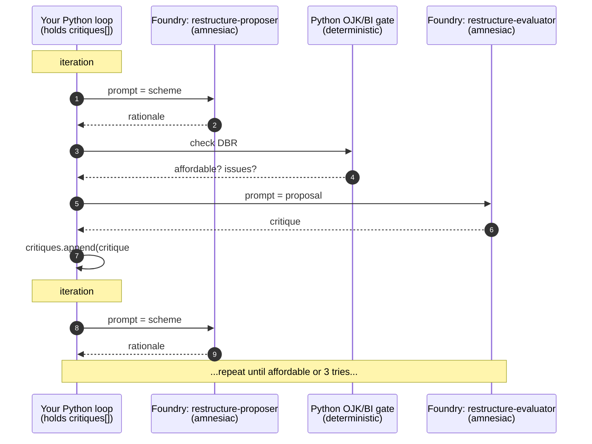
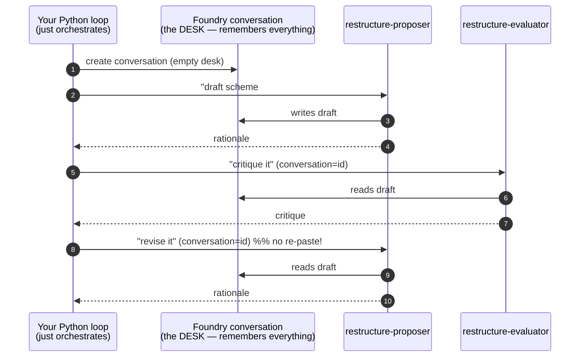
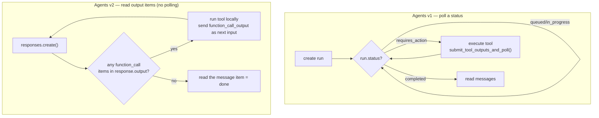
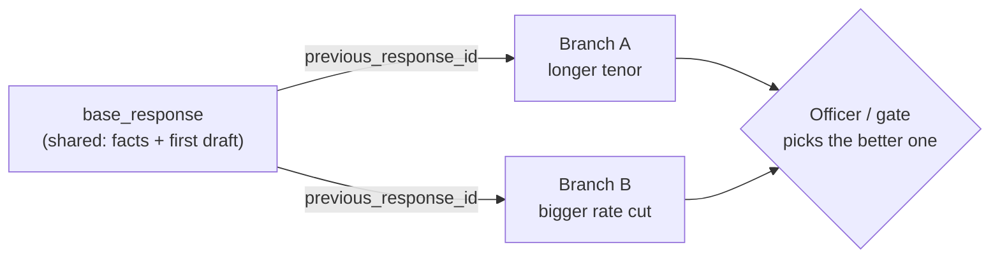
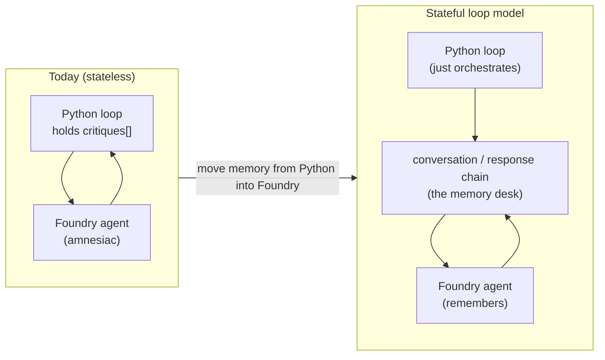

# 11 — Stateful Agentic Loops (Foundry Agents v2 / Responses API) — for absolute beginners

> **What this page is.** A from-zero explanation of the pattern taught in the Microsoft Learn
> module *“Design Stateful Agentic Loops with Microsoft Foundry Agent Service”*, **compared to how
> your BNS code works today**, and **exactly what would change** if you adopted it. No prior
> knowledge assumed — every term is defined the first time it appears.
>
> **Where it fits.** This is a v2 companion page. Your current v2 runner is
> [app/agents/shared/foundry_runner.py](../app/agents/shared/foundry_runner.py); the use case we use
> as the running example is Use Case 4, [app/workflows/restructure_foundry_workflow.py](../app/workflows/restructure_foundry_workflow.py).

---

## 0. TL;DR (baca ini dulu)

- Your code **already calls Foundry-hosted agents** — but in a **stateless / “amnesiac”** way: each
  call to an agent forgets the previous call. **Your Python code is the memory.**
- The **stateful loop model** moves that memory **into Foundry** using a new object called a
  **`conversation`** (or by chaining responses with `previous_response_id`). The agent then
  **remembers its own previous drafts and critiques** — you stop re-pasting them into every prompt.
- Same idea, three extra super-powers you don’t have today: **built-in memory**, **resume after a
  crash/pause**, and **fork** (explore two options in parallel from the same starting point).
- **Nothing forces you to switch.** This page explains the trade-offs so you can decide per use case.

---

## 1. One story we will reuse everywhere 📖

We follow **one** concrete example for the whole page (don’t introduce a second one — a beginner
learns by seeing the *same* thing from many angles):

> **Ibu Sari** (customer `C-00042`) can’t afford her loan installment after losing income. She asks
> the bank to **restructure** (restrukturisasi) it. The **Loan Restructuring Advisor** (Use Case 4)
> must **draft a relief scheme**, **check it’s affordable** (deterministic OJK/BI DBR gate),
> **critique it**, and **revise** — up to 3 times — until it passes or is referred to a human.

That “draft → check → critique → revise” shape is called a **reflection loop** (an *Evaluator–
Optimizer* loop). It is the heart of both the Learn module and Use Case 4.

### The one analogy family we’ll use: a **writer’s room** ✍️

Pick one mental world and stay in it. Ours is a magazine **writer’s room**:

| Real thing (code / Foundry) | Analogy in the writer’s room |
|---|---|
| **Agent** (`restructure-proposer`) | The **junior writer** who drafts the scheme |
| **Agent** (`restructure-evaluator`) | The **senior editor** who red-pens the draft |
| **Instructions** (the agent’s system prompt) | The writer’s **job description** |
| **Model** (e.g. `gpt-4.1`) | The writer’s **brain** |
| **Prompt / input** | The **assignment note** you hand the writer |
| **Response / output** | The **draft** the writer hands back |
| **Conversation** (v2) | The **desk** where every draft + note piles up, kept by the building |
| **Item** (v2) | **One sheet** on that desk (a note, a draft, a “go fetch this file” slip, the fetched file) |
| **`previous_response_id`** | A **sticky note** on a fresh sheet: “continue from draft #2” |
| **Tool call** (MCP/REST) | The writer **phoning the records office** for a fact |
| **State persistence** (Cosmos DB) | **Photocopying the whole desk into a filing cabinet** so you can restore it tomorrow |
| **Fork** | **Photocopying the desk** and giving copies to two writers exploring two different endings |

> 🧠 **Key mental model:** “Who holds the memory of previous drafts?” Today the answer is **your
> Python code**. In the stateful model the answer is **Foundry’s `conversation`**.

---

## 2. The four words you must know (v1 vs v2)

Foundry has **two generations** of the agent API. Your repo uses the **v2** wire call already, but in
a stateless style. Here is the whole vocabulary in one table (this is the single most important table
on the page):

| Idea | **Agents v1** (older “Assistants” style) | **Agents v2** (Responses API — the stateful model) | Writer’s-room analogy |
|---|---|---|---|
| The worker | **Agent** (a random GUID) | **Agent** (a **name + version**, stored in Foundry) | the writer |
| The memory container | **Thread** (holds *messages* only) | **Conversation** (holds typed **items**) | the **desk** |
| One unit of work | **Run** (you **poll its status** until done) | **Response** (returns the finished output **directly**) | handing back a draft |
| One entry of history | **Message** | **Item** (typed: `message`, `function_call`, `function_call_output`, …) | one **sheet** on the desk |

> ⚠️ **The single biggest v1→v2 change:** in v1 you create a **run** and **poll** it in a loop
> (`queued → in_progress → requires_action → completed`). In v2 you call `responses.create(...)`
> and it **either returns the answer or raises an error** — **no status loop**. (Source: Learn Unit
> 2 & 3.)

> ✅ **Takeaway:** “stateful loop” = you keep talking to the **same `conversation`** (or chain by
> `previous_response_id`), and **Foundry remembers everything on the desk for you**.

---

## 3. What your code does **today** (stateless — Python is the memory)

Your v2 runner makes **one stateless call per step**. Look at the real code
([app/agents/shared/foundry_runner.py](../app/agents/shared/foundry_runner.py)):

```python
# FoundryAgentRunner.run(...) — simplified
response = self.openai.responses.create(
    input=prompt,                                   # the assignment note
    extra_body={"agent_reference": {"name": agent_name, "type": "agent_reference"}},
)
text = getattr(response, "output_text", "")         # the draft back
```

Notice what is **NOT** there: no `conversation=...`, no `previous_response_id=...`. So **every call
is a blank desk** — the writer has amnesia. The agent does not remember its previous draft.

So **who remembers the previous drafts and critiques?** Your Python loop does. In
[app/workflows/restructure_foundry_workflow.py](../app/workflows/restructure_foundry_workflow.py) the
memory lives in ordinary Python variables and is **re-pasted into the next prompt as text**:

```python
critiques: list[str] = []           # <-- YOUR code is the memory
...
for i in range(1, MAX_ITERS + 1):
    # manually stitch the previous critique back into the next prompt:
    fb = "" if not critiques else f" Umpan balik sebelumnya (WAJIB diperbaiki): {critiques[-1][:200]}"
    rationale = await _call("propose", "RestructureProposer", "restructure-proposer",
                            f"... Skema usulan: ... {fb}")     # <-- re-paste memory as a string
    ...
    critique = await _call("evaluate", "RestructureEvaluator", "restructure-evaluator", "...")
    critiques.append(critique)       # <-- remember it yourself for next loop
```

Here is that flow as a picture. The **desk is wiped after every call**; your Python `critiques` list is
the only thing that survives:



> 🏙️ **Analogy:** every morning the cleaners empty the desk. So before the junior writer starts
> draft #2, **you** photocopy yesterday’s editor notes from your own folder and clip them on top.
> It works — but the *writer* never truly “remembers”; **you** do.

**This is fine!** It’s simple, fully auditable, and every fact is deterministic. But it has costs:
you re-send prior text every loop (tokens), you truncate it (`[:200]`) to save tokens (losing
detail), and if the portal process dies mid-loop, the in-flight `critiques` list is **gone**.

---

## 4. What the **stateful loop model** changes

The stateful model says: **create a `conversation` once, then keep talking to it.** Foundry keeps
every draft and critique **on the desk (server-side)**, so the agent sees its own history
automatically. You stop re-pasting.

The v2 core loop from Learn Unit 3, adapted to Ibu Sari:

```python
# ONE desk for the whole restructuring case:
conversation = openai.conversations.create()

# Draft #1 — the proposer sees an empty desk
r1 = openai.responses.create(
    input="Draft a conservative relief scheme for C-00042 (hardship: lost income).",
    conversation=conversation.id,                                   # <-- the desk
    extra_body={"agent_reference": {"name": "restructure-proposer", "type": "agent_reference"}},
)

# Editor critiques — SAME desk, so it already sees draft #1 without you pasting it
c1 = openai.responses.create(
    input="Critique that scheme for affordability (DBR) and OJK/BI policy.",
    conversation=conversation.id,                                   # <-- same desk
    extra_body={"agent_reference": {"name": "restructure-evaluator", "type": "agent_reference"}},
)

# Draft #2 — proposer sees draft #1 AND critique #1 automatically. No re-paste.
r2 = openai.responses.create(
    input="Revise the scheme to address the critique.",
    conversation=conversation.id,                                   # <-- same desk
    extra_body={"agent_reference": {"name": "restructure-proposer", "type": "agent_reference"}},
)
```

Same picture, but now **the desk survives between calls** and both agents read from it:



> 🏙️ **Analogy:** now the building keeps the desk exactly as it was overnight. Draft #1 and the red-
> pen notes are still there. The junior writer walks in, **reads the desk**, and writes draft #2 — you
> never had to photocopy anything.

There’s also a lighter-weight option with **no `conversation` object**: chain calls with
`previous_response_id`. Each response remembers its own ancestry:

```python
r1 = openai.responses.create(input="draft #1", extra_body={...proposer...})
c1 = openai.responses.create(input="critique it", previous_response_id=r1.id, extra_body={...evaluator...})
r2 = openai.responses.create(input="revise it",   previous_response_id=c1.id, extra_body={...proposer...})
```

> 🧠 **Two ways to be “stateful”:** a **`conversation`** (a durable desk, best for long/branching
> work) or a **`previous_response_id` chain** (a trail of sticky notes, best for a simple linear
> reflection loop). Both let the agent remember without you re-pasting.

---

## 5. Today vs stateful — the difference in one table

| Question | **Your code today** (stateless v2) | **Stateful loop model** (Learn module) |
|---|---|---|
| Who remembers previous drafts/critiques? | **Your Python** (`critiques[]`, re-pasted as text) | **Foundry** (`conversation` items or response chain) |
| Do you re-send history every loop? | **Yes** — and you truncate it (`[:200]`) to save tokens | **No** — the service already has it |
| Does the agent “see” its own past? | Only what you paste back | **Automatically**, in full |
| Survives portal crash / user pause? | **No** for the in-flight loop | **Yes** — persist `conversation.id`/`response.id` and resume |
| Explore two schemes in parallel from one start? | Hard (re-run from scratch) | **Fork** from one `previous_response_id` / duplicated conversation |
| Tool calls | Your Python calls MCP/REST, pastes results into the prompt | Appear as **`function_call` items**; you run them, hand back a `function_call_output` item |
| Token cost of history | You pay to **re-send** trimmed history each loop | Service manages history (auto-truncates if it overflows the model window) |
| Auditability of *your* deterministic OJK/BI gate | **100% in your Python** ✅ | **Still 100% in your Python** ✅ (unchanged) |

> ✅ **Big takeaway:** adopting the stateful model **does not move your OJK/BI decision logic into the
> LLM.** The deterministic gate (`evaluate_restructure(...)`) stays exactly where it is. Only the
> *narrative memory* moves from your Python variables into Foundry.

---

## 6. The reflection loop, side by side (the exact use-case change)

Here is Use Case 4’s loop, both ways, so you can see precisely what code changes.

**Today (your repo — memory in Python):**

```python
critiques = []
for i in range(1, MAX_ITERS + 1):
    fb = "" if not critiques else f"previous feedback: {critiques[-1][:200]}"   # re-paste
    rationale = runner.run(agent_key="restructure-proposer", prompt=scheme_facts + fb)
    gate = evaluate_restructure(...)          # deterministic OJK/BI — KEEP THIS
    critique = runner.run(agent_key="restructure-evaluator", prompt=proposal_facts)
    critiques.append(critique)                # remember it yourself
    if gate["affordable"]:
        break
```

**Stateful (memory in Foundry — `previous_response_id` chain):**

```python
last_id = None
for i in range(1, MAX_ITERS + 1):
    prompt = scheme_facts if last_id is None else "Revise to fix the editor's critique."
    r = openai.responses.create(input=prompt, previous_response_id=last_id,     # <-- memory
                                extra_body={"agent_reference": {"name": "restructure-proposer", ...}})
    last_id = r.id
    gate = evaluate_restructure(...)          # deterministic OJK/BI — UNCHANGED ✅
    c = openai.responses.create(input="Critique for DBR + OJK/BI policy.", previous_response_id=last_id,
                                extra_body={"agent_reference": {"name": "restructure-evaluator", ...}})
    last_id = c.id                            # the agent will remember this critique for you
    if gate["affordable"]:
        break
```

The diff in words:
1. `critiques.append(...)` + the `fb` re-paste **disappear** — Foundry remembers.
2. You carry a single `last_id` (a sticky note) instead of a growing list of trimmed strings.
3. Your **deterministic gate is untouched**. Your audit/cost hooks stay the same.

> 🏙️ **Analogy:** you fired the photocopier. The desk (or the trail of sticky notes) now carries the
> memory, so the writer and editor keep building on each other without you in the middle re-typing.

---

## 7. “Run status” vs “output items” — the tool-handling difference

This trips up beginners, so here it is plainly. When an agent needs a **tool** (e.g. the Credit
Bureau MCP), the two generations behave differently:



- **v1:** the run **pauses** at `requires_action`; you must submit tool results and **keep polling**.
- **v2 (stateful model):** there’s **no status enum**. You look inside `response.output` for
  `function_call` items, run them, and pass a `function_call_output` item back in. One call, one
  answer — never a half-finished “in progress” state to babysit.

> 🏙️ **Analogy — v1:** the writer stops mid-sentence and waits by the door until you fetch the file.
> **v2:** the writer instead hands you a **slip** (“fetch file X”), you bring it back, and the writing
> continues — no awkward waiting-by-the-door state.

> 💡 In your app today you dodge this entirely because **your Python** calls MCP/REST and pastes
> results into the prompt. That’s valid. The v2 item model just gives you a *standard* way to let the
> **agent itself** ask for tools when you want that.

---

## 8. Session state — surviving a crash or a coffee break ☕

Right now, if the portal restarts while Ibu Sari’s loop is running, the in-flight `critiques` list
vanishes. (Your SME use case already solves a *different* pause problem with a persistent
[case store](../app/workflows/case_store.py) — this is the same spirit, but for the LLM history.)

The stateful model gives you two levels of durability:

| Tier | What it is | When to use (Ibu Sari) |
|---|---|---|
| **Conversation only** (server-managed) | Foundry keeps the desk while the case is active | The whole restructuring runs in one sitting |
| **+ Cosmos DB persistence** | You also save `conversation.id` / `response.id` + business metadata to your own store | Case is paused for a human officer, or must survive a crash, or needs a **queryable audit trail** |

Resume is then trivial — you saved the id, so you reopen the same desk:

```python
# On pause: store the pointer next to your business record
save_case(customer="C-00042", conversation_id=conversation.id, status="awaiting-officer")

# On resume (even days later, even on another server instance):
convo_id = load_case("C-00042")["conversation_id"]
r = openai.responses.create(input="Officer approved option B; finalize the letter.",
                            conversation=convo_id, extra_body={...writer...})
```

> 🏙️ **Analogy:** photocopy the desk into a **filing cabinet** (Cosmos DB) with a label. Monday
> morning, pull the folder, lay it back on a desk, and the writer continues as if no weekend passed.

> ⚠️ **Pitfall:** a `conversation` can outgrow the model’s context window (e.g. 128K tokens). Foundry
> then **auto-truncates the input** (it doesn’t delete your desk). For must-keep facts (the approved
> DBR threshold, the final offer), **store them yourself** and re-inject them — don’t rely on the
> window. This is the v2 version of your current `[:200]` trimming, done deliberately.

---

## 9. Fork — explore two relief schemes at once 🌱

Ibu Sari might qualify for **two** valid schemes: “longer tenor, small rate cut” vs “short grace
period, bigger rate cut”. Today you’d run the loop twice from scratch. **Fork** lets both branches
**share the expensive setup** (KYC, credit pull, first draft) and then diverge:



```python
base = openai.responses.create(input="Gather facts and draft a baseline scheme for C-00042.",
                               extra_body={...proposer...})

branch_a = openai.responses.create(input="Variant A: extend tenor, minimal rate cut.",
                                   previous_response_id=base.id, extra_body={...proposer...})
branch_b = openai.responses.create(input="Variant B: short grace + bigger rate cut.",
                                   previous_response_id=base.id, extra_body={...proposer...})
# Both branches reused the base context — you paid for the setup once.
```

> 🏙️ **Analogy:** photocopy the desk **once**, hand a copy to two writers, and let each write a
> different ending. You didn’t make either writer redo the research.

> 💡 **Don’t fork if** the two options are cheap to compute or fully independent — just run twice.
> Fork pays off when the **shared setup is expensive** (KYC + credit bureau + first draft).

---

## 10. The three context strategies (cheat sheet)

When you go stateful, you pick **how** history is kept. Straight from Learn Unit 3/5:

| Strategy | Server stores history? | Use when (Ibu Sari) |
|---|---|---|
| **Conversation** (`conversation.id`) | Yes, service-managed | Long/branching case, want easy resume + debugging |
| **`previous_response_id` chain** | Yes, per response | Simple linear reflection loop (our Use Case 4) |
| **`store=False`** (zero-retention) | **No** | Strict compliance: nothing may be stored server-side; **you** carry every prior item |

> ✅ For Use Case 4, the **`previous_response_id` chain** is the smallest, cleanest upgrade from what
> you have now.

---

## 11. What would actually change in *your* repo

Concrete, file-level, if you decide to adopt this for one use case:

1. **`app/agents/shared/foundry_runner.py`** — teach `FoundryAgentRunner.run(...)` to accept an
   optional `conversation_id` **or** `previous_response_id`, and pass it into
   `openai.responses.create(...)`. (Today it passes neither.) Keep **all** your governance hooks
   (`cost.add`, `audit.record`, `tech.append`) exactly as they are.
2. **`app/workflows/restructure_foundry_workflow.py`** — delete the `critiques[]` re-paste (`fb`),
   thread a `last_id` through the loop instead. **Keep** `evaluate_restructure(...)` and every
   `audit.record(...)` call unchanged.
3. **(Optional) persistence** — when a case pauses for a human, save `conversation.id`/`response.id`
   next to the business record (mirror what [case_store.py](../app/workflows/case_store.py) already
   does for SME), so you can resume.
4. **Nothing else moves.** Deterministic OJK/BI logic, content safety, APIM routing
   ([gateway.py](../app/agents/shared/gateway.py)), token metering, and the portal panels all stay.

> 🛡️ **Risk this prevents:** losing an in-flight reflection loop when the portal restarts, and
> paying to re-send trimmed critique text every iteration. Making the loop stateful fixes both.

---

## 12. When to use it — and when NOT to

**Use the stateful loop model when:**
- The loop is **multi-turn** and each turn should build on the last (reflection, planning) — exactly
  Use Case 4 (Restructure) and Use Case 7 (Magentic).
- You need to **pause/resume** (human-in-the-loop, long cases) — Use Case 2 (SME).
- You want to **fork** and compare options from one expensive setup.

**Keep your current stateless style when:**
- The use case is a **straight-through, single-pass** pipeline where each step’s facts are fully
  recomputed deterministically anyway — e.g. Use Case 1 (Retail). Adding a conversation buys little.
- You need **zero server-side retention** and already re-send context deliberately.

> 🧠 **Rule of thumb:** the *more the agent should remember across turns*, the more the stateful model
> pays off. A one-shot classifier gains nothing; a reflect-and-revise loop gains a lot.

---

## 13. The whole thing in six sentences (mental model)

1. An **agent** is a named worker in Foundry; you already call yours by reference.
2. Today each call is **amnesiac**, so **your Python is the memory** (you re-paste prior critiques).
3. The **stateful loop model** keeps memory in a Foundry **`conversation`** (a desk) or a
   **`previous_response_id`** chain (sticky notes), so the agent remembers its own history.
4. v2 also drops the v1 **status-polling** loop — a `response` returns the answer directly, and tool
   needs show up as **items** you fulfil and hand back.
5. Because history is server-side, you get **resume-after-crash** and **fork** almost for free.
6. Your **deterministic OJK/BI decisions, audit, cost, and APIM routing do not change** — only the
   narrative memory moves.



---

## 14. Sources & further reading
- Microsoft Learn: [Design Stateful Agentic Loops with Microsoft Foundry Agent Service](https://learn.microsoft.com/en-us/training/modules/aaai-design-agentic-loops-azure-ai-agent-service/)
  (Units 2–7: run lifecycle, Responses API v2 model, reflection/planning, session state, fork, v1→v2 migration).
- Your code: [foundry_runner.py](../app/agents/shared/foundry_runner.py) ·
  [restructure_foundry_workflow.py](../app/workflows/restructure_foundry_workflow.py) ·
  [case_store.py](../app/workflows/case_store.py) · [gateway.py](../app/agents/shared/gateway.py).
- Related v2 pages: [01-what-is-a-foundry-agent.md](01-what-is-a-foundry-agent.md) ·
  [02-architecture-and-flow-foundry.md](02-architecture-and-flow-foundry.md) ·
  [06-use-case-code-walkthrough-foundry.md](06-use-case-code-walkthrough-foundry.md).
