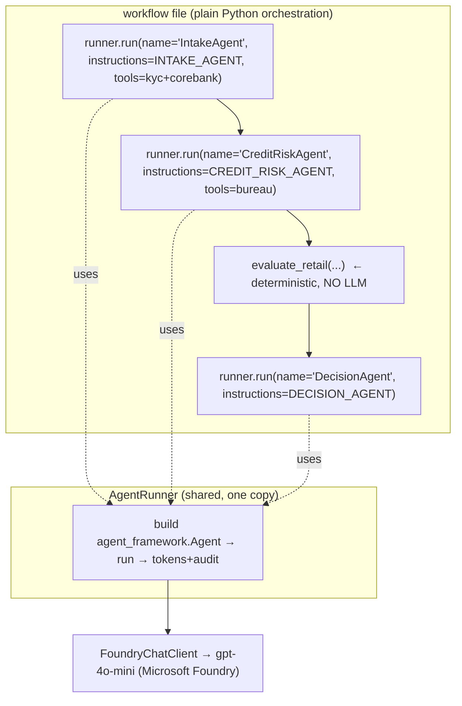

# 1 · What is an "agent" in this code?

> *"I don't see any specific agent written here — everything is in one code/agent. I assumed each
> agent should have its own code, but I don't see it. It's hard to understand."*

This is the **most important** thing to understand about the codebase. Let's fix the mental model.

---

## The expectation vs. the reality

**What you probably expected** (one class per agent):

```python
class IntakeAgent:        # ❌ NOT how this app works
    def run(self, application): ...

class CreditRiskAgent:    # ❌
    def run(self, application): ...
```

**What this app actually does** — an agent is a **configuration passed to one reusable runner**:

```python
# an "agent" = name + instructions + tools + output schema, run by AgentRunner.run(...)
intake = await runner.run(
    step="intake",
    name="IntakeAgent",                 # ← the agent's name
    instructions=INTAKE_AGENT,          # ← the agent's "brain" (system prompt) — a plain string
    tools=[get_account_summary, kyc_tool],   # ← the agent's tools
    response_format=IntakeResult,       # ← the agent's structured output (a Pydantic model)
    prompt="Applicant: customer_id=CUST-1001, ...",   # ← the task for this run
)
```

So **there is no `IntakeAgent` class**. "IntakeAgent" is just a **name + a system prompt +
some tools** that we hand to a **single, shared runner**. The runner builds a Microsoft Agent
Framework `Agent` object *at that moment*, runs it once, and returns the result.

Think of it like `logging.getLogger(name)` — you don't write a class per logger; you configure a
generic object by name. Same idea: **one generic `Agent` type, configured per call.**

---

## Where the "agents" actually live

Two files per use case:

| Piece | File | Contains |
|-------|------|----------|
| **The agents' brains** | `app/agents/<use_case>/agents.py` | The **instructions** (system prompts) as plain string constants: `INTAKE_AGENT`, `CREDIT_RISK_AGENT`, `DECISION_AGENT`, … |
| **The orchestration** | `app/workflows/<use_case>_workflow.py` | Python that **calls** those agents in the right order/parallelism/loop, wires **tools**, and applies **deterministic gates**. |

Example — [app/agents/retail/agents.py](../app/agents/retail/agents.py) is literally just strings:

```python
INTAKE_AGENT = """
You are the Intake & Verification agent at Bank Nusantara Sejahtera (BNS)...
1. Call screen_individual (KYC/AML tool) with the applicant's NIK ...
2. Call get_account_summary (core banking) ...
Return a structured IntakeResult. ...
""".strip()

CREDIT_RISK_AGENT = """ You are the Credit Risk Scoring agent ... """.strip()
DECISION_AGENT   = """ You are the Decision & Communication agent ... """.strip()
```

That's it. Each constant **is** an agent's persona/behavior. The retail use case has **3 LLM
agents** (`INTAKE_AGENT`, `CREDIT_RISK_AGENT`, `DECISION_AGENT`) plus **1 deterministic step**
(compliance) that uses **no LLM at all**.

---

## The one runner that runs every agent

All agents in the whole app go through **one method**:
[`AgentRunner.run(...)`](../app/agents/shared/model_client.py). Here is the heart of it (abridged):

```python
class AgentRunner:
    async def run(self, *, step, name, instructions, prompt,
                  response_format=None, tools=None):
        # 1) Build a framework Agent from the config passed in ↓
        agent = Agent(
            client=self.client,               # FoundryChatClient → the LLM (gpt-4o-mini on Foundry)
            name=name,
            instructions=instructions,        # the system prompt (e.g. INTAKE_AGENT)
            tools=list(tools) if tools else None,
            middleware=[_make_tool_logger(self.tech)],   # records real tool calls
        )
        # 2) Run it once
        result = await agent.run(prompt, options={"response_format": response_format})
        # 3) Governance: token accounting + audit log
        self.cost.add(in_tok, out_tok)
        self.audit.record(request_id=..., step=step, actor=name, tokens=..., detail=...)
        # 4) Return parsed model (if response_format) or plain text
        return result.value if response_format else result.text
```

So **"everything in one code"** is by design: the *plumbing* (build agent → run → account tokens →
audit) is written **once**, and every agent reuses it. What makes agents **different** is only what
you pass in: `name`, `instructions`, `tools`, `response_format`.

---

## "So how is it multi-agent then?"

Because the **workflow file calls `runner.run(...)` multiple times**, each time with a different
agent config, and arranges those calls into a pattern:



- **3 boxes call the runner** → that's **3 agents** (Intake, Credit, Decision).
- **1 box is deterministic** (`evaluate_retail`) → not an agent, just Python rules.
- The **arrows** (`A → B → C → D`) are the **orchestration** — here, sequential. Other use cases use
  `asyncio.gather` (parallel), `for` loops (reflection), routing branches, etc.

---

## Mapping: "agent" ↔ code (Retail example)

| Agent (logical) | Instructions constant | File | Tools it uses | Called at step |
|-----------------|-----------------------|------|---------------|----------------|
| Intake & Verification | `INTAKE_AGENT` | `agents/retail/agents.py` | KYC/AML MCP, Core Banking REST | `step="intake"` |
| Credit Risk | `CREDIT_RISK_AGENT` | `agents/retail/agents.py` | Credit Bureau MCP | `step="credit_risk"` |
| Compliance | *(none — deterministic)* | `mock_services/policy.py` | — (Python rules) | `step="compliance"` |
| Decision & Offer | `DECISION_AGENT` | `agents/retail/agents.py` | — | `step="decision"` |

Every other use case follows the exact same convention (see
[03-use-cases.md](03-use-cases.md)).

---

## Could we write one class per agent instead?

Yes — you *could* wrap each `runner.run(...)` in its own class/function. The demo deliberately keeps
agents as **instruction constants + runner calls** because:

- It's **idiomatic Microsoft Agent Framework**: `Agent(...)` is a generic type you *configure*, not
  subclass.
- It makes the **orchestration** (the interesting multi-agent part) obvious and all in one place.
- It centralizes **governance** (audit, cost, tool-logging) so every agent gets it for free.

If you prefer the class style, a thin wrapper like
`class IntakeAgent: def __init__(self, runner): ...; async def run(self, app): return await self.runner.run(name="IntakeAgent", instructions=INTAKE_AGENT, ...)`
would behave identically — it's a stylistic choice, not a functional one.

---

**Next:** [02-architecture-and-flow.md](02-architecture-and-flow.md) traces a full request end-to-end.
