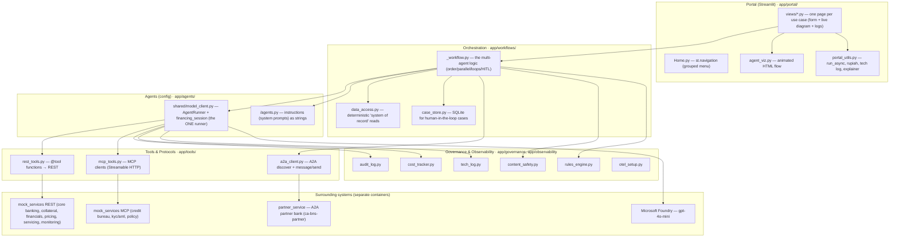
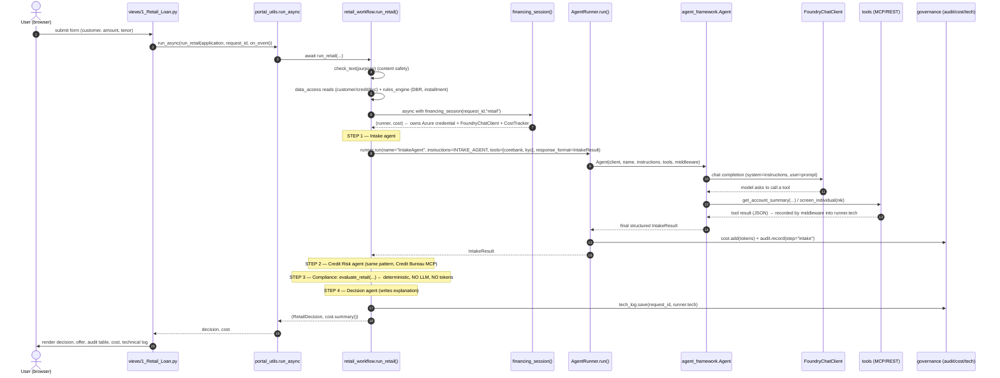
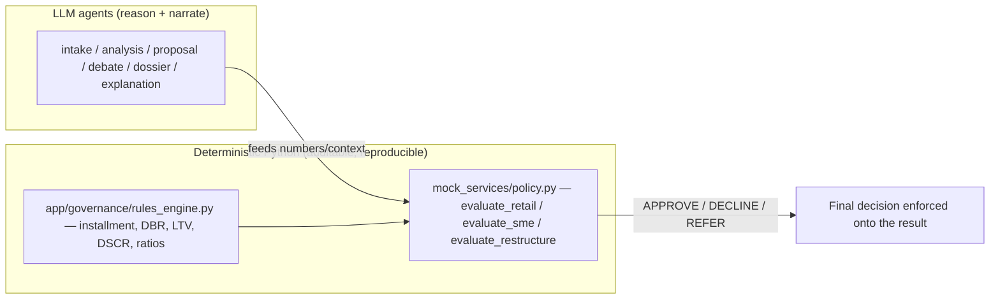

# 2 · Architecture, code flow & request trace

This explains **how a request flows through the code**, how the **Microsoft Agent Framework** is
called, and where every component lives.

---

## Layered architecture



---

## Component map (file → responsibility)

| File / folder | Responsibility |
|---|---|
| `app/portal/Home.py` | Entry point; builds the **grouped sidebar** with `st.navigation`. |
| `app/portal/views/<n>_*.py` | One **page per use case**: form → calls the workflow → renders diagram, logs, result, audit, cost, tech log. |
| `app/portal/agent_viz.py` | The **live animated flow** (pure HTML/CSS) + node catalogs + `FlowState`. |
| `app/portal/portal_utils.py` | `run_async`, `rupiah`, `render_tech_log`, `render_pattern_explainer`, `render_audit_legend`. |
| `app/workflows/<uc>_workflow.py` | **Orchestration** — the multi-agent logic for one use case. |
| `app/workflows/case_store.py` | SQLite persistence for **human-in-the-loop** cases (SME, AML). |
| `app/workflows/data_access.py` | Deterministic **system-of-record** reads (customer, credit, kyc, loans, alerts…). |
| `app/agents/<uc>/agents.py` | The **agents' instructions** (system prompts) as string constants. |
| `app/agents/shared/model_client.py` | **`AgentRunner`** (runs every agent) + **`financing_session`** (credential + client + cost). |
| `app/tools/rest_tools.py` | `@tool` functions that call the REST back-office. |
| `app/tools/mcp_tools.py` | MCP tool clients (`MCPStreamableHTTPTool`). |
| `app/tools/a2a_client.py` | A2A client: discover Agent Card + JSON-RPC `message/send`. |
| `app/governance/*` | Audit log, cost/token budget, PII/content safety, deterministic rules engine, technical call log. |
| `app/observability/otel_setup.py` | OpenTelemetry → App Insights / Aspire. |
| `app/core/{config,models}.py` | Settings (`get_settings`) and Pydantic **domain models** (agent inputs/outputs). |
| `mock_services/` | The **surrounding systems** (REST + 3 MCP servers) — a separate container. |
| `partner_service/` | The **A2A partner bank** — a separate container. |

---

## End-to-end trace of one request (Retail example)



Each `on_event(node, state, detail)` callback the workflow fires updates the **live diagram** and the
**streaming log** in the page while this runs.

---

## How the framework is called (the 3 lines that matter)

Inside [`AgentRunner.run`](../app/agents/shared/model_client.py):

```python
agent  = Agent(client=self.client, name=name, instructions=instructions,
               tools=list(tools) if tools else None, middleware=[_make_tool_logger(self.tech)])
result = await agent.run(prompt, options={"response_format": response_format})
return result.value if response_format else result.text
```

- `Agent(...)` — the **Microsoft Agent Framework** agent object. It is **generic**; the persona comes
  from `instructions`, the abilities from `tools`, the output shape from `response_format`.
- `client=FoundryChatClient(...)` — the LLM connection (model `gpt-4o-mini` hosted on **Microsoft
  Foundry**, auth via `DefaultAzureCredential`). Created once per request in `financing_session`.
- `middleware=[_make_tool_logger(...)]` — a **function middleware** that intercepts **every real tool
  call** (name, args, result, latency) and records it → this is what the page's *Technical log* shows.
- `options={"response_format": SomeModel}` — asks the framework to return a **validated Pydantic
  object** (structured output), not free text.

---

## `financing_session` — one credential + client + budget per request

```python
@asynccontextmanager
async def financing_session(request_id, use_case):
    cost = CostTracker(request_id)                     # token budget for this request
    async with DefaultAzureCredential() as credential: # Azure AD auth (az login / managed identity)
        client = make_chat_client(credential)          # FoundryChatClient(project_endpoint, model, credential)
        runner = AgentRunner(client, request_id, use_case, cost)
        yield runner, cost                             # every agent in this request reuses these
```

So all agents in one request share **one LLM client** and **one cost tracker** — clean and cheap.

---

## Orchestration = plain Python (this is the "multi-agent" part)

The framework runs a **single** agent per `runner.run(...)`. The **coordination of many agents** is
ordinary Python in the workflow file:

| Orchestration | Python mechanism | Use case |
|---|---|---|
| Sequential | `a = run(); b = run(); c = run()` | Retail |
| Concurrent | `await asyncio.gather(run(), run(), run(), run())` | SME |
| Routing | classify → `if intent == ...: run(handler)` | Servicing |
| Reflection loop | `for i in range(MAX): propose = run(); critique = run(); if ok: break` | Restructuring |
| ReAct (single autonomous agent) | one `run(tools=[...])`; the model chooses tools | AML |
| Group chat | nested `for round: for speaker: run()` sharing a transcript | Committee |
| Magentic | `plan = run(); for step: run(worker); replan = run()` | Complex Investigation |
| A2A | `run(arranger)` → `a2a_send(partner)` → `run(synthesizer)` | Syndication |

---

## Where decisions are made: deterministic vs LLM

A core governance principle: **regulatory/financial decisions are deterministic Python**, not the LLM.



Example: in Retail, the LLM does intake + credit reasoning + the explanation, but **`evaluate_retail`
(pure Python)** makes the APPROVE/DECLINE/REFER call. The workflow then **overrides** the agent's
decision field with the deterministic one — the LLM can never approve past a hard policy breach.

---

## Protocol wiring in code

### MCP (agent → tools/data) — `app/tools/mcp_tools.py`
```python
def kyc_aml_tool():  # returns an MCP client (Streamable HTTP)
    return MCPStreamableHTTPTool(name="kyc_aml", url=f"{BASE}/mcp/kyc-aml/")
```
Used as an async context manager and passed into `runner.run(tools=[kyc_tool])`. The **model decides**
to call `screen_individual`; the framework executes it over MCP; the middleware logs it.

### A2A (agent → another agent) — `app/tools/a2a_client.py` + `partner_service/`
Not a `runner.run` — it's a **cross-service call**:
```python
meta = await a2a_send(PARTNER_URL, deal_json)   # 1) GET /.well-known/agent-card.json (discover)
                                                # 2) POST /a2a  JSON-RPC message/send
offer = ParticipationOffer(**json.loads(meta["reply_text"]))
```
The partner (`partner_service/app.py`) is a **separate container** with its **own** Agent Card and
underwriting logic. See [03-use-cases.md](03-use-cases.md#8--syndication--a2a).

---

## Governance & observability hooks (applied to every agent)

| Concern | Code | When |
|---|---|---|
| **Audit** | `audit_log.record(...)` | inside `AgentRunner.run` (every step) + at workflow decision points |
| **Cost/token budget** | `CostTracker.add(...)` | inside `AgentRunner.run` |
| **PII redaction** | `content_safety.redact_pii(...)` | before any log write |
| **Content safety** | `content_safety.check_text(...)` | on free-text inputs at workflow start |
| **Technical call log** | `_make_tool_logger` middleware → `tech_log.save(...)` | every real MCP/REST/A2A call |
| **Telemetry** | `otel_setup.setup_observability()` | once per page load; traces → App Insights |

---

**Next:** [03-use-cases.md](03-use-cases.md) documents each of the 8 use cases in detail.
