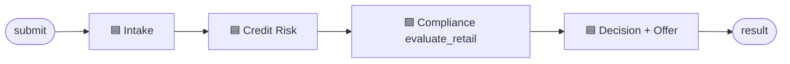
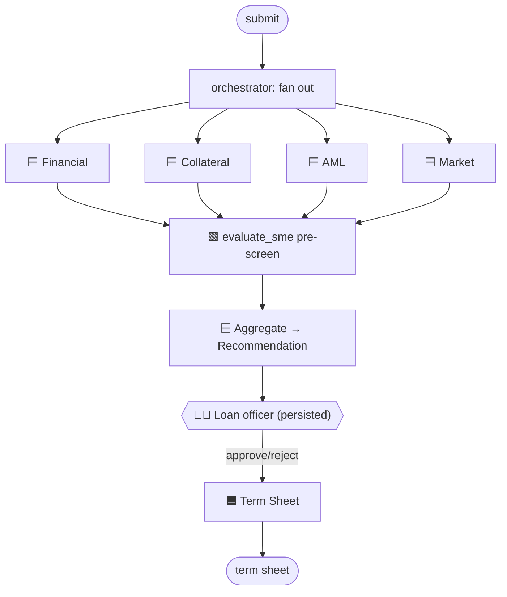
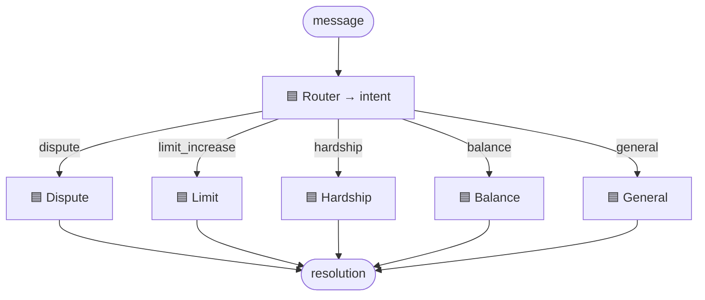
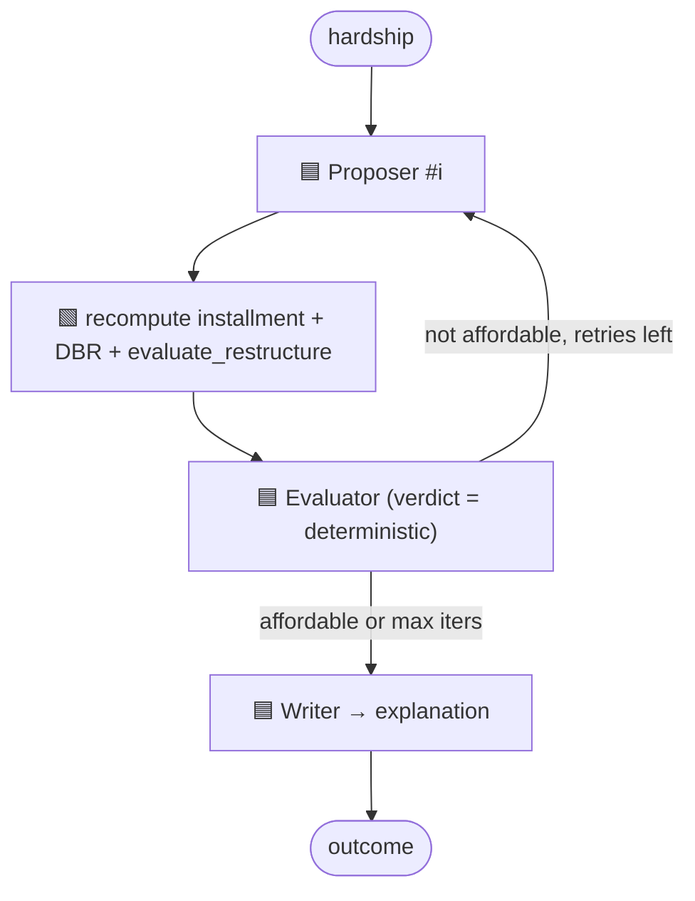
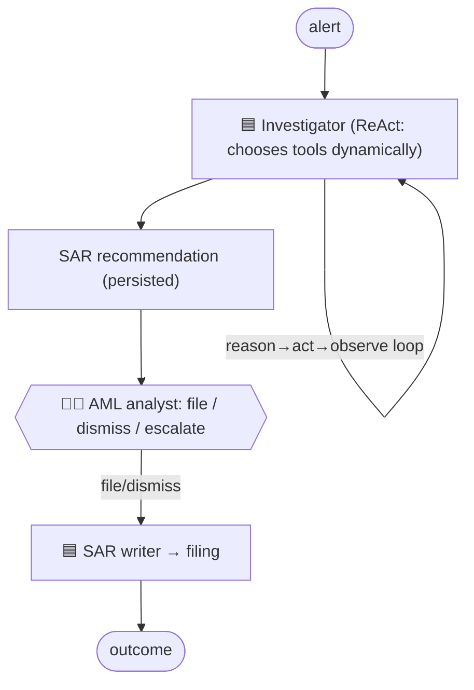
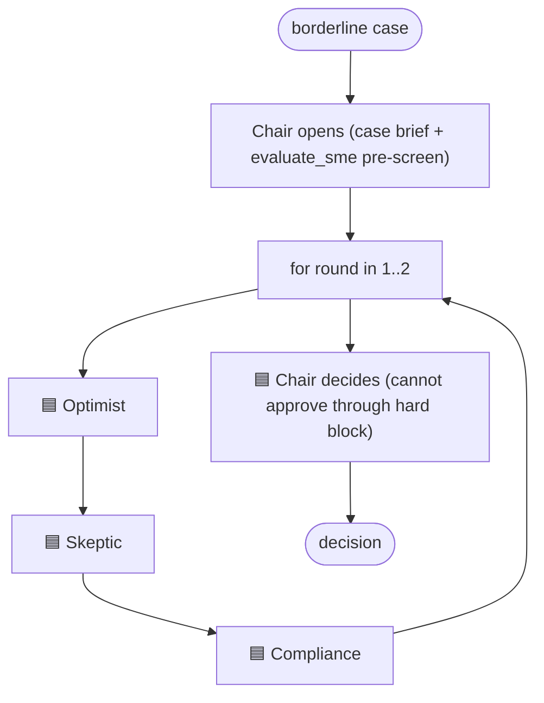
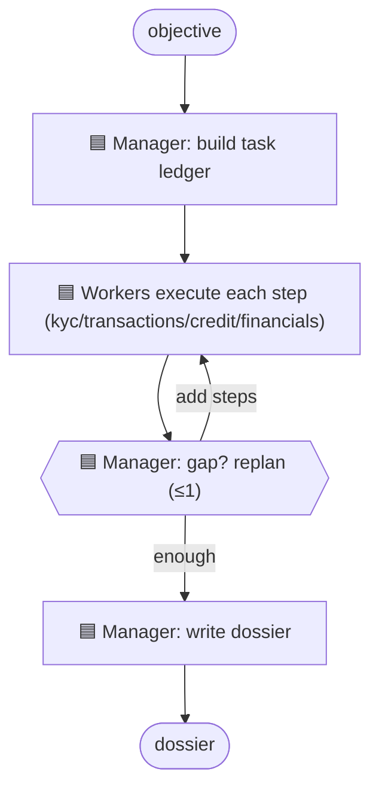
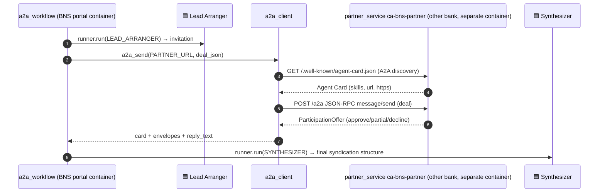

# 3 · Use cases in detail

For every use case: **entry point → components → agents → orchestration → decisions → protocols**,
with a diagram. Remember from [01](01-what-is-an-agent.md): an "agent" = an **instructions constant**
(in `app/agents/<uc>/agents.py`) invoked via **`runner.run(...)`** (in `app/workflows/<uc>_workflow.py`).

Legend: 🟦 = LLM agent (`runner.run`) · 🟩 = deterministic Python (no LLM) · 🧑‍⚖️ = human gate ·
🔌 = MCP tool · 🌐 = REST tool · 🤝 = A2A.

Need deeper implementation details (code POV, metrics visibility, and governance proofs)?

- Per-use-case code trace (EN/ID): [06-use-case-code-walkthrough.md](06-use-case-code-walkthrough.md)
- Governance, logs, tokens, cost internals (EN/ID): [07-governance-token-cost.md](07-governance-token-cost.md)

---

## 1 · Retail Personal Loan — Sequential (Prompt Chaining)

- **Page:** `app/portal/views/1_Retail_Loan.py` → `run_retail(...)`
- **Workflow:** `app/workflows/retail_workflow.py` · **Instructions:** `app/agents/retail/agents.py`

| # | Agent / step | Kind | Tools | Output |
|---|---|---|---|---|
| 1 | `INTAKE_AGENT` | 🟦 | 🔌 KYC/AML `screen_individual`, 🌐 `get_account_summary` | `IntakeResult` |
| 2 | `CREDIT_RISK_AGENT` | 🟦 | 🔌 Credit Bureau `get_credit_report` | `CreditAssessment` |
| 3 | `evaluate_retail(...)` | 🟩 | — | APPROVE/DECLINE/REFER |
| 4 | `DECISION_AGENT` | 🟦 | — | explanation text |

- **Orchestration:** straight sequence; each output feeds the next.
- **Decision:** `evaluate_retail` (Python) decides; the result's `decision` is set from it (LLM cannot override). Amount ≥ auto-approve ceiling → **REFER**.

---

## 2 · SME / Commercial Financing — Concurrent + Human-in-the-loop

- **Page:** `views/2_SME_Underwriting.py` (2 tabs) → `run_sme_analysis(...)` then `resume_sme_with_decision(...)`
- **Workflow:** `sme_workflow.py` · **Instructions:** `agents/sme/agents.py` · **Persistence:** `case_store.py`

| Phase | Agent / step | Kind | Tools |
|---|---|---|---|
| A | `FINANCIAL_ANALYST` | 🟦 | 🌐 `get_financial_statements` |
| A | `COLLATERAL_AGENT` | 🟦 | 🌐 `get_collateral` |
| A | `AML_FRAUD_AGENT` | 🟦 | 🔌 KYC/AML `screen_entity` |
| A | `MARKET_RISK_AGENT` | 🟦 | — (reasoning) |
| A | `evaluate_sme(...)` | 🟩 | — |
| A | `ORCHESTRATOR` (aggregate) | 🟦 | — |
| — | **Loan officer decides** | 🧑‍⚖️ | persisted `PENDING_HUMAN` |
| B | `TERMSHEET_AGENT` | 🟦 | — |

- **Orchestration:** the 4 specialists run in **parallel** via `await asyncio.gather(run_financial(), run_collateral(), run_aml(), run_market())`. The case is **saved to SQLite** and the workflow returns; Phase B resumes later after the human decides.
- **Decision:** `evaluate_sme` (Python) sets the recommended decision; SME always needs the **human gate** before a term sheet.

---

## 3 · Smart Customer Servicing — Routing

- **Page:** `views/4_Customer_Servicing.py` → `run_servicing(...)`
- **Workflow:** `servicing_workflow.py` · **Instructions:** `agents/servicing/agents.py`

| Step | Agent | Kind | Tools |
|---|---|---|---|
| classify | `ROUTER_AGENT` | 🟦 | — → `RoutingDecision(intent)` |
| handle (1 of 5) | `DISPUTE` / `LIMIT_INCREASE` / `HARDSHIP` / `BALANCE` / `GENERAL` | 🟦 | dispute→🌐`get_transactions`; limit→🌐`get_account_summary`+🔌bureau; hardship→🌐`get_existing_loans`; balance→🌐`get_account_summary`; general→— |

- **Orchestration:** the router returns an `intent`; a Python `dict` maps intent → the **single** handler that runs (`_HANDLERS[intent]`). Only one handler executes → token-efficient. This is a **one-hop Handoff** (a simplified version of the official Handoff orchestration).

---

## 4 · Loan Restructuring Advisor — Evaluator–Optimizer (reflection loop)

- **Page:** `views/5_Restructuring.py` → `run_restructure(...)`
- **Workflow:** `restructure_workflow.py` (`MAX_ITERS=3`) · **Instructions:** `agents/restructure/agents.py`

| Step (per iteration) | Agent / gate | Kind |
|---|---|---|
| propose | `PROPOSER_AGENT` (🌐`get_existing_loans`, 🔌bureau) | 🟦 |
| clamp (round 1) | conservative min-concession clamp | 🟩 |
| affordability | `monthly_installment`, `debt_burden_ratio`, `evaluate_restructure` | 🟩 |
| critique | `EVALUATOR_AGENT` (verdict forced from the deterministic gate) | 🟦 |
| final | `WRITER_AGENT` | 🟦 |

- **Orchestration:** a `for i in range(1, MAX_ITERS+1)` loop. The evaluator's feedback is fed back into the next proposal. **Round 1 is clamped to a conservative scheme** so genuinely distressed borrowers (e.g. **CUST-1006**) need ≥2 iterations.
- **Decision:** affordability is **deterministic** (`evaluate_restructure` reusing the retail DBR ceiling); the LLM only proposes/critiques/writes. APPROVE if affordable, else REFER to a human officer.

---

## 5 · AML / Fraud Investigation — ReAct + human SAR gate

- **Page:** `views/6_AML_Investigation.py` (2 tabs) → `run_aml_investigation(...)` then `resume_aml_with_decision(...)`
- **Workflow:** `aml_workflow.py` · **Instructions:** `agents/aml/agents.py` · **Persistence:** `case_store.py` (aml_cases)

| Phase | Agent | Kind | Tools |
|---|---|---|---|
| A | `INVESTIGATOR_AGENT` | 🟦 (ReAct) | 🔌KYC `screen_individual`, 🔌bureau `get_credit_report`, 🌐`get_monitoring_alerts`, 🌐`get_transactions` |
| — | **AML analyst decides** | 🧑‍⚖️ | persisted `PENDING_HUMAN` |
| B | `SAR_WRITER_AGENT` | 🟦 | — |

- **Orchestration:** a **single autonomous agent** with **4 tools**; the model decides *which* tool to call *when* — the steps are not fixed. A deterministic escalation forces `file_sar=True` if a DTTOT sanctions hit is present.
- **This is the ReAct pattern** — contrast with Magentic (#7) which is manager-coordinated multi-agent.

---

## 6 · Credit Committee — Group Chat

- **Page:** `views/7_Credit_Committee.py` → `run_committee(...)`
- **Workflow:** `committee_workflow.py` (`ROUNDS=2`) · **Instructions:** `agents/committee/agents.py`

| Step | Agent | Kind |
|---|---|---|
| debate ×2 rounds | `RISK_OPTIMIST`, `RISK_SKEPTIC`, `COMPLIANCE_OFFICER` (each sees the shared transcript) | 🟦×3 |
| decide | `CHAIR_AGENT` (guardrail: `evaluate_sme` hard block) | 🟦 |

- **Orchestration:** nested loops — `for round: for (node, speaker, instructions) in _DEBATERS: run(...)`; each turn's prompt includes the **shared transcript** so agents respond to each other. The Chair synthesizes and decides.

---

## 7 · Complex Investigation — Magentic

- **Page:** `views/8_Complex_Investigation.py` → `run_magentic(...)`
- **Workflow:** `magentic_workflow.py` (`MAX_REPLANS=1`) · **Instructions:** `agents/magentic/agents.py`

| Step | Agent | Kind | Tools |
|---|---|---|---|
| plan | `MANAGER_PLAN` → `MagenticPlan` (3–5 steps, each assigned to a worker) | 🟦 | — |
| execute | `WORKER_AGENT` per step | 🟦 | kyc→🔌; transactions→🌐×2; credit→🔌; financials→🌐×2 |
| replan | `MANAGER_REPLAN` (add ≤2 steps if a gap remains) | 🟦 | — |
| dossier | `MANAGER_DOSSIER` | 🟦 | — |

- **Orchestration:** a **manager** builds a ledger (`MagenticPlan`), the workflow executes each step via the right worker+tools, then the manager **reviews & may replan**, then writes the dossier. Multi-agent, manager-coordinated — the multi-agent cousin of ReAct (#5).

---

## 8 · Syndication / Co-Financing — A2A (Agent2Agent)

- **Page:** `views/9_Syndication_A2A.py` → `run_syndication(...)`
- **Workflow:** `a2a_workflow.py` · **Instructions:** `agents/syndication/agents.py` · **Client:** `app/tools/a2a_client.py` · **Remote agent:** `partner_service/app.py` (separate container `ca-bns-partner`)

| Step | Agent / call | Kind |
|---|---|---|
| arrange | `LEAD_ARRANGER` (BNS, splits hold vs syndicate) | 🟦 |
| delegate | `a2a_send(PARTNER_URL, deal)` — discover Agent Card + `message/send` | 🤝 |
| partner | `partner_service` co-underwriting (separate org, **rule-based, no LLM/creds**) | 🟩 (remote) |
| finalize | `SYNTHESIZER` (combine BNS + partner, blended rate) | 🟦 |

- **Orchestration:** two LLM agents **in the BNS container** wrap a **cross-organisation A2A call** to a **separately deployed** partner agent. The partner is opaque (BNS never sees its code/data/model).
- **This is the one case that genuinely needs A2A** — the agents live in different containers/organisations. All other use cases are in-process orchestration. See the in-app **📖 FAQ** page for MCP-vs-A2A and when-to-use guidance.

---

## Quick reference — all 8

| # | Use case | Pattern | Orchestration mechanism | Human gate | Protocols |
|---|---|---|---|---|---|
| 1 | Retail | Sequential | chained `run()` | — | MCP, REST |
| 2 | SME | Concurrent | `asyncio.gather` | ✅ | MCP, REST |
| 3 | Servicing | Routing | classify → dict dispatch | — | MCP, REST |
| 4 | Restructuring | Evaluator–Optimizer | `for` loop + feedback | — | MCP, REST |
| 5 | AML | ReAct | one agent, dynamic tools | ✅ | MCP, REST |
| 6 | Committee | Group Chat | nested loops + transcript | — | MCP |
| 7 | Complex Inv. | Magentic | plan → workers → replan | — | MCP, REST |
| 8 | Syndication | **A2A** | `run` → `a2a_send` → `run` | — | **A2A**, MCP, REST |
