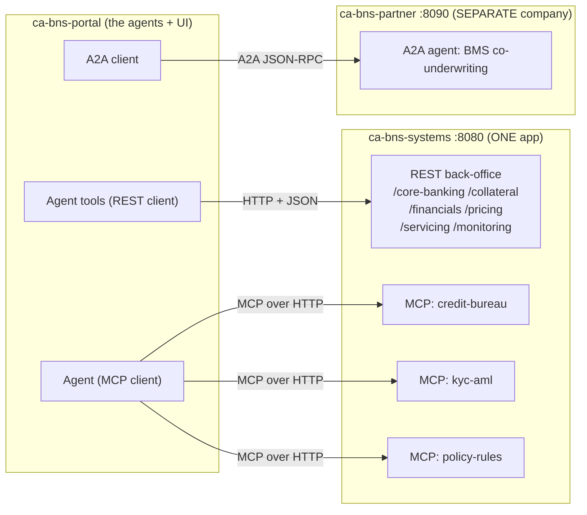
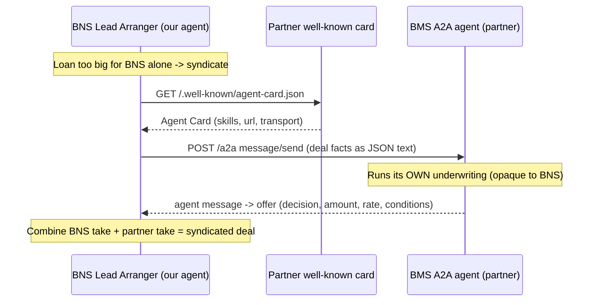

# 04 — Surrounding Systems (REST, MCP, and A2A)

> **Who is this for?** A newcomer who wants to understand the "systems around the agents":
> what they are, why they exist, what data they hold, and — most importantly —
> **exactly how to call them from another program** (URLs, methods, request/response,
> and whether any username/password/API-key is needed).

---

## TL;DR (read this first)

- The agents never invent facts. They pull real-looking data from **surrounding systems** —
  the same kind of back-office systems a real bank has (core banking, credit bureau, KYC/AML, etc.).
- In this demo those systems are **mocks** (fake but realistic), so the whole thing runs with
  **no real bank access and no secrets**.
- There are **three different ways** something talks to a surrounding system, and the demo shows
  all three on purpose:

  | # | Style | Protocol | Who calls it | Analogy |
  |---|-------|----------|--------------|---------|
  | 1 | **REST API** | HTTP + JSON | Agent *tools* (our Python code) | "Call a web API" |
  | 2 | **MCP** | Model Context Protocol over HTTP | The LLM agent *directly* | "Give the model a toolbox" |
  | 3 | **A2A** | Agent2Agent over JSON-RPC | Our agent → **another company's agent** | "Two robots negotiate" |

- Everything is packaged into **two container apps**:
  - `ca-bns-systems` — REST + all three MCP servers (one app, one port `8080`).
  - `ca-bns-partner` — the **external** A2A partner bank (its own app, port `8090`).
- **There is no auth.** No API key, no username/password, no token. These are public read-only
  demo endpoints. (The "Production hardening" section at the end explains what you *would* add.)

---

## Part 1 — What is a "surrounding system", and why build it?

### 1.1 What it is

A **surrounding system** (Indonesian: *sistem pendukung*) is any system the loan process depends on
but does **not** live inside the agent app itself. In a real bank these are separate departments/
vendors, each with its own database:

| Real-world system | What it knows | Real Indonesian equivalent |
|-------------------|---------------|----------------------------|
| Core banking | Accounts, balances, transaction history | The bank's ledger |
| Credit bureau | Credit score, outstanding debt, delinquencies | **SLIK OJK**, Pefindo/CLIK |
| KYC/AML screening | Identity check, sanctions/terror-list hits | **Dukcapil** (NIK), **DTTOT**, **PPATK** |
| Policy engine | The lending rules (min income, max DBR, …) | **OJK / BI** regulations |
| Collateral registry | Appraised value of pledged assets | Independent appraiser |
| Pricing | Product catalog + interest-rate quote | Treasury / product team |
| Partner bank | Another bank willing to co-fund a big loan | **Syndication** partner |

### 1.2 Why we build a *mock* of them

We cannot (and should not) connect a demo to a real bank's core system. So we build a **mock**:
a small service that returns realistic, deterministic JSON for a fixed set of customers
(`CUST-1001` … `CUST-1006`, `SME-5001`, …). Benefits:

- **Safe** — no real personal data, no secrets, nothing to leak.
- **Deterministic** — the same customer always returns the same numbers, so demos are repeatable
  and the audit trail is reproducible.
- **Realistic** — the *shapes* (fields, units, ID formats) match what a real integration looks like,
  so the agent code is written the same way it would be against production.

### 1.3 Why is it **one** container app?

You might expect 7 separate services. Instead, all the mock back-office endpoints **and** the three
MCP servers are mounted into **one ASGI app** ([mock_services/server.py](../mock_services/server.py))
and shipped as **one container** (`ca-bns-systems`). Why:

- **Simpler & cheaper** — one image to build, one Container App to run, one URL to configure
  (`REST_BASE_URL`). A demo does not need 7 separately-scaled microservices.
- **One front door** — REST lives at `/core-banking`, `/collateral`, … while MCP lives at
  `/mcp/credit-bureau`, `/mcp/kyc-aml`, `/mcp/policy-rules`. Same host, different paths.
- **Still modular in code** — each system is its own Python module (`rest_apis/app.py`,
  `mcp_servers/*.py`), so you *could* split them into separate containers later without rewriting them.

The **partner bank is deliberately a *second, separate* container** (`ca-bns-partner`) because the
whole point of A2A is that it belongs to a **different company** — different code, different data,
different (or zero) credentials. Keeping it in its own app makes that boundary real.



---

## Part 2 — The three protocols, and why each is used

All three are "an agent gets information from an external system", but they differ in **who** makes
the call and **how much the model is trusted to drive it**.

| | **REST API (tools)** | **MCP** | **A2A** |
|---|---|---|---|
| Full name | Representational State Transfer | Model Context Protocol | Agent2Agent |
| Who calls | Our Python **tool** function | The **LLM** picks & calls the tool | Our agent calls **another agent** |
| Transport | HTTP `GET`/`POST` + JSON | JSON-RPC over HTTP ("Streamable HTTP") | JSON-RPC over HTTP |
| Discovery | You read the docs / OpenAPI | The model asks the server "what tools do you have?" | The caller fetches an **Agent Card** |
| Boundary | Inside our company | Inside our company | **Across companies** |
| Used in demo for | Core banking, collateral, financials, pricing, servicing, monitoring | Credit bureau, KYC/AML, policy rules | Loan syndication with a partner bank |
| Why chosen | Plain data fetch; we control the call shape | Let the model choose *which* screening tool to run and *when* | Cooperate with an agent we **don't** own or control |

**Rule of thumb used in this codebase:**
- If **our code** should decide exactly what to fetch → **REST tool**.
- If **the model** should decide which capability to use (and we just expose a toolbox) → **MCP**.
- If the counterparty is a **separate agent/organization** → **A2A**.

---

## Part 3 — How to access them (URLs, auth, keys)

### 3.1 Base URLs

| Environment | Portal (UI) | Surrounding systems (REST + MCP) | Partner bank (A2A) |
|-------------|-------------|----------------------------------|--------------------|
| **Local** | `http://localhost:8501` (default Streamlit) | `http://localhost:8080` | `http://localhost:8090` |
| **Cloud (Azure Container Apps)** | `https://ca-bns-portal.delightfulisland-5bc416ad.eastus2.azurecontainerapps.io` | `https://ca-bns-systems.delightfulisland-5bc416ad.eastus2.azurecontainerapps.io` | `https://ca-bns-partner.delightfulisland-5bc416ad.eastus2.azurecontainerapps.io` |

The app finds these via two environment variables (see [app/core/config.py](../app/core/config.py)):

```text
REST_BASE_URL      → base for REST + MCP   (default http://localhost:8080)
PARTNER_A2A_URL    → base for the A2A bank (default http://localhost:8090)
```

### 3.2 Authentication — **there is none** (by design)

> **Do I need a username, password, API key, or token?** **No.**

These are **public, read-only demo endpoints** serving **fake data**. There is:

- no API key or `Authorization` header,
- no username/password,
- no OAuth/token,
- no cookie or session.

You can call them from `curl`, Postman, a browser, or any language with zero setup. The partner A2A
service also runs with **no cloud credentials at all** — that is intentional, to prove A2A works
between agents that share nothing.

> ⚠️ This is **only** acceptable because everything is mock data. See **Part 9 — Production hardening**
> for exactly what you must add before pointing this at anything real.

### 3.3 60-second smoke test

```bash
# 1) Is the surrounding-systems app alive?
curl https://ca-bns-systems.delightfulisland-5bc416ad.eastus2.azurecontainerapps.io/health
# → {"status":"ok","service":"bns-mock-rest"}

# 2) What does the front door list?
curl https://ca-bns-systems.delightfulisland-5bc416ad.eastus2.azurecontainerapps.io/
# → {"service":"...","rest":[...],"mcp":{...}}

# 3) Is the partner (A2A) bank alive?
curl https://ca-bns-partner.delightfulisland-5bc416ad.eastus2.azurecontainerapps.io/health
# → {"status":"ok","service":"bms-partner-a2a","provider":"Bank Mitra Sejahtera (BMS)"}

# 4) Open the UI portal
curl -I https://ca-bns-portal.delightfulisland-5bc416ad.eastus2.azurecontainerapps.io
```

### 3.4 Live access links (quick reference)

- Portal (UI): `https://ca-bns-portal.delightfulisland-5bc416ad.eastus2.azurecontainerapps.io`
- Surrounding systems root: `https://ca-bns-systems.delightfulisland-5bc416ad.eastus2.azurecontainerapps.io`
- Systems health: `https://ca-bns-systems.delightfulisland-5bc416ad.eastus2.azurecontainerapps.io/health`
- Surrounding REST samples:
  - `https://ca-bns-systems.delightfulisland-5bc416ad.eastus2.azurecontainerapps.io/core-banking/customers/CUST-1001/accounts`
  - `https://ca-bns-systems.delightfulisland-5bc416ad.eastus2.azurecontainerapps.io/pricing/products`
- Surrounding MCP endpoints:
  - `https://ca-bns-systems.delightfulisland-5bc416ad.eastus2.azurecontainerapps.io/mcp/credit-bureau/`
  - `https://ca-bns-systems.delightfulisland-5bc416ad.eastus2.azurecontainerapps.io/mcp/kyc-aml/`
  - `https://ca-bns-systems.delightfulisland-5bc416ad.eastus2.azurecontainerapps.io/mcp/policy-rules/`
- Partner A2A:
  - Agent Card: `https://ca-bns-partner.delightfulisland-5bc416ad.eastus2.azurecontainerapps.io/.well-known/agent-card.json`
  - JSON-RPC endpoint: `https://ca-bns-partner.delightfulisland-5bc416ad.eastus2.azurecontainerapps.io/a2a`

---

## Part 4 — System A: the REST back-office

**File:** [mock_services/rest_apis/app.py](../mock_services/rest_apis/app.py) (FastAPI).
**Auth:** none. **Format:** JSON. **Base:** `REST_BASE_URL`.

Six logical systems share one FastAPI app:

| Path prefix | Logical system | Purpose |
|-------------|----------------|---------|
| `/core-banking` | Core banking | Accounts + transaction history |
| `/collateral` | Collateral registry | Appraised value of pledged assets |
| `/financials` | Financial statements | 3 years of SME financials |
| `/servicing` | Loan servicing | Existing/outstanding facility (for restructuring) |
| `/monitoring` | Transaction monitoring | AML alerts (for investigation) |
| `/pricing` | Pricing | Product catalog + rate quote |

### 4.1 Endpoint reference

| Method & path | Query params | Returns |
|---------------|--------------|---------|
| `GET /health` | — | `{status, service}` |
| `GET /` | — | Index of all REST + MCP paths |
| `GET /core-banking/customers/{customer_id}/accounts` | — | `{customer_id, accounts[]}` |
| `GET /core-banking/customers/{customer_id}/transactions` | `months` (1–6, default 6) | avg monthly credit/debit + raw rows |
| `GET /collateral/{collateral_id}` | — | Appraisal (declared vs appraised, type, condition) |
| `GET /financials/companies/{company_id}` | `years` (1–3, default 3) | `{company_id, statements[]}` |
| `GET /servicing/loans/{customer_id}` | — | Existing loan facility + arrears |
| `GET /monitoring/alerts/{customer_id}` | — | AML alerts (typologies, severity) |
| `GET /pricing/products` | — | Product catalog + base rate + risk spreads |
| `POST /pricing/quote` | `amount_idr`, `tenor_months`, `risk_grade`, `product_code` | Rate, monthly installment, total repayment |

> Note: `POST /pricing/quote` takes its inputs as **query-string parameters**, not a JSON body
> (that's how the FastAPI signature is defined).

### 4.2 Copy-paste examples

```bash
BASE=https://ca-bns-systems.delightfulisland-5bc416ad.eastus2.azurecontainerapps.io

# Accounts + 6-month cashflow
curl "$BASE/core-banking/customers/CUST-1001/accounts"
curl "$BASE/core-banking/customers/CUST-1001/transactions?months=6"

# Collateral appraisal
curl "$BASE/collateral/COL-9001"

# SME financial statements (last 3 years)
curl "$BASE/financials/companies/SME-5001?years=3"

# Existing loan (restructuring) and AML alerts
curl "$BASE/servicing/loans/CUST-1006"
curl "$BASE/monitoring/alerts/CUST-1001"

# Pricing: catalog, then a quote (params in the query string)
curl "$BASE/pricing/products"
curl -X POST "$BASE/pricing/quote?amount_idr=50000000&tenor_months=24&risk_grade=B&product_code=KTA-STD"
```

### 4.3 How our agent uses it (the "tool" pattern)

The agents don't call REST directly — they call **Python tool functions** in
[app/tools/rest_tools.py](../app/tools/rest_tools.py) that wrap these endpoints (e.g.
`get_account_summary`, `get_collateral`, `get_price_quote`). The tool decides the exact URL; the model
only decides *whether* to call the tool. This is why REST is used where **we** want to control the call.

---

## Part 5 — System B: the MCP servers

**Files:** [mock_services/mcp_servers/](../mock_services/mcp_servers) (FastMCP).
**Auth:** none. **Transport:** MCP "Streamable HTTP". **Base:** `REST_BASE_URL` + `/mcp/...`.

### 5.1 What is MCP, in one paragraph

**MCP (Model Context Protocol)** is an open standard for giving a model a **toolbox**. Instead of us
hard-coding a URL, the model connects to an MCP server, asks *"what tools do you have?"*, and then
**chooses** which tool to call and with what arguments. It's perfect for screening tasks where the
agent should decide, e.g., "this is a company, so call `screen_entity`, not `screen_individual`."

### 5.2 The three MCP servers and their tools

| MCP server | Mount path | Tool | Input | Returns |
|------------|-----------|------|-------|---------|
| **credit-bureau** (SLIK/Pefindo) | `/mcp/credit-bureau/` | `get_credit_report` | `customer_id` (e.g. `CUST-1001`) | score, grade, SLIK kol, outstanding debt, facilities, delinquencies |
| | | `get_company_credit` | `company_id` (e.g. `SME-5001`) | same shape for an SME |
| **kyc-aml** (Dukcapil/DTTOT/PPATK) | `/mcp/kyc-aml/` | `screen_individual` | `nik` (16-digit) | dukcapil_verified, dttot_sanctions_hit, pep_status, adverse_media, risk_rating |
| | | `screen_entity` | `company_id` | dttot_sanctions_hit, ppatk_flag, beneficial_owner_pep, risk_rating |
| **policy-rules** (OJK/BI) | `/mcp/policy-rules/` | `list_rules` | — | the full rule set |
| | | `evaluate_retail` | age, income, DBR, score, SLIK kol, sanctions, amount | `APPROVE`/`DECLINE`/`REFER` + triggered rules |
| | | `evaluate_sme` | years, LTV, DSCR, D/E, score, sanctions, PPATK | decision + triggered rules |

> **Why `policy-rules` is deliberately NOT an LLM:** compliance must be reproducible and auditable.
> The rule engine is plain Python, so the same inputs always give the same decision and the exact
> `triggered_rules` list is written to the audit trail.

### 5.3 How our agent connects

[app/tools/mcp_tools.py](../app/tools/mcp_tools.py) builds an `MCPStreamableHTTPTool` per server, e.g.
`url = {REST_BASE_URL}/mcp/credit-bureau/`. The agent is created with that tool attached, and the
framework handles the MCP handshake (list tools → call tool) for us.

### 5.4 Calling MCP from another system

MCP is **not** a plain `GET` you can `curl` casually — it's a JSON-RPC session ("initialize", then
"tools/list" / "tools/call"). The easy way to consume it from another program is an **MCP client
library** (the official `mcp` Python SDK, or any MCP-compatible client) pointed at the mount URL, e.g.
`https://ca-bns-systems.../mcp/credit-bureau/`. If you just want the raw data without MCP, the same
facts are also reachable via REST/JSON — MCP here is specifically about letting a **model** drive the call.

---

## Part 6 — System C: the A2A partner bank (deep dive)

This is the part you asked to expand. **A2A (Agent2Agent)** lets our agent hand a task to a
**completely separate agent owned by another company** — without sharing code, data, or model.

**File:** [partner_service/app.py](../partner_service/app.py) (Starlette).
**Container:** `ca-bns-partner`. **Auth:** none, **no cloud credentials**.
**Provider:** *Bank Mitra Sejahtera (BMS)* — a fictional partner bank.

### 6.1 The scenario (why A2A here)

When BNS wants to approve a loan that is **too big for one bank** (above its single-obligor cap), it
**syndicates**: it invites a partner bank to co-fund part of it. The partner's underwriting is its
**own black box** — BNS cannot see BMS's code or risk model, only the **offer** it returns. A2A is the
protocol for exactly this "two independent agents cooperate over the wire" situation.

### 6.2 The skeleton — only 3 real routes

The entire A2A server is tiny and spec-shaped:

| Route | Method | Purpose |
|-------|--------|---------|
| `/.well-known/agent-card.json` | `GET` | **Discovery** — publish the Agent Card (identity + skills + endpoint) |
| `/.well-known/agent.json` | `GET` | Legacy alias of the card |
| `/a2a` | `POST` | **Work** — JSON-RPC `message/send` (the actual task) |
| `/health` | `GET` | Liveness |

### 6.3 Step 1 — Discovery: the **Agent Card**

Any A2A caller first fetches the card at the **well-known path**. It's the partner's "business card":
who it is, what it can do, where to send work, and in what format.

```bash
curl https://ca-bns-partner.delightfulisland-5bc416ad.eastus2.azurecontainerapps.io/.well-known/agent-card.json
```

```json
{
  "protocolVersion": "0.3.0",
  "name": "BMS Co-Underwriting Agent",
  "description": "Agen underwriting otomatis milik Bank Mitra Sejahtera ...",
  "provider": { "organization": "Bank Mitra Sejahtera (BMS)", "url": "https://bms.example.id" },
  "version": "1.0.0",
  "url": "https://ca-bns-partner.../a2a",
  "preferredTransport": "JSONRPC",
  "capabilities": { "streaming": false, "pushNotifications": false },
  "defaultInputModes": ["application/json", "text/plain"],
  "defaultOutputModes": ["application/json", "text/plain"],
  "skills": [
    {
      "id": "co_underwrite",
      "name": "Co-underwriting participation",
      "description": "Menilai permintaan co-financing dan mengembalikan penawaran partisipasi ...",
      "tags": ["syndication", "co-financing", "underwriting", "fsi"]
    }
  ]
}
```

Key fields: `url` is **where to POST tasks**; `skills[]` tells you **what it can do**;
`preferredTransport: JSONRPC` tells you **how to talk to it**.

### 6.4 Step 2 — Work: JSON-RPC `message/send`

You then `POST` a JSON-RPC 2.0 envelope to the card's `url`. The task payload (the deal facts) is
carried as **text inside a message part** — here we put a small JSON string in that text part.

```bash
RPC=https://ca-bns-partner.delightfulisland-5bc416ad.eastus2.azurecontainerapps.io/a2a

curl -X POST "$RPC" -H "Content-Type: application/json" -d '{
  "jsonrpc": "2.0",
  "id": "req-1",
  "method": "message/send",
  "params": {
    "message": {
      "role": "user",
      "messageId": "m-1",
      "parts": [{ "kind": "text", "text": "{\"sector\":\"manufacturing\",\"requested_participation_idr\":8000000000,\"dscr\":1.4,\"ltv\":0.65,\"credit_score\":700,\"risk_grade\":\"B\",\"tenor_months\":48}" }]
    }
  }
}'
```

The reply is an A2A **agent message** whose text part carries the structured offer:

```json
{
  "jsonrpc": "2.0",
  "id": "req-1",
  "result": {
    "kind": "message",
    "role": "agent",
    "messageId": "…",
    "parts": [{ "kind": "text", "text": "{\"partner_name\":\"Bank Mitra Sejahtera (BMS)\",\"decision\":\"APPROVE\",\"participation_amount_idr\":8000000000,\"indicative_rate_pct\":15.0,\"conditions\":[…],\"rationale\":\"…\"}" }]
  }
}
```

### 6.5 What the deal payload accepts / what the offer returns

**Request (deal facts)** — fields read by `_co_underwrite`:

| Field | Meaning |
|-------|---------|
| `sector` | Industry (drives appetite; some sectors are avoided) |
| `requested_participation_idr` | How much co-funding BNS asks for |
| `dscr` | Debt-service coverage ratio |
| `ltv` | Loan-to-value |
| `credit_score` | Borrower score |
| `risk_grade` | A/B/C/D (drives pricing spread) |
| `tenor_months` | Loan tenor |

**Response (offer)** — the partner's independent decision:

| Field | Meaning |
|-------|---------|
| `partner_name` | Who answered |
| `decision` | `APPROVE` or `DECLINE` |
| `participation_amount_idr` | How much BMS will fund (may be a *partial* take, capped at BMS's own ceiling) |
| `indicative_rate_pct` | BMS's price (it prices a touch higher than BNS) |
| `conditions[]` | e.g. pari-passu security, quarterly covenants |
| `rationale` | Human-readable reason |

> The partner has its **own, opaque risk appetite** (stricter DSCR, its own ceiling, preferred/avoided
> sectors). BNS cannot see those rules — only the offer. That is the whole point of A2A.

### 6.6 The full A2A flow



### 6.7 Our A2A client

[app/tools/a2a_client.py](../app/tools/a2a_client.py) implements the two steps above (`fetch_agent_card`
then `a2a_send`). One production-flavored detail it handles: behind an HTTPS ingress the card might
advertise an `http://` URL; POSTing there triggers a `301` redirect that **drops the JSON-RPC body**,
so the client upgrades the RPC URL to `https://` and follows redirects. (This same bug was fixed on the
server side too, by honoring `X-Forwarded-Proto`.)

### 6.8 Calling the partner from **your own** system

Because there's no auth, any A2A-capable caller can use it:
1. `GET {PARTNER_A2A_URL}/.well-known/agent-card.json` → read `url` + `skills`.
2. `POST` a JSON-RPC `message/send` to that `url` with your deal facts as the text part.
3. Parse the JSON offer out of `result.parts[0].text`.

The official `a2a` SDK models these exact shapes; this demo hand-rolls the wire format to stay
dependency-light and fully observable.

---

## Part 7 — The data catalog

All data is plain JSON in [mock_services/data/](../mock_services/data), generated deterministically by
[mock_services/data/seed.py](../mock_services/data/seed.py). The loader
([mock_services/data/__init__.py](../mock_services/data/__init__.py)) reads and caches each file.

| File | Keyed by | Feeds | Example key |
|------|----------|-------|-------------|
| `customers.json` | `customer_id` | identity, income | `CUST-1001` |
| `accounts.json` | `customer_id` | core-banking accounts | `CUST-1001` |
| `transactions.json` | `customer_id` | cashflow | `CUST-1001` |
| `credit_bureau.json` | `customer_id` / `company_id` | credit-bureau MCP | `CUST-1001`, `SME-5001` |
| `kyc.json` | **NIK** / `company_id` | KYC/AML MCP | `1769356319029045` |
| `policy_rules.json` | — | policy MCP + orchestrator gate | retail / sme thresholds |
| `companies.json` | `company_id` | SME profile | `SME-5001` |
| `financials.json` | `company_id` | SME statements | `SME-5001` |
| `collateral.json` | `collateral_id` | appraisal | `COL-9001` |
| `products.json` | `product_code` | pricing | `KTA-STD`, `SME-TERM` |
| `existing_loans.json` | `customer_id` | restructuring | `CUST-1006` |
| `alerts.json` | `customer_id` | AML investigation | `CUST-1001` |

### 7.1 Handy IDs to try

- **Retail customers:** `CUST-1001` … `CUST-1006`
- **SME/company:** `SME-5001`
- **Collateral:** `COL-9001`
- **NIK** (for KYC): use the `nik` field from `customers.json` (e.g. `CUST-1001` → `1769356319029045`)
- **Restructuring case:** `CUST-1006` (tuned for a multi-round restructuring loop)

### 7.2 Example data shapes

```jsonc
// credit_bureau.json → individuals[CUST-1001]
{ "credit_score": 712, "risk_grade": "B", "slik_kol": 1,
  "total_outstanding_debt_idr": 52003493, "monthly_debt_obligations_idr": 3059029,
  "active_facilities": [{ "type": "KKB", "monthly_payment_idr": 3059029 }],
  "delinquencies_12m": 0, "enquiries_6m": 4 }

// kyc.json → individuals[<NIK>]
{ "nik": "1769356319029045", "dukcapil_verified": true, "dttot_sanctions_hit": false,
  "pep_status": false, "adverse_media": [], "risk_rating": "low" }

// policy_rules.json → retail
{ "min_monthly_income_idr": 5000000, "max_dbr_ratio": 0.4, "min_age": 21, "max_age": 60,
  "min_credit_score": 580, "max_slik_kol": 2, "sanctions_block": true,
  "auto_approve_ceiling_idr": 100000000 }
```

### 7.3 Regenerating the data

```bash
python mock_services/data/seed.py   # deterministic; safe to re-run
```

---

## Part 8 — Recipes: calling from another system

### 8.1 REST — from Python

```python
import httpx
BASE = "https://ca-bns-systems.delightfulisland-5bc416ad.eastus2.azurecontainerapps.io"
r = httpx.get(f"{BASE}/core-banking/customers/CUST-1001/accounts", timeout=15)
print(r.json())
```

### 8.2 REST — from Node.js

```js
const BASE = "https://ca-bns-systems.delightfulisland-5bc416ad.eastus2.azurecontainerapps.io";
const res = await fetch(`${BASE}/collateral/COL-9001`);
console.log(await res.json());
```

### 8.3 A2A — from Python (discover then send)

```python
import httpx, json
PARTNER = "https://ca-bns-partner.delightfulisland-5bc416ad.eastus2.azurecontainerapps.io"

card = httpx.get(f"{PARTNER}/.well-known/agent-card.json", timeout=20).json()
deal = {"sector": "manufacturing", "requested_participation_idr": 8_000_000_000,
        "dscr": 1.4, "ltv": 0.65, "credit_score": 700, "risk_grade": "B", "tenor_months": 48}
env = {"jsonrpc": "2.0", "id": "1", "method": "message/send",
       "params": {"message": {"role": "user", "messageId": "m1",
                              "parts": [{"kind": "text", "text": json.dumps(deal)}]}}}
resp = httpx.post(card["url"], json=env, timeout=20, follow_redirects=True).json()
offer = json.loads(resp["result"]["parts"][0]["text"])
print(offer["decision"], offer["participation_amount_idr"])
```

---

## Part 9 — Deploy / rebuild (for maintainers)

Both surrounding-system apps are containers built from the repo:

| App | Dockerfile | Port | Notes |
|-----|-----------|------|-------|
| `ca-bns-systems` | [Dockerfile.systems](../Dockerfile.systems) | 8080 | Runs `seed.py` at build so data is baked in |
| `ca-bns-partner` | [Dockerfile.partner](../Dockerfile.partner) | 8090 | Only `starlette` + `uvicorn`; no secrets |

Local everything (systems + telemetry dashboard) is in [docker-compose.yml](../docker-compose.yml):

```bash
docker compose up            # systems on :8080, Aspire dashboard on :18888
uvicorn partner_service.app:app --port 8090   # partner (A2A) separately
```

Cloud rebuild follows the established pattern: `az acr build` the image, then
`az containerapp update` the app, then verify `/health`.

---

## Part 10 — Production hardening (what's missing on purpose)

This demo is intentionally open. **Before** connecting anything real you would add:

- **AuthN/AuthZ** on every endpoint — an API key or (better) OAuth2 / managed-identity tokens; for A2A,
  signed/authenticated Agent Cards and mutual TLS between partners.
- **Network isolation** — private endpoints / VNet instead of public ingress.
- **Rate limiting & quotas** — to protect the back-office.
- **Real PII handling** — encryption at rest/in transit, data-minimization, consent, retention.
- **Input validation & schema contracts** — treat every partner reply as untrusted.
- **Secrets management** — Azure Key Vault, no credentials in code or images.

Everything else about the *shape* of the integration (URLs, JSON, MCP tools, A2A card + `message/send`)
stays the same — which is why the mock is a faithful blueprint for the real thing.
