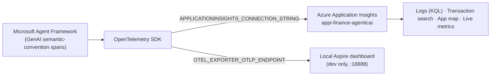

# 8 · Observability & Analytics — How to Log, Retrieve & Query (EN/ID)

This document explains the **telemetry/analytics layer** (OpenTelemetry → Azure Application Insights)
that is *separate* from the app-level governance in [07-governance-token-cost.md](07-governance-token-cost.md):

- **Governance (doc 07)** = your own SQLite audit log + `CostTracker` + technical log, shown in the portal.
- **Observability (this doc)** = **OpenTelemetry** traces/metrics/logs emitted by Microsoft Agent Framework,
  exported to **Azure Application Insights** (and optionally a local Aspire dashboard). This is what you
  query with **KQL** and browse in the Azure portal.

Dokumen ini menjelaskan lapisan **telemetry/analitik** (OpenTelemetry → Application Insights) yang
terpisah dari governance aplikasi. Governance = audit log + token + biaya (SQLite, tampil di portal).
Observability = jejak OpenTelemetry yang diekspor ke Application Insights, di-query dengan KQL.

---

## 1) Architecture — what emits what



- **Emitter:** Agent Framework auto-emits **GenAI spans** (model calls, tool calls) using OpenTelemetry
  semantic conventions — no manual span code required for agent steps.
- **Exporter (cloud):** `azure-monitor-opentelemetry` ships them to App Insights.
- **Exporter (local):** an OTLP endpoint (Aspire dashboard) for dev.

### ID
Agent Framework otomatis mengeluarkan span GenAI (panggilan model & tool). OpenTelemetry mengirimnya ke
Application Insights (cloud) dan/atau Aspire dashboard (lokal).

---

## 2) How it's turned on — the code

One idempotent call wires everything: [setup_observability()](../app/observability/otel_setup.py#L20).

```python
# app/observability/otel_setup.py (excerpt)
from azure.monitor.opentelemetry import configure_azure_monitor
from agent_framework.observability import create_resource, enable_instrumentation

configure_azure_monitor(
    connection_string=settings.applicationinsights_connection_string,
    resource=create_resource(),
    enable_live_metrics=True,           # powers the App Insights "Live metrics" blade
)
enable_instrumentation()                # turns on Agent Framework GenAI spans
```

It is called once at startup from every entrypoint, e.g. [app/portal/Home.py](../app/portal/Home.py#L13)
and each page ([11_SME_on_Foundry.py](../app/portal/views/11_SME_on_Foundry.py#L24)).

Config anchors ([app/core/config.py](../app/core/config.py#L29)):

| Env var | Effect |
|---|---|
| `ENABLE_INSTRUMENTATION=true` | Master on/off. If false, no telemetry is emitted. |
| `APPLICATIONINSIGHTS_CONNECTION_STRING` | Enables the **Azure App Insights** exporter (production). |
| `OTEL_EXPORTER_OTLP_ENDPOINT` | Enables the **local OTLP/Aspire** exporter (dev). |
| `OTEL_SERVICE_NAME` (`bns-financing-agents`) | Shows up as `cloud_RoleName` in App Insights — filter by it. |

### ID
Cukup satu panggilan `setup_observability()` saat startup. Diaktifkan lewat env var di atas. Sudah dipasang
di `Home.py` dan tiap halaman portal.

---

## 3) How to ADD analytics to your own project (client playbook)

1. **Create** an Application Insights resource → copy its **Connection String**.
2. **Install** deps (already in [requirements.txt](../requirements.txt)):
   `azure-monitor-opentelemetry`, `opentelemetry-exporter-otlp-proto-grpc`, `agent-framework`.
3. **Set env**:
   ```
   ENABLE_INSTRUMENTATION=true
   APPLICATIONINSIGHTS_CONNECTION_STRING=InstrumentationKey=...;IngestionEndpoint=...
   OTEL_SERVICE_NAME=bns-financing-agents
   ```
4. **Call** `setup_observability()` once at process start (already wired here).
5. Run a scenario → traces appear in App Insights within ~1–2 minutes.

In this repo the deployed portal (`ca-bns-portal`) already has these env vars set and points at
**`appi-finance-agenticai`**.

### ID
Untuk klien: buat App Insights, salin connection string, set env, panggil `setup_observability()`. Selesai —
telemetry otomatis mengalir.

---

## 4) Add your OWN custom span (optional, beyond auto GenAI spans)

Auto-instrumentation covers model/tool calls. To trace a **business step** (e.g. a full underwriting run)
and tag it with your `request_id`, add a manual span:

```python
from opentelemetry import trace

tracer = trace.get_tracer("bns.workflow")

with tracer.start_as_current_span("sme.underwriting") as span:
    span.set_attribute("bns.request_id", request_id)   # <- correlate with your audit log
    span.set_attribute("bns.use_case", "sme_foundry")
    span.set_attribute("bns.decision", decision)
    span.set_attribute("bns.total_tokens", cost.total_tokens)
    # ... run the workflow ...
```

Those attributes land in App Insights under `customDimensions` and become queryable columns (see §6).
Tagging **`bns.request_id`** is the key to correlating an App Insights trace with a portal audit row.

### ID
Untuk menandai langkah bisnis (mis. satu proses underwriting) dan mengaitkannya dengan `request_id`, buat
span manual dan set atribut. Atribut muncul di `customDimensions` dan bisa di-query.

---

## 5) How to ACCESS it — Azure portal

Resource group `rg-finance-agenticai` → **`appi-finance-agenticai`** (Application Insights):

| Blade | Use it for |
|---|---|
| **Live metrics** | Real-time requests/dependencies while you demo (enabled via `enable_live_metrics=True`). |
| **Transaction search** | Browse individual end-to-end traces; click a span to see attributes. |
| **Application map** | Visual topology: portal → model → MCP/REST calls, with latency/error rates. |
| **Performance** | Slowest operations/dependencies. |
| **Failures** | Exceptions & failed dependencies. |
| **Logs** | Run **KQL** queries (the powerful part — see §6). |

### ID
Buka `appi-finance-agenticai` → **Live metrics** (real-time saat demo), **Transaction search** (telusuri satu
jejak), **Application map** (peta panggilan), **Logs** (query KQL).

---

## 6) How to QUERY in detail — KQL examples

App Insights → **Logs**. Core tables: `requests`, `dependencies` (model & tool calls live here),
`traces` (logs), `exceptions`, `customEvents`, `customMetrics`. GenAI attributes live in the dynamic
`customDimensions` column. Filter your app with `cloud_RoleName == "bns-financing-agents"`.

> Attribute names follow OpenTelemetry GenAI semantic conventions (e.g. `gen_ai.usage.input_tokens`).
> Exact keys can vary by Agent Framework version — run the "discover keys" query first (6.1) and adjust.

### 6.1 Discover what attributes exist (run this first)
```kusto
dependencies
| where timestamp > ago(1h)
| where cloud_RoleName == "bns-financing-agents"
| take 20
| project timestamp, name, duration, target, customDimensions
```

### 6.2 All model (GenAI) calls with token usage
```kusto
dependencies
| where timestamp > ago(1d)
| where cloud_RoleName == "bns-financing-agents"
| where tostring(customDimensions) has "gen_ai"
| extend model  = tostring(customDimensions["gen_ai.request.model"]),
         in_tok = toint(customDimensions["gen_ai.usage.input_tokens"]),
         out_tok= toint(customDimensions["gen_ai.usage.output_tokens"])
| project timestamp, name, duration_ms=duration, model, in_tok, out_tok, operation_Id
| order by timestamp desc
```

### 6.3 Token usage & call volume per day
```kusto
dependencies
| where tostring(customDimensions) has "gen_ai.usage"
| extend in_tok = toint(customDimensions["gen_ai.usage.input_tokens"]),
         out_tok= toint(customDimensions["gen_ai.usage.output_tokens"])
| summarize calls=count(), input_tokens=sum(in_tok), output_tokens=sum(out_tok)
          by bin(timestamp, 1d)
| order by timestamp desc
```

### 6.4 Slowest operations (latency P50/P95)
```kusto
dependencies
| where timestamp > ago(1d) and cloud_RoleName == "bns-financing-agents"
| summarize p50=percentile(duration,50), p95=percentile(duration,95), count() by name
| order by p95 desc
```

### 6.5 Errors & exceptions
```kusto
exceptions
| where timestamp > ago(1d) and cloud_RoleName == "bns-financing-agents"
| project timestamp, type, outerMessage, operation_Id, method
| order by timestamp desc
```

### 6.6 Full end-to-end trace for ONE run
```kusto
let opId = "<operation_Id-from-transaction-search>";
union requests, dependencies, traces, exceptions
| where operation_Id == opId
| project timestamp, itemType, name, duration, message, severityLevel
| order by timestamp asc
```

### 6.7 Correlate with YOUR request_id (needs the custom span from §4)
```kusto
dependencies
| where customDimensions["bns.request_id"] == "SMEF-abc12345"
| project timestamp, name, duration, customDimensions
| order by timestamp asc
```

### ID
Buka **Logs**, tabel utama: `dependencies` (panggilan model/tool), `traces`, `exceptions`. Atribut GenAI ada
di `customDimensions`. Jalankan query 6.1 dulu untuk melihat nama atribut, lalu pakai 6.2–6.7 (token, latency,
error, trace end-to-end, korelasi dengan `request_id`).

---

## 7) Local development analytics (no Azure needed)

`docker-compose up` starts the **Aspire dashboard** ([docker-compose.yml](../docker-compose.yml)):

- Web UI: `http://localhost:18888` (traces/metrics/logs viewer)
- Set `OTEL_EXPORTER_OTLP_ENDPOINT=http://localhost:4317` and `ENABLE_INSTRUMENTATION=true`
- Run a scenario locally → spans stream into the Aspire dashboard in real time.

### ID
Untuk lokal: `docker-compose up` menyalakan Aspire dashboard di `localhost:18888`. Set
`OTEL_EXPORTER_OTLP_ENDPOINT=http://localhost:4317`, jalankan skenario, jejak muncul real-time.

---

## 8) Governance vs Observability — which to use when

| Question | Use |
|---|---|
| "What did each agent step decide, per request, for audit?" | Governance audit log ([07](07-governance-token-cost.md)) |
| "Exact token/cost estimate shown to the user in the UI" | Governance `CostTracker` ([07](07-governance-token-cost.md)) |
| "Production latency, error rates, live traffic, topology" | **Observability / App Insights** (this doc) |
| "Ad-hoc analytics across ALL runs with KQL" | **Observability / App Insights** (this doc) |
| "Real-time monitoring during a client demo" | **Live metrics** blade (this doc §5) |

Best practice: keep **both**. Governance is the auditable business record; observability is the operational/
analytics telemetry.

### ID
Pakai **keduanya**: governance = catatan bisnis yang bisa diaudit; observability = telemetry operasional +
analitik (latency, error, KQL, real-time).

---

## 9) Ready-to-import Workbook + saved queries (pin the tiles)

A pre-built Azure Monitor **Workbook** with the §6 tiles is included:
[docs/bns-agent-analytics.workbook.json](bns-agent-analytics.workbook.json). It has a **Time range** picker
and 5 tiles: discover attributes, GenAI calls + token usage, token usage over time, latency P50/P95, and
errors/exceptions.

### Import it into App Insights
1. Azure portal → `appi-finance-agenticai` → **Workbooks** → **+ New** → open the **Advanced Editor** (`</>` icon).
2. Delete the sample JSON, paste the full contents of `bns-agent-analytics.workbook.json`, click **Apply**.
3. Click **Done Editing** → **Save** (name it e.g. *BNS Agent Analytics*, pick the resource group). It now
   appears under **Workbooks** for anyone with access — ready for the demo.

### Pin a single tile to a dashboard
In any Logs query result or Workbook tile → **Pin** icon → choose an Azure **Dashboard**. Great for a
one-glance demo board (live tokens + latency + errors).

### Save a KQL query as a reusable Function
To let the client re-run a query by name (e.g. `bnsTokenUsage`):
1. App Insights → **Logs** → paste a §6 query → **Save** → **Save as function**.
2. Give it a name (`bnsTokenUsage`) and category (`BNS`).
3. Anyone can then just run `bnsTokenUsage` in Logs instead of pasting the full KQL.

### ID
Sudah disediakan **Workbook** siap-impor ([bns-agent-analytics.workbook.json](bns-agent-analytics.workbook.json)).
Impor lewat App Insights → **Workbooks** → **+ New** → Advanced Editor → paste JSON → Save. Tile bisa
**Pin** ke Dashboard, dan query KQL bisa disimpan sebagai **Function** agar mudah dipanggil ulang.
